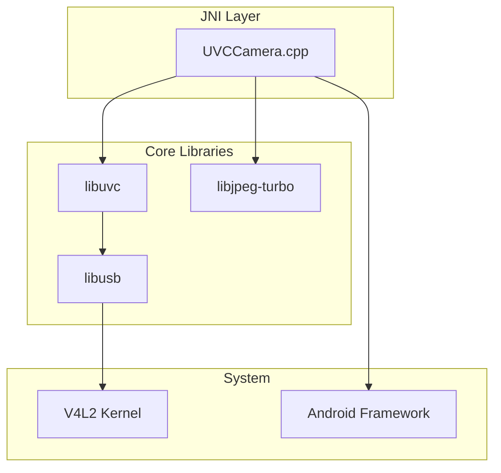
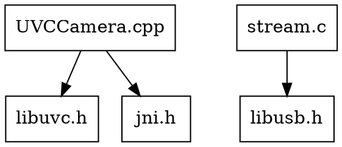

# AUDIT-001: UVCCamera Codebase Reconnaissance

**Status:** Draft
**Created:** 2026-01-11
**Author:** Jeffrey Litecky / Claude
**Project:** ScopeCam - UVCCamera Library Modernization
**Target:** Android 16 (API 36) / C++23

---

## Executive Summary

This audit establishes the foundational understanding of the UVCCamera legacy codebase required before any modernization work begins. The reconnaissance phase inventories all artifacts, maps component dependencies, and establishes baseline metrics that will drive subsequent audit phases.

**Audit Scope:** `/jni` directory and associated build configuration
**Expected Duration:** 2-4 hours for complete inventory
**Output Artifacts:** 6 structured deliverables

---

## Table of Contents

1. [Objectives](#1-objectives)
2. [Pre-Audit Requirements](#2-pre-audit-requirements)
3. [Audit Tasks](#3-audit-tasks)
   - 3.1 [Directory Structure Inventory](#31-directory-structure-inventory)
   - 3.2 [Source File Census](#32-source-file-census)
   - 3.3 [Header Analysis](#33-header-analysis)
   - 3.4 [Build Artifact Mapping](#34-build-artifact-mapping)
   - 3.5 [Dependency Graph Construction](#35-dependency-graph-construction)
   - 3.6 [Baseline Metrics Collection](#36-baseline-metrics-collection)
4. [Deliverables](#4-deliverables)
5. [Verification Criteria](#5-verification-criteria)
6. [Agent Instructions](#6-agent-instructions)

---

## 1. Objectives

### Primary Objectives

| ID | Objective | Success Criteria |
|----|-----------|------------------|
| O1 | Complete inventory of `/jni` directory | 100% of files catalogued with metadata |
| O2 | Dependency map between components | Directed graph with all edges identified |
| O3 | Baseline metrics established | All metrics in Section 3.6 collected |
| O4 | Build system documented | All `.mk` files analyzed, flags catalogued |

### Secondary Objectives

| ID | Objective | Success Criteria |
|----|-----------|------------------|
| O5 | Identify technical debt markers | List of TODO/FIXME/HACK comments |
| O6 | Document code provenance | License headers and attribution identified |
| O7 | Establish naming conventions | Pattern analysis of existing code style |

---

## 2. Pre-Audit Requirements

### 2.1 Repository Access

```bash
# Verify repository is accessible
ls -la /path/to/UVCCamera/  # or ScopeCam equivalent

# Confirm /jni directory exists
ls -la /path/to/repo/libuvccamera/src/main/jni/
```

### 2.2 Required Tools

| Tool | Purpose | Installation Check |
|------|---------|-------------------|
| `cloc` | Lines of code counting | `cloc --version` |
| `tree` | Directory visualization | `tree --version` |
| `grep` | Pattern searching | `grep --version` |
| `find` | File discovery | `find --version` |
| `wc` | Word/line counting | Built-in |
| `file` | File type identification | `file --version` |
| `nm` | Symbol extraction (for .so files) | `nm --version` |
| `readelf` | ELF analysis | `readelf --version` |

### 2.3 Environment Setup

```bash
# Install cloc if missing
# Ubuntu/Debian
sudo apt-get install cloc

# macOS
brew install cloc

# Verify all tools
for cmd in cloc tree grep find wc file; do
    command -v $cmd >/dev/null 2>&1 && echo "✓ $cmd" || echo "✗ $cmd MISSING"
done
```

---

## 3. Audit Tasks

### 3.1 Directory Structure Inventory

**Objective:** Create complete hierarchical map of `/jni` directory

#### 3.1.1 Generate Directory Tree

```bash
# Full tree with file sizes and permissions
tree -ahpugDF --dirsfirst /path/to/jni/ > audit/directory-tree.txt

# Depth-limited overview (for large codebases)
tree -L 3 --dirsfirst /path/to/jni/
```

#### 3.1.2 Directory Classification

For each directory, classify by purpose:

| Directory | Classification | Description |
|-----------|---------------|-------------|
| `libuvc/` | Core Library | UVC protocol implementation |
| `libusb/` | Dependency | USB communication layer |
| `libjpeg-turbo/` | Dependency | JPEG encoding/decoding |
| `UVCCamera/` | JNI Bridge | Java ↔ Native interface |
| `include/` | Headers | Public API definitions |

#### 3.1.3 Expected Directory Structure Template

```
jni/
├── Android.mk                 # Top-level build config
├── Application.mk             # NDK application settings
├── libuvc/
│   ├── Android.mk
│   ├── include/
│   │   └── libuvc/
│   │       └── libuvc.h
│   └── src/
│       ├── ctrl.c            # UVC control commands
│       ├── device.c          # Device management
│       ├── diag.c            # Diagnostics
│       ├── frame.c           # Frame handling
│       ├── init.c            # Initialization
│       ├── misc.c            # Utilities
│       └── stream.c          # Streaming
├── libusb/
│   └── [libusb source tree]
├── libjpeg-turbo/
│   └── [libjpeg-turbo source tree]
└── UVCCamera/
    ├── Android.mk
    ├── _onload.cpp           # JNI_OnLoad
    ├── UVCCamera.cpp         # Main JNI implementation
    ├── UVCCamera.h
    └── [additional JNI files]
```

#### 3.1.4 Deliverable: INVENTORY-001-directory-structure.md

Document must include:
- Complete `tree` output
- Directory purpose annotations
- Any unexpected or undocumented directories
- Empty directories (potential dead code indicators)

---

### 3.2 Source File Census

**Objective:** Catalog every source file with metadata

#### 3.2.1 File Discovery Commands

```bash
# All C source files
find /path/to/jni/ -name "*.c" -type f > audit/c-sources.txt

# All C++ source files
find /path/to/jni/ \( -name "*.cpp" -o -name "*.cc" -o -name "*.cxx" \) -type f > audit/cpp-sources.txt

# All header files
find /path/to/jni/ \( -name "*.h" -o -name "*.hpp" -o -name "*.hxx" \) -type f > audit/headers.txt

# Assembly files (if any)
find /path/to/jni/ \( -name "*.s" -o -name "*.S" -o -name "*.asm" \) -type f > audit/assembly.txt

# Build files
find /path/to/jni/ \( -name "*.mk" -o -name "CMakeLists.txt" -o -name "*.cmake" \) -type f > audit/build-files.txt
```

#### 3.2.2 File Metadata Collection

For each source file, collect:

| Field | Collection Method | Example |
|-------|------------------|---------|
| Path | `find` output | `libuvc/src/stream.c` |
| Size (bytes) | `stat -c %s` | `24576` |
| Lines | `wc -l` | `847` |
| Last Modified | `stat -c %y` | `2014-03-15` |
| Encoding | `file -i` | `text/x-c; charset=utf-8` |
| License Header | `head -30` inspection | `LGPL-2.1` |

#### 3.2.3 Automated Census Script

```bash
#!/bin/bash
# census.sh - Generate source file census

JNI_PATH="${1:-./jni}"
OUTPUT="audit/source-census.csv"

echo "path,extension,size_bytes,lines,last_modified,encoding" > "$OUTPUT"

find "$JNI_PATH" -type f \( -name "*.c" -o -name "*.cpp" -o -name "*.h" -o -name "*.hpp" \) | while read -r file; do
    ext="${file##*.}"
    size=$(stat -c %s "$file" 2>/dev/null || stat -f %z "$file")
    lines=$(wc -l < "$file")
    modified=$(stat -c %y "$file" 2>/dev/null | cut -d' ' -f1 || stat -f %Sm -t %Y-%m-%d "$file")
    encoding=$(file -bi "$file" | cut -d'=' -f2)
    echo "\"$file\",\"$ext\",\"$size\",\"$lines\",\"$modified\",\"$encoding\"" >> "$OUTPUT"
done

echo "Census written to $OUTPUT"
```

#### 3.2.4 Source File Classification Matrix

| Component | C Files | C++ Files | Headers | Total LOC |
|-----------|---------|-----------|---------|-----------|
| libuvc | ? | ? | ? | ? |
| libusb | ? | ? | ? | ? |
| libjpeg-turbo | ? | ? | ? | ? |
| UVCCamera (JNI) | ? | ? | ? | ? |
| **TOTAL** | **?** | **?** | **?** | **?** |

#### 3.2.5 Deliverable: INVENTORY-002-source-census.csv

CSV file with complete metadata for every source file.

---

### 3.3 Header Analysis

**Objective:** Map public API surface and internal interfaces

#### 3.3.1 Public Header Identification

```bash
# Headers in include/ directories (typically public)
find /path/to/jni/ -path "*/include/*.h" -type f

# Headers with extern "C" declarations
grep -l 'extern "C"' /path/to/jni/**/*.h
```

#### 3.3.2 Header Dependency Extraction

```bash
# Extract all #include statements
grep -rh '#include' /path/to/jni/ --include="*.c" --include="*.cpp" --include="*.h" | \
    sed 's/.*#include[[:space:]]*[<"]\([^>"]*\)[>"].*/\1/' | \
    sort | uniq -c | sort -rn > audit/include-frequency.txt
```

#### 3.3.3 Header Classification

| Category | Criteria | Example |
|----------|----------|---------|
| Public API | In `include/` directory | `libuvc/libuvc.h` |
| Internal | Not in `include/`, used by multiple `.c` files | `libuvc_internal.h` |
| System | Angle brackets, standard library | `<stdint.h>` |
| Platform | Android/Linux specific | `<android/log.h>` |

#### 3.3.4 Critical Headers to Document

| Header | Purpose | Consumers |
|--------|---------|-----------|
| `libuvc.h` | Main UVC API | JNI layer |
| `libusb.h` | USB API | libuvc |
| `jpeglib.h` | JPEG API | Frame conversion |
| `UVCCamera.h` | JNI declarations | Java layer |

#### 3.3.5 Deliverable: INVENTORY-003-header-analysis.md

Document must include:
- Complete header inventory with classification
- Include dependency graph (which files include which)
- Public API function count per header
- Macro definitions inventory

---

### 3.4 Build Artifact Mapping

**Objective:** Document all build configuration and outputs

#### 3.4.1 Android.mk Analysis

For each `Android.mk` file, extract:

```makefile
# Key variables to document
LOCAL_MODULE           # Output module name
LOCAL_SRC_FILES        # Source files compiled
LOCAL_C_INCLUDES       # Include paths
LOCAL_CFLAGS          # C compiler flags
LOCAL_CPPFLAGS        # C++ compiler flags
LOCAL_LDFLAGS         # Linker flags
LOCAL_LDLIBS          # Libraries to link
LOCAL_SHARED_LIBRARIES # Shared library dependencies
LOCAL_STATIC_LIBRARIES # Static library dependencies
```

#### 3.4.2 Build Configuration Template

```markdown
## Module: [MODULE_NAME]

**Type:** SHARED_LIBRARY | STATIC_LIBRARY | EXECUTABLE
**Output:** lib[name].so | lib[name].a

### Source Files
- file1.c
- file2.cpp

### Compiler Flags
| Flag | Purpose |
|------|---------|
| `-DFOO=1` | Enable FOO feature |
| `-O2` | Optimization level |

### Dependencies
| Library | Type | Purpose |
|---------|------|---------|
| libusb | Static | USB communication |
| log | System | Android logging |

### Include Paths
- $(LOCAL_PATH)/include
- $(LOCAL_PATH)/../libusb
```

#### 3.4.3 Application.mk Analysis

```makefile
# Document these settings
APP_ABI              # Target architectures (armeabi-v7a, arm64-v8a, x86, x86_64)
APP_PLATFORM         # Minimum API level
APP_STL              # STL implementation (c++_shared, c++_static, gnustl_*)
APP_CFLAGS           # Global C flags
APP_CPPFLAGS         # Global C++ flags
APP_OPTIM            # debug | release
NDK_TOOLCHAIN_VERSION # Compiler version
```

#### 3.4.4 Build Output Mapping

| Module | Architecture | Output File | Size | Dependencies |
|--------|--------------|-------------|------|--------------|
| uvccamera | arm64-v8a | libuvccamera.so | ? KB | libusb, libuvc |
| uvccamera | armeabi-v7a | libuvccamera.so | ? KB | libusb, libuvc |

#### 3.4.5 Deliverable: INVENTORY-004-build-config.md

Complete documentation of all build configuration.

---

### 3.5 Dependency Graph Construction

**Objective:** Create visual and textual representation of component relationships

#### 3.5.1 Component-Level Dependencies



#### 3.5.2 File-Level Dependency Extraction

```bash
# Generate include graph for Graphviz
#!/bin/bash
echo "digraph includes {"
find /path/to/jni/ -name "*.c" -o -name "*.cpp" | while read -r src; do
    basename_src=$(basename "$src")
    grep '#include.*"' "$src" | sed 's/.*"\([^"]*\)".*/\1/' | while read -r inc; do
        echo "    \"$basename_src\" -> \"$inc\";"
    done
done
echo "}"
```

#### 3.5.3 Dependency Matrix

| Source | libuvc.h | libusb.h | jpeglib.h | jni.h | android/log.h |
|--------|----------|----------|-----------|-------|---------------|
| UVCCamera.cpp | ✓ | ? | ✓ | ✓ | ✓ |
| stream.c | ✓ | ✓ | ? | - | - |
| device.c | ✓ | ✓ | - | - | - |
| frame.c | ✓ | - | ✓ | - | - |

#### 3.5.4 External Dependency Inventory

| Dependency | Version | Source | License | Required By |
|------------|---------|--------|---------|-------------|
| libusb | 1.0.x | In-tree | LGPL-2.1 | libuvc |
| libjpeg-turbo | 1.x.x | In-tree | BSD-3 | Frame conversion |
| Android NDK | r?? | External | Apache-2.0 | All |

#### 3.5.5 Deliverable: INVENTORY-005-dependency-graph.md

Must include:
- Mermaid diagram (component level)
- Graphviz DOT file (file level)
- Dependency matrix
- External dependency inventory with versions

---

### 3.6 Baseline Metrics Collection

**Objective:** Establish quantitative baseline for tracking modernization progress

#### 3.6.1 Code Volume Metrics

```bash
# Use cloc for comprehensive metrics
cloc /path/to/jni/ --by-file --csv --out=audit/cloc-by-file.csv
cloc /path/to/jni/ --by-file-by-lang --csv --out=audit/cloc-by-lang.csv

# Summary view
cloc /path/to/jni/
```

#### 3.6.2 Required Metrics

| Metric | Collection Method | Baseline Value |
|--------|------------------|----------------|
| **Total Lines of Code** | `cloc --sum` | ? |
| **C Lines** | `cloc --include-lang=C` | ? |
| **C++ Lines** | `cloc --include-lang=C++` | ? |
| **Header Lines** | Count `.h` files | ? |
| **Comment Ratio** | `cloc` comment/code ratio | ? |
| **Blank Line Ratio** | `cloc` blank/total ratio | ? |
| **File Count** | `find | wc -l` | ? |
| **Average File Size** | Sum/count | ? lines |
| **Largest File** | `wc -l | sort -rn | head -1` | ? |
| **Function Count** | `ctags` or `grep` estimate | ? |

#### 3.6.3 Complexity Metrics (if tooling available)

| Metric | Tool | Baseline |
|--------|------|----------|
| Cyclomatic Complexity (avg) | `lizard` | ? |
| Cyclomatic Complexity (max) | `lizard` | ? |
| Functions > 50 lines | `lizard` | ? |
| Functions > CC 10 | `lizard` | ? |

```bash
# Install lizard for complexity analysis
pip install lizard

# Run analysis
lizard /path/to/jni/ --csv > audit/complexity.csv
```

#### 3.6.4 Technical Debt Indicators

```bash
# TODO/FIXME/HACK/XXX comments
grep -rn "TODO\|FIXME\|HACK\|XXX\|BUG" /path/to/jni/ --include="*.c" --include="*.cpp" --include="*.h" > audit/technical-debt-markers.txt

# Count by type
echo "Technical Debt Markers:"
for marker in TODO FIXME HACK XXX BUG; do
    count=$(grep -rc "$marker" /path/to/jni/ --include="*.c" --include="*.cpp" --include="*.h" | awk -F: '{sum += $2} END {print sum}')
    echo "  $marker: $count"
done
```

#### 3.6.5 Code Age Analysis

```bash
# Files not modified since specific date (potential stale code)
find /path/to/jni/ -name "*.c" -o -name "*.cpp" -mtime +365 -type f

# Modification timeline
find /path/to/jni/ \( -name "*.c" -o -name "*.cpp" \) -type f -printf '%TY-%Tm\n' | sort | uniq -c
```

#### 3.6.6 Memory Safety Indicators (Pre-Phase 2)

```bash
# Raw pointer usage (rough estimate)
echo "Memory Safety Indicators:"
echo "  malloc calls: $(grep -rc 'malloc(' /path/to/jni/ --include="*.c" --include="*.cpp" | awk -F: '{sum += $2} END {print sum}')"
echo "  free calls: $(grep -rc 'free(' /path/to/jni/ --include="*.c" --include="*.cpp" | awk -F: '{sum += $2} END {print sum}')"
echo "  raw pointers (*): $(grep -rc '\*[a-zA-Z]' /path/to/jni/ --include="*.c" --include="*.cpp" | awk -F: '{sum += $2} END {print sum}')"
echo "  memcpy: $(grep -rc 'memcpy' /path/to/jni/ --include="*.c" --include="*.cpp" | awk -F: '{sum += $2} END {print sum}')"
echo "  strcpy: $(grep -rc 'strcpy' /path/to/jni/ --include="*.c" --include="*.cpp" | awk -F: '{sum += $2} END {print sum}')"
```

#### 3.6.7 Deliverable: INVENTORY-006-baseline-metrics.md

Complete metrics document with all values populated.

---

## 4. Deliverables

### 4.1 Deliverable Checklist

| ID | Deliverable | Format | Status |
|----|-------------|--------|--------|
| INVENTORY-001 | Directory Structure | Markdown | ☐ |
| INVENTORY-002 | Source Census | CSV | ☐ |
| INVENTORY-003 | Header Analysis | Markdown | ☐ |
| INVENTORY-004 | Build Configuration | Markdown | ☐ |
| INVENTORY-005 | Dependency Graph | Markdown + DOT | ☐ |
| INVENTORY-006 | Baseline Metrics | Markdown | ☐ |

### 4.2 Deliverable Output Structure

```
audit/
├── AUDIT-001-codebase-reconnaissance.md  # This document
├── INVENTORY-001-directory-structure.md
├── INVENTORY-002-source-census.csv
├── INVENTORY-003-header-analysis.md
├── INVENTORY-004-build-config.md
├── INVENTORY-005-dependency-graph.md
├── INVENTORY-005-dependency-graph.dot
├── INVENTORY-006-baseline-metrics.md
├── raw/
│   ├── directory-tree.txt
│   ├── c-sources.txt
│   ├── cpp-sources.txt
│   ├── headers.txt
│   ├── include-frequency.txt
│   ├── cloc-by-file.csv
│   ├── cloc-by-lang.csv
│   ├── complexity.csv
│   └── technical-debt-markers.txt
└── scripts/
    └── census.sh
```

---

## 5. Verification Criteria

### 5.1 Completeness Verification

| Criterion | Verification Method | Pass/Fail |
|-----------|-------------------|-----------|
| All directories documented | Compare `tree` output to INVENTORY-001 | ☐ |
| All source files catalogued | `find` count matches CSV row count | ☐ |
| All headers classified | No "Unknown" classifications | ☐ |
| All `.mk` files analyzed | Compare `find *.mk` to INVENTORY-004 | ☐ |
| Dependency graph complete | All edges have both nodes | ☐ |
| All metrics populated | No "?" values in INVENTORY-006 | ☐ |

### 5.2 Accuracy Verification

```bash
# Verify source count matches
FIND_COUNT=$(find /path/to/jni/ \( -name "*.c" -o -name "*.cpp" \) -type f | wc -l)
CSV_COUNT=$(tail -n +2 audit/INVENTORY-002-source-census.csv | wc -l)
[ "$FIND_COUNT" -eq "$CSV_COUNT" ] && echo "✓ Source count verified" || echo "✗ Count mismatch: find=$FIND_COUNT csv=$CSV_COUNT"

# Verify LOC matches cloc
CLOC_TOTAL=$(cloc /path/to/jni/ --csv --quiet | tail -1 | cut -d',' -f5)
# Compare to documented total
```

### 5.3 Quality Gates

| Gate | Requirement | Threshold |
|------|-------------|-----------|
| Completeness | All deliverables produced | 6/6 |
| No Unknowns | Unclassified items | 0 |
| Documentation | All sections populated | 100% |

---

## 6. Agent Instructions

### 6.1 Investigation-First Methodology

**CRITICAL:** Before writing ANY output, agents MUST:

1. **SHOW** the raw command output
2. **SHOW** grep/find results
3. **ANALYZE** the findings
4. **THEN** produce documented output

Evidence of investigation must precede all deliverables.

### 6.2 Execution Order

```
1. Verify repository access and tool availability
2. Execute directory tree generation (Task 3.1)
3. Execute source file census (Task 3.2)
4. Execute header analysis (Task 3.3)
5. Execute build artifact mapping (Task 3.4)
6. Construct dependency graph (Task 3.5)
7. Collect baseline metrics (Task 3.6)
8. Verify all deliverables (Section 5)
```

### 6.3 Error Handling

| Error | Recovery Action |
|-------|----------------|
| Missing tool | Document gap, provide manual alternative |
| Permission denied | Document inaccessible paths |
| Encoding issues | Use `file -i` to identify, document |
| Large file warning | Note in metrics, proceed with sampling |

### 6.4 Progress Reporting

Agents should report progress after each major task:

```
[AUDIT-001] Task 3.1 Complete: Directory structure mapped
  - Directories found: N
  - Depth levels: N
  - Anomalies: [list or "none"]
```

---

## Appendix A: Command Reference

### Quick Reference Commands

```bash
# Directory overview
tree -L 2 --dirsfirst /path/to/jni/

# Source file count
find /path/to/jni/ -name "*.c" -o -name "*.cpp" | wc -l

# Lines of code (quick)
find /path/to/jni/ -name "*.c" -exec cat {} \; | wc -l

# Lines of code (accurate)
cloc /path/to/jni/

# Header dependencies
grep -rh '#include' /path/to/jni/ --include="*.c" | sort | uniq -c | sort -rn | head -20

# Technical debt markers
grep -rn "TODO\|FIXME" /path/to/jni/ --include="*.c" --include="*.cpp"

# Build files
find /path/to/jni/ -name "*.mk" -o -name "CMakeLists.txt"
```

---

## Appendix B: Template Snippets

### Source Census CSV Header

```csv
path,extension,size_bytes,lines,last_modified,encoding,license,component
```

### Dependency Edge Format (DOT)



### Metric Documentation Format

```markdown
## Metric: [Name]

**Value:** [number]
**Collection Date:** [date]
**Collection Method:** [command or tool]
**Notes:** [any caveats or observations]
```

---

## Appendix C: Critical V4L2/UVC Background Knowledge

### C.1 V4L2 data_offset Field (ACK 5.10+)

**Critical Context for UVCCamera Modernization:**

The `v4l2_plane.data_offset` field has undergone significant evolution in Android Common Kernels. Understanding this history is essential for ScopeCam's architecture decisions.

```c
struct v4l2_plane {
    __u32 bytesused;
    __u32 length;
    union {
        __u32 mem_offset;
        unsigned long userptr;
        __s32 fd;
    } m;
    __u32 data_offset;  // CRITICAL FIELD
    __u32 reserved;
};
```

**Historical Problem (Pre-GKI):**
- Android relies on NV12 format (YUV 4:2:0 semi-planar) for camera/video pipelines
- Single DMABUF contains both Y and UV planes at non-standard alignments
- Hardware requires strides aligned to 64/128/256 bytes (memory controller burst sizes)
- Example: 1920x1080 NV12
  - Logical UV offset: `1920 × 1080 = 2,073,600`
  - With 64-byte aligned stride (1920 → 1984): `1984 × 1080 = 2,142,720`
  - **Difference: 69,120 bytes** — causes "green line" artifacts if wrong offset used

**GKI Standardization (Android 12+):**
- The `data_offset` patch is now **standardized in ACK 5.10, 5.15, 6.1, 6.6**
- Protected by KMI (Kernel Module Interface) stability guarantees
- Userspace (Gralloc) sets `data_offset`; kernel respects it for DMABUF imports
- No longer requires vendor-specific patches

**Implications for ScopeCam:**
1. When interfacing with V4L2, the JNI layer must correctly populate `data_offset` for multi-plane formats
2. The AHardwareBuffer migration path (Phase 2, Section 4.7) aligns with this architecture
3. Build system (Phase 5) must target ACK 6.1+ for guaranteed support

### C.2 UVC Driver Quirk Flags for Industrial/Scientific Sensors

**ScopeCam Context:** Industrial USB cameras (microscopes, inspection cameras) often require specific kernel quirks. These must be documented during reconnaissance.

**Critical Quirk Flags:**

| Flag | Hex | Decimal | Purpose |
|------|-----|---------|---------|
| `UVC_QUIRK_STATUS_INTERVAL` | 0x01 | 1 | Fixes interrupt polling for async control completion |
| `UVC_QUIRK_FIX_BANDWIDTH` | 0x80 | 128 | **Critical:** Recalculates bandwidth (fixes ENOSPC) |
| `UVC_QUIRK_RESTRICT_FRAME_RATE` | 0x200 | 512 | Fixes exposure/FPS coupling loops |
| `UVC_QUIRK_DISABLE_AUTOSUSPEND` | 0x8000 | 32768 | **Critical:** Prevents sleep during long exposure |
| `UVC_QUIRK_STREAM_NO_FID` | 0x10 | 16 | Ignores missing Frame ID toggles in raw streams |
| `UVC_QUIRK_MJPEG_NO_EOF` | 0x20000 | 131072 | Allows truncated MJPEG frames |

**Recommended Baseline for ToupTek/Altair-class Industrial Sensors:**
```bash
modprobe uvcvideo quirks=0x8280 timeout=10000 nodrop=1
```

Where `0x8280 = 0x8000 | 0x200 | 0x80` (33408 decimal):
- Disable autosuspend
- Restrict frame rate negotiation
- Fix bandwidth calculation

**Audit Action:** During Phase 1, identify if `/jni` contains any quirk-related code or if the library assumes default kernel behavior.

### C.3 CVE-2024-58002: UVC Async Control Vulnerability

**Security Note:** A critical vulnerability exists in UVC async control handling.

**The Bug:** When async control is issued and the requesting file handle closes (app crash/timeout), the driver holds a dangling pointer. When the device sends the status interrupt, `uvc_ctrl_status_event` dereferences freed memory → kernel panic.

**Relevance to ScopeCam:**
- Long exposure operations (common in microscopy) trigger this pattern
- If userspace times out waiting for exposure, crash can occur
- Patches by Ricardo Ribalda (2024-2025) fix this in kernel 5.15+

**Audit Action:** Document any async control patterns in libuvc that may be affected.

---

## Appendix D: Android Platform Version Considerations

### D.1 Target Platform Matrix

| Android Version | Kernel | Key Features for ScopeCam |
|-----------------|--------|---------------------------|
| Android 14 | 5.15/6.1 | Foreground Service types mandatory |
| Android 15 | 6.1 | USB protection initial implementation |
| Android 16 | 6.1/6.6 | **Advanced Data Protection**, FD persistence rules |

### D.2 Android 16 USB Behavior Impact

**Critical for ScopeCam Architecture:**

Android 16 introduces "USB Protection" under Advanced Data Protection:

1. **New connections while locked:** BLOCKED at hardware level (data pins disabled)
2. **Existing connections when screen locks:** PERSIST (Session Continuity)
3. **Reconnection after disconnect while locked:** Requires unlock + re-plug

**FD Persistence Rules:**
| Event | FD Status |
|-------|-----------|
| Connect (unlocked) → Lock screen | **FD Remains Valid** |
| Lock → Unlock | **FD Remains Valid** |
| Connect while locked | **No FD created** (blocked) |
| Disconnect while locked → Reconnect | **Must unlock + re-plug** |

**Foreground Service Requirement (Android 14+):**
```xml
<service
    android:name=".UsbCameraService"
    android:foregroundServiceType="connectedDevice"
    android:exported="false">
</service>
```

Without `connectedDevice` foreground service type, the app will be killed during Doze, closing the FD.

---

## Revision History

| Version | Date | Author | Changes |
|---------|------|--------|---------|
| 0.1 | 2026-01-11 | Claude | Initial draft |
| 0.2 | 2026-01-11 | Claude | Added V4L2 data_offset, UVC quirks, CVE-2024-58002, Android 16 USB behavior |

---

*End of AUDIT-001*
