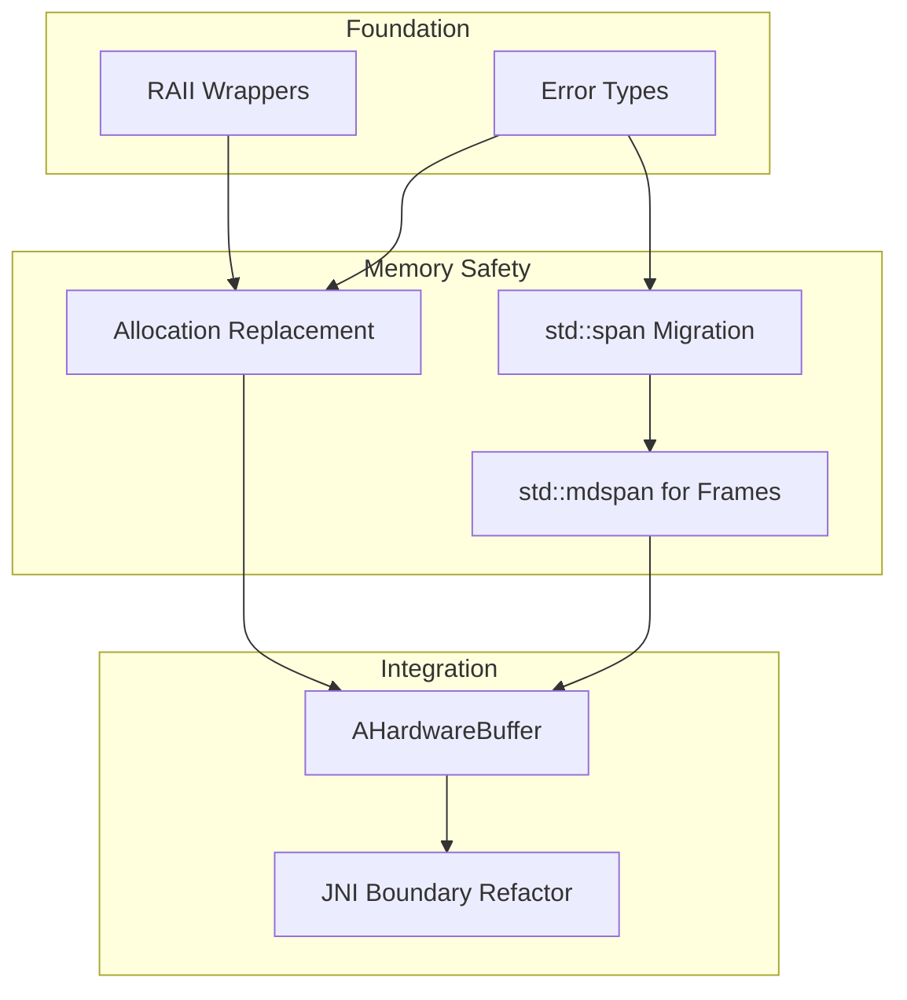

# AUDIT-002: Memory Safety Audit

**Status:** Draft
**Created:** 2026-01-11
**Author:** Jeffrey Litecky / Claude
**Project:** ScopeCam - UVCCamera Library Modernization
**Target:** Android 16 (API 36) / C++23 / NDK r28+
**Prerequisite:** AUDIT-001 (Codebase Reconnaissance) Complete

---

## Executive Summary

This audit catalogs all memory safety hazards in the UVCCamera codebase and maps each to its C++23 mitigation strategy. The goal is a **Zero-Trust Memory Architecture** that maintains the **Zero-Copy** requirement essential for high-speed camera streaming.

**Core Philosophy:** Every raw pointer is guilty until proven safe. Every buffer boundary is a potential exploit vector. Every resource handle is a leak waiting to happen.

**Audit Scope:** All memory allocation, buffer manipulation, pointer arithmetic, and resource handle management in `/jni`
**Expected Duration:** 4-6 hours for complete hazard catalog
**Output Artifacts:** 8 structured deliverables

---

## Table of Contents

1. [Objectives](#1-objectives)
2. [Pre-Audit Requirements](#2-pre-audit-requirements)
3. [Hazard Taxonomy](#3-hazard-taxonomy)
4. [Audit Tasks](#4-audit-tasks)
   - 4.1 [Manual Memory Management Inventory](#41-manual-memory-management-inventory)
   - 4.2 [Buffer Boundary Analysis](#42-buffer-boundary-analysis)
   - 4.3 [Pointer Arithmetic Catalog](#43-pointer-arithmetic-catalog)
   - 4.4 [Resource Handle Audit](#44-resource-handle-audit)
   - 4.5 [Error Handling Pattern Analysis](#45-error-handling-pattern-analysis)
   - 4.6 [JNI Memory Boundary Audit](#46-jni-memory-boundary-audit)
   - 4.7 [Hardware Buffer Integration Analysis](#47-hardware-buffer-integration-analysis)
   - 4.8 [Static Analysis Configuration](#48-static-analysis-configuration)
5. [Mitigation Mapping](#5-mitigation-mapping)
6. [Deliverables](#6-deliverables)
7. [Verification Criteria](#7-verification-criteria)
8. [Agent Instructions](#8-agent-instructions)

---

## 1. Objectives

### Primary Objectives

| ID | Objective | Success Criteria |
|----|-----------|------------------|
| O1 | Catalog all `malloc`/`free`/`new`/`delete` | 100% of allocation sites identified |
| O2 | Map all buffer boundary violations risks | Every `(ptr, len)` pair documented |
| O3 | Inventory all resource handles | FD, USB handles, V4L2 resources catalogued |
| O4 | Document all pointer arithmetic | Every `ptr + offset` expression located |
| O5 | Analyze error handling patterns | All `return -1` patterns mapped to `std::expected` |

### Secondary Objectives

| ID | Objective | Success Criteria |
|----|-----------|------------------|
| O6 | Identify Zero-Copy opportunities | `AHardwareBuffer` integration points mapped |
| O7 | Configure static analysis tooling | Clang-Tidy config producing actionable warnings |
| O8 | Risk-rank all hazards | Severity matrix populated |

### 2026 Engineering Targets

| Legacy Pattern | C++23 Replacement | Zero-Copy Compatible |
|----------------|-------------------|---------------------|
| `uint8_t* data, int len` | `std::span<std::byte>` | ✓ |
| `data[y * width + x]` | `std::mdspan` | ✓ |
| `return -1` on error | `std::expected<T, E>` | N/A |
| `malloc`/`free` | `std::vector` or `std::unique_ptr` | Depends |
| Raw `fd` | RAII `UniqueFd` wrapper | ✓ |
| `libusb_device_handle*` | RAII wrapper with custom deleter | ✓ |
| `SetByteArrayRegion` | `AHardwareBuffer` | ✓✓ (GPU direct) |

---

## 2. Pre-Audit Requirements

### 2.1 Prerequisite Artifacts

| Artifact | Source | Required For |
|----------|--------|--------------|
| INVENTORY-002 | AUDIT-001 | Source file list for scanning |
| INVENTORY-005 | AUDIT-001 | Dependency graph for scope boundaries |
| INVENTORY-006 | AUDIT-001 | Baseline metrics for comparison |

### 2.2 Required Tools

| Tool | Purpose | Installation |
|------|---------|--------------|
| `grep`/`ripgrep` | Pattern searching | System / `cargo install ripgrep` |
| `clang-tidy` | Static analysis | NDK r28+ includes |
| `cppcheck` | Secondary static analysis | `apt install cppcheck` |
| `semgrep` | Pattern-based scanning | `pip install semgrep` |
| `ctags`/`universal-ctags` | Symbol extraction | `apt install universal-ctags` |

### 2.3 Environment Setup

```bash
# Verify clang-tidy from NDK
$ANDROID_NDK_HOME/toolchains/llvm/prebuilt/*/bin/clang-tidy --version

# Install supplementary tools
pip install semgrep
apt install cppcheck universal-ctags ripgrep

# Verify all tools
for cmd in grep rg clang-tidy cppcheck semgrep ctags; do
    command -v $cmd >/dev/null 2>&1 && echo "✓ $cmd" || echo "✗ $cmd MISSING"
done
```

### 2.4 Scan Configuration

```bash
# Define scan scope from AUDIT-001
JNI_PATH="/path/to/jni"
SOURCE_EXTENSIONS="-name '*.c' -o -name '*.cpp' -o -name '*.cc'"
HEADER_EXTENSIONS="-name '*.h' -o -name '*.hpp'"
```

---

## 3. Hazard Taxonomy

### 3.1 Hazard Categories

| Category | Code | Description | Severity Range |
|----------|------|-------------|----------------|
| Manual Memory | MM | malloc/free, new/delete | High-Critical |
| Buffer Overflow | BO | Unchecked array/pointer access | Critical |
| Resource Leak | RL | Unclosed handles, leaked allocations | Medium-High |
| Use After Free | UAF | Access to deallocated memory | Critical |
| Double Free | DF | Multiple deallocations | Critical |
| Null Dereference | ND | Unchecked pointer access | Medium-High |
| Integer Overflow | IO | Size calculations overflow | High |
| Type Confusion | TC | Unsafe casts, aliasing violations | Medium-High |
| Race Condition | RC | Unsynchronized shared memory | High |

### 3.2 Risk Severity Matrix

| Severity | Exploitability | Impact | Examples |
|----------|---------------|--------|----------|
| **Critical** | Remote/Easy | Code Exec/Data Breach | Buffer overflow in frame parsing |
| **High** | Local/Moderate | Crash/Data Corruption | Use-after-free in device disconnect |
| **Medium** | Requires Interaction | DoS/Resource Exhaustion | FD leak on repeated open/close |
| **Low** | Theoretical | Minor/Recoverable | Unnecessary copy in non-hot path |

### 3.3 2026 Mitigation Reference

| Hazard | C++23 Mitigation | Header Required |
|--------|------------------|-----------------|
| MM | `std::unique_ptr`, `std::vector` | `<memory>`, `<vector>` |
| BO | `std::span`, `std::mdspan` | `<span>`, `<mdspan>` |
| RL | RAII wrappers, `std::unique_ptr` + deleter | `<memory>` |
| UAF | Ownership semantics, `std::unique_ptr` | `<memory>` |
| DF | RAII (destructor runs once) | N/A |
| ND | `std::optional`, `std::expected` | `<optional>`, `<expected>` |
| IO | `std::safe_numerics` (P0228), checked math | `<numeric>` |
| TC | `std::bit_cast`, concepts | `<bit>`, `<concepts>` |
| RC | `std::atomic`, `std::jthread` | `<atomic>`, `<thread>` |

---

## 4. Audit Tasks

### 4.1 Manual Memory Management Inventory

**Objective:** Catalog every dynamic allocation and deallocation site

#### 4.1.1 Allocation Pattern Detection

```bash
# C-style allocations
grep -rn 'malloc\s*(' $JNI_PATH --include="*.c" --include="*.cpp" > audit/malloc-sites.txt
grep -rn 'calloc\s*(' $JNI_PATH --include="*.c" --include="*.cpp" > audit/calloc-sites.txt
grep -rn 'realloc\s*(' $JNI_PATH --include="*.c" --include="*.cpp" > audit/realloc-sites.txt
grep -rn 'free\s*(' $JNI_PATH --include="*.c" --include="*.cpp" > audit/free-sites.txt

# C++-style allocations
grep -rn '\bnew\b' $JNI_PATH --include="*.cpp" --include="*.cc" > audit/new-sites.txt
grep -rn '\bdelete\b' $JNI_PATH --include="*.cpp" --include="*.cc" > audit/delete-sites.txt

# Combined summary
echo "=== ALLOCATION SUMMARY ===" > audit/allocation-summary.txt
echo "malloc:  $(wc -l < audit/malloc-sites.txt)" >> audit/allocation-summary.txt
echo "calloc:  $(wc -l < audit/calloc-sites.txt)" >> audit/allocation-summary.txt
echo "realloc: $(wc -l < audit/realloc-sites.txt)" >> audit/allocation-summary.txt
echo "free:    $(wc -l < audit/free-sites.txt)" >> audit/allocation-summary.txt
echo "new:     $(wc -l < audit/new-sites.txt)" >> audit/allocation-summary.txt
echo "delete:  $(wc -l < audit/delete-sites.txt)" >> audit/allocation-summary.txt
```

#### 4.1.2 Allocation/Deallocation Pairing Analysis

For each allocation site, document:

| Field | Description |
|-------|-------------|
| Location | `file:line` |
| Allocation Type | `malloc`/`calloc`/`new`/etc. |
| Size Expression | The size calculation (potential overflow?) |
| Assigned To | Variable name |
| Deallocation Site(s) | Where is it freed? |
| Error Path Coverage | Is it freed on all error paths? |
| Lifetime Scope | Function-local, object member, global? |

#### 4.1.3 Allocation Catalog Template

```markdown
### Allocation: [SYMBOL_NAME]

**Location:** `libuvc/src/stream.c:247`
**Type:** `malloc`
**Size Expression:** `width * height * 2`
**Integer Overflow Risk:** YES — no overflow check before multiplication

**Lifecycle:**
- Allocated: `uvc_stream_start()` line 247
- Deallocated: `uvc_stream_stop()` line 412
- Error paths: NOT COVERED — early return at line 289 leaks

**2026 Mitigation:** Replace with `std::vector<std::byte>` member
**Risk Level:** HIGH
```

#### 4.1.4 Deliverable: SAFETY-001-allocation-inventory.md

Complete catalog of all allocation sites with lifecycle analysis.

---

### 4.2 Buffer Boundary Analysis

**Objective:** Identify all buffer access patterns vulnerable to overflow

#### 4.2.1 Dangerous Function Signatures

```bash
# Find (pointer, length) pairs in function signatures
grep -rn 'uint8_t\s*\*.*,\s*\(int\|size_t\|unsigned\)' $JNI_PATH --include="*.h" --include="*.c" --include="*.cpp" > audit/ptr-len-signatures.txt

# Find void* buffer parameters
grep -rn 'void\s*\*.*buf' $JNI_PATH --include="*.h" --include="*.c" --include="*.cpp" >> audit/ptr-len-signatures.txt

# Find raw array parameters
grep -rn '\[\s*\]' $JNI_PATH --include="*.h" > audit/array-params.txt
```

#### 4.2.2 Buffer Access Pattern Detection

```bash
# Direct array indexing without bounds check
# Pattern: ptr[expr] where expr could exceed bounds
grep -rn '\[[^]]*\*[^]]*\]' $JNI_PATH --include="*.c" --include="*.cpp" > audit/computed-index.txt

# memcpy/memmove without size validation
grep -rn 'memcpy\|memmove\|memset' $JNI_PATH --include="*.c" --include="*.cpp" > audit/mem-functions.txt

# strcpy/strcat (always dangerous)
grep -rn 'strcpy\|strcat\|sprintf\|gets' $JNI_PATH --include="*.c" --include="*.cpp" > audit/unsafe-string.txt
```

#### 4.2.3 Frame Buffer Hot Paths

**Critical for UVCCamera:** Identify all frame data paths

```bash
# Frame-related keywords
grep -rn 'frame\|buffer\|pixel\|yuv\|mjpeg\|jpeg' $JNI_PATH --include="*.c" --include="*.cpp" -i > audit/frame-handling.txt

# YUYV/NV21 conversion (high-risk index math)
grep -rn 'YUYV\|NV21\|NV12\|YUV\|RGB' $JNI_PATH --include="*.c" --include="*.cpp" > audit/colorspace-conversion.txt
```

#### 4.2.4 Buffer Boundary Catalog Template

```markdown
### Buffer Access: [FUNCTION_NAME]

**Location:** `UVCCamera/frame_convert.cpp:156`
**Signature:** `void convert_yuyv_to_rgb(uint8_t* src, uint8_t* dst, int width, int height)`
**Hazard Type:** BO (Buffer Overflow)

**Access Pattern:**
```c
for (int y = 0; y < height; y++) {
    for (int x = 0; x < width; x++) {
        int src_idx = (y * width + x) * 2;      // YUYV: 2 bytes per pixel
        int dst_idx = (y * width + x) * 3;      // RGB: 3 bytes per pixel
        // ... access src[src_idx], dst[dst_idx]
    }
}
```

**Vulnerabilities:**
1. No validation that `src` has `width * height * 2` bytes
2. No validation that `dst` has `width * height * 3` bytes
3. Integer overflow possible in `width * height` if both are large

**2026 Mitigation:**
```cpp
void convert_yuyv_to_rgb(
    std::mdspan<const std::byte, std::dextents<size_t, 2>> src,  // [height][width*2]
    std::mdspan<std::byte, std::dextents<size_t, 2>> dst         // [height][width*3]
) {
    // Bounds checking automatic via mdspan
}
```

**Risk Level:** CRITICAL
**Zero-Copy Compatible:** YES (mdspan is non-owning view)
```

#### 4.2.5 Deliverable: SAFETY-002-buffer-boundaries.md

Complete catalog of buffer boundary hazards.

---

### 4.3 Pointer Arithmetic Catalog

**Objective:** Document all pointer arithmetic for `std::span`/`std::mdspan` migration

#### 4.3.1 Pointer Arithmetic Detection

```bash
# Pointer increment/decrement
grep -rn '\+\+\s*\*\|\*.*\+\+\|--\s*\*\|\*.*--' $JNI_PATH --include="*.c" --include="*.cpp" > audit/ptr-inc-dec.txt

# Pointer addition/subtraction
grep -rn '[a-zA-Z_][a-zA-Z0-9_]*\s*[\+\-]\s*[0-9a-zA-Z_]' $JNI_PATH --include="*.c" --include="*.cpp" | grep '\*' > audit/ptr-arithmetic.txt

# Array-style indexing on pointers (not arrays)
grep -rn '\*[a-zA-Z_][a-zA-Z0-9_]*\s*\[' $JNI_PATH --include="*.c" --include="*.cpp" > audit/ptr-indexing.txt
```

#### 4.3.2 Index Calculation Patterns

```bash
# Multiplication in index (common in image processing)
grep -rn '\[.*\*.*\]' $JNI_PATH --include="*.c" --include="*.cpp" > audit/computed-indices.txt

# The classic (y * width + x) pattern
grep -rn '\*\s*width\s*+\|\*\s*stride\s*+' $JNI_PATH --include="*.c" --include="*.cpp" > audit/2d-index-pattern.txt
```

#### 4.3.3 Pointer Arithmetic Catalog Template

```markdown
### Arithmetic Site: [IDENTIFIER]

**Location:** `libuvc/src/frame.c:89`
**Expression:** `frame->data + offset`
**Context:**
```c
uint8_t* pixel = frame->data + (y * frame->stride) + (x * 2);
```

**Hazards:**
1. `offset` not validated against `frame->data_bytes`
2. `stride` may not equal `width * bytes_per_pixel` (padding)
3. No compile-time or runtime bounds enforcement

**2026 Migration:**
```cpp
// Using mdspan with stride support
auto pixel_view = std::mdspan(
    reinterpret_cast<std::byte*>(frame->data),
    std::layout_stride::mapping(
        std::extents{frame->height, frame->width, 2},
        std::array{frame->stride, 2, 1}
    )
);
auto pixel = pixel_view[y, x, 0];  // Bounds-checked access
```

**Complexity:** HIGH (requires stride-aware mdspan)
**Risk Level:** HIGH
```

#### 4.3.4 Deliverable: SAFETY-003-pointer-arithmetic.md

Complete catalog of pointer arithmetic with migration paths.

---

### 4.4 Resource Handle Audit

**Objective:** Catalog all non-memory resources requiring RAII wrappers

#### 4.4.1 File Descriptor Detection

```bash
# File descriptor operations
grep -rn 'open\s*(\|close\s*(\|read\s*(\|write\s*(\|ioctl\s*(' $JNI_PATH --include="*.c" --include="*.cpp" > audit/fd-operations.txt

# FD variable declarations
grep -rn '\bint\s\+fd\b\|\bint\s\+.*_fd\b' $JNI_PATH --include="*.c" --include="*.cpp" --include="*.h" > audit/fd-declarations.txt

# V4L2 specific
grep -rn 'v4l2_\|V4L2_\|VIDIOC_' $JNI_PATH --include="*.c" --include="*.cpp" > audit/v4l2-usage.txt
```

#### 4.4.2 USB Handle Detection

```bash
# libusb handles
grep -rn 'libusb_device_handle\|libusb_open\|libusb_close\|libusb_claim\|libusb_release' $JNI_PATH --include="*.c" --include="*.cpp" > audit/libusb-handles.txt

# UVC handles
grep -rn 'uvc_device_handle\|uvc_open\|uvc_close\|uvc_stream_handle' $JNI_PATH --include="*.c" --include="*.cpp" > audit/uvc-handles.txt
```

#### 4.4.3 Other Resource Types

```bash
# Thread handles
grep -rn 'pthread_\|std::thread' $JNI_PATH --include="*.c" --include="*.cpp" > audit/thread-handles.txt

# Mutex/synchronization
grep -rn 'pthread_mutex\|std::mutex\|pthread_cond' $JNI_PATH --include="*.c" --include="*.cpp" > audit/sync-primitives.txt

# Memory mappings
grep -rn 'mmap\|munmap' $JNI_PATH --include="*.c" --include="*.cpp" > audit/mmap-usage.txt
```

#### 4.4.4 Resource Lifecycle Analysis

For each resource type, analyze:

| Resource | Acquisition | Release | Error Path Coverage | RAII Candidate |
|----------|-------------|---------|---------------------|----------------|
| USB FD | `open()` | `close()` | ? | `UniqueFd` |
| libusb handle | `libusb_open()` | `libusb_close()` | ? | `unique_ptr<T, D>` |
| V4L2 buffer | `VIDIOC_REQBUFS` | `VIDIOC_REQBUFS(0)` | ? | Custom wrapper |
| mmap region | `mmap()` | `munmap()` | ? | `MappedRegion` |

#### 4.4.5 RAII Wrapper Design Template

```cpp
// Template for UniqueFd wrapper
class UniqueFd {
public:
    UniqueFd() noexcept : fd_(-1) {}
    explicit UniqueFd(int fd) noexcept : fd_(fd) {}
    ~UniqueFd() { if (fd_ >= 0) ::close(fd_); }

    // Move-only
    UniqueFd(UniqueFd&& other) noexcept : fd_(std::exchange(other.fd_, -1)) {}
    UniqueFd& operator=(UniqueFd&& other) noexcept {
        if (this != &other) {
            reset();
            fd_ = std::exchange(other.fd_, -1);
        }
        return *this;
    }
    UniqueFd(const UniqueFd&) = delete;
    UniqueFd& operator=(const UniqueFd&) = delete;

    [[nodiscard]] int get() const noexcept { return fd_; }
    [[nodiscard]] int release() noexcept { return std::exchange(fd_, -1); }
    void reset(int fd = -1) noexcept {
        if (fd_ >= 0) ::close(fd_);
        fd_ = fd;
    }
    [[nodiscard]] explicit operator bool() const noexcept { return fd_ >= 0; }

private:
    int fd_;
};

// Template for libusb handle wrapper
using UniqueUsbHandle = std::unique_ptr<
    libusb_device_handle,
    decltype([](libusb_device_handle* h) { if (h) libusb_close(h); })
>;
```

#### 4.4.6 Deliverable: SAFETY-004-resource-handles.md

Complete catalog of resource handles with RAII wrapper designs.

---

### 4.5 Error Handling Pattern Analysis

**Objective:** Map legacy error patterns to `std::expected`

#### 4.5.1 Return Code Pattern Detection

```bash
# Functions returning int (potential error codes)
grep -rn 'int\s\+[a-zA-Z_][a-zA-Z0-9_]*\s*(' $JNI_PATH --include="*.h" | grep -v '//' > audit/int-return-functions.txt

# Return -1 patterns
grep -rn 'return\s*-1\|return\s*(-1)' $JNI_PATH --include="*.c" --include="*.cpp" > audit/return-minus-one.txt

# Return NULL/nullptr patterns
grep -rn 'return\s*NULL\|return\s*nullptr\|return\s*0\s*;' $JNI_PATH --include="*.c" --include="*.cpp" > audit/return-null.txt

# Error checking patterns
grep -rn 'if\s*(\s*.*\s*<\s*0\s*)\|if\s*(\s*.*\s*==\s*-1\s*)\|if\s*(\s*.*\s*==\s*NULL\s*)' $JNI_PATH --include="*.c" --include="*.cpp" > audit/error-checks.txt
```

#### 4.5.2 Error Code Enumeration Discovery

```bash
# Find error enums/defines
grep -rn 'UVC_ERROR\|UVC_SUCCESS\|LIBUSB_ERROR\|errno' $JNI_PATH --include="*.c" --include="*.cpp" --include="*.h" > audit/error-codes.txt

# Find error strings/messages
grep -rn 'strerror\|perror\|__android_log' $JNI_PATH --include="*.c" --include="*.cpp" > audit/error-messages.txt
```

#### 4.5.3 Error Handling Catalog Template

```markdown
### Error Pattern: [FUNCTION_NAME]

**Location:** `libuvc/src/device.c:342`
**Current Signature:** `int uvc_open(uvc_device_t* dev, uvc_device_handle_t** handle)`
**Return Values:**
- `0` = Success
- `-1` = Generic failure
- `UVC_ERROR_NO_MEM` = Allocation failed
- `UVC_ERROR_ACCESS` = Permission denied

**Call Sites Checked:** 3/7 (43% unchecked)
**Unchecked Call Sites:**
- `UVCCamera.cpp:156` — return value ignored
- `UVCCamera.cpp:289` — cast to bool only
- `stream.c:78` — checked but error not propagated

**2026 Migration:**
```cpp
// Error type definition
enum class UvcError {
    NoMemory,
    AccessDenied,
    DeviceNotFound,
    DeviceBusy,
    InvalidParam,
    IoError,
    Timeout
};

// New signature
std::expected<UniqueUvcHandle, UvcError> uvc_open(uvc_device_t& dev);

// Usage (caller MUST handle error)
auto result = uvc_open(dev);
if (!result) {
    switch (result.error()) {
        case UvcError::AccessDenied: // handle
        // ...
    }
    return std::unexpected(result.error());
}
auto handle = std::move(*result);
```

**Risk Level:** HIGH (silent failures lead to null dereference)
```

#### 4.5.4 Deliverable: SAFETY-005-error-handling.md

Complete error handling pattern analysis with `std::expected` migration plan.

---

### 4.6 JNI Memory Boundary Audit

**Objective:** Identify all JNI boundary crossings and memory transfer hazards

#### 4.6.1 JNI Function Detection

```bash
# JNI function implementations
grep -rn 'JNIEXPORT\|JNIEnv\s*\*' $JNI_PATH --include="*.cpp" --include="*.c" > audit/jni-functions.txt

# JNI array operations (high risk)
grep -rn 'GetByteArrayElements\|ReleaseByteArrayElements\|SetByteArrayRegion\|GetArrayLength' $JNI_PATH --include="*.cpp" > audit/jni-array-ops.txt

# JNI string operations
grep -rn 'GetStringUTFChars\|ReleaseStringUTFChars\|NewStringUTF' $JNI_PATH --include="*.cpp" > audit/jni-string-ops.txt

# JNI direct buffer operations
grep -rn 'GetDirectBufferAddress\|NewDirectByteBuffer\|GetDirectBufferCapacity' $JNI_PATH --include="*.cpp" > audit/jni-direct-buffer.txt

# JNI global/local refs (leak risk)
grep -rn 'NewGlobalRef\|DeleteGlobalRef\|NewLocalRef\|DeleteLocalRef' $JNI_PATH --include="*.cpp" > audit/jni-refs.txt
```

#### 4.6.2 JNI Memory Hazards

| Pattern | Hazard | Detection |
|---------|--------|-----------|
| `GetByteArrayElements` without `Release` | Native memory leak | Pair analysis |
| `SetByteArrayRegion` with wrong length | Buffer overflow | Size validation check |
| `GetStringUTFChars` without `Release` | Memory leak | Pair analysis |
| `NewGlobalRef` without `DeleteGlobalRef` | Reference leak | Pair analysis |
| Direct buffer outlives native allocation | Use-after-free | Lifetime analysis |

#### 4.6.3 JNI Boundary Catalog Template

```markdown
### JNI Boundary: [FUNCTION_NAME]

**Native Signature:**
```cpp
JNIEXPORT jint JNICALL Java_com_example_UVCCamera_nativeGetFrame(
    JNIEnv* env, jobject thiz, jbyteArray frameBuffer)
```

**Memory Operations:**
1. `GetByteArrayElements(frameBuffer, NULL)` at line 45
2. `memcpy(nativePtr, jniPtr, frameSize)` at line 52
3. `ReleaseByteArrayElements(frameBuffer, jniPtr, 0)` at line 58

**Hazards:**
- `frameSize` not validated against `GetArrayLength(frameBuffer)`
- Exception check missing after `GetByteArrayElements`
- Mode `0` copies back — should be `JNI_ABORT` if read-only

**2026 Migration:**
```cpp
// Use AHardwareBuffer for zero-copy GPU path
JNIEXPORT jobject JNICALL Java_com_example_UVCCamera_nativeGetFrameHardwareBuffer(
    JNIEnv* env, jobject thiz)
{
    AHardwareBuffer* buffer = acquireFrameBuffer();  // Zero-copy from USB
    return AHardwareBuffer_toHardwareBuffer(env, buffer);
}
```

**Zero-Copy Opportunity:** YES — frame data can go directly to GPU
**Risk Level:** HIGH
```

#### 4.6.4 Deliverable: SAFETY-006-jni-boundaries.md

Complete JNI boundary audit with `AHardwareBuffer` migration opportunities.

---

### 4.7 Hardware Buffer Integration Analysis

**Objective:** Map paths for `AHardwareBuffer` zero-copy integration

#### 4.7.1 Current Data Flow Analysis

```bash
# Trace frame data from USB to Java
# Step 1: USB bulk transfer receipt
grep -rn 'libusb_bulk_transfer\|usb_bulk_msg' $JNI_PATH --include="*.c" --include="*.cpp" > audit/usb-transfer.txt

# Step 2: Frame assembly/decoding
grep -rn 'uvc_frame\|frame_callback\|mjpeg_decode\|jpeg_decompress' $JNI_PATH --include="*.c" --include="*.cpp" > audit/frame-assembly.txt

# Step 3: Handoff to Java
grep -rn 'SetByteArrayRegion\|DirectByteBuffer\|Surface\|ANativeWindow' $JNI_PATH --include="*.cpp" > audit/java-handoff.txt
```

#### 4.7.2 Current vs Target Data Flow

**Current (Copy-Heavy):**
```
USB Bulk → libusb buffer → uvc_frame malloc → JPEG decode →
  → malloc RGB buffer → memcpy to JNI ByteArray → Java heap →
  → Bitmap → Canvas/GL upload → GPU
```

**Target (Zero-Copy):**
```
USB Bulk → AHardwareBuffer (GPU-visible) → JPEG decode in-place →
  → Direct GPU texture bind → Render
```

#### 4.7.3 AHardwareBuffer Integration Points

| Current Pattern | Location | AHardwareBuffer Replacement |
|-----------------|----------|----------------------------|
| `malloc` frame buffer | `stream.c:XXX` | `AHardwareBuffer_allocate()` |
| `memcpy` to RGB | `convert.cpp:XXX` | Decode directly to HWB |
| `SetByteArrayRegion` | `UVCCamera.cpp:XXX` | Return `HardwareBuffer` object |
| `Bitmap.copyPixelsFromBuffer` | Java layer | `ImageReader` + `HardwareBuffer` |

#### 4.7.4 AHardwareBuffer Requirements

```cpp
// Minimum API level check
#if __ANDROID_API__ >= 26

#include <android/hardware_buffer.h>
#include <android/hardware_buffer_jni.h>

// Allocation for camera frame (RGBA 1920x1080)
AHardwareBuffer_Desc desc = {
    .width = 1920,
    .height = 1080,
    .layers = 1,
    .format = AHARDWAREBUFFER_FORMAT_R8G8B8A8_UNORM,
    .usage = AHARDWAREBUFFER_USAGE_CPU_WRITE_OFTEN |
             AHARDWAREBUFFER_USAGE_GPU_SAMPLED_IMAGE,
};

AHardwareBuffer* buffer = nullptr;
int result = AHardwareBuffer_allocate(&desc, &buffer);

#endif
```

#### 4.7.5 Deliverable: SAFETY-007-hardware-buffer.md

Complete `AHardwareBuffer` integration analysis with migration path.

---

### 4.8 Static Analysis Configuration

**Objective:** Configure Clang-Tidy for automated hazard detection

#### 4.8.1 Clang-Tidy Configuration

```yaml
# .clang-tidy for UVCCamera modernization
---
Checks: >
  -*,
  bugprone-*,
  -bugprone-easily-swappable-parameters,
  cert-*,
  clang-analyzer-*,
  cppcoreguidelines-*,
  -cppcoreguidelines-avoid-magic-numbers,
  -cppcoreguidelines-pro-type-reinterpret-cast,
  modernize-*,
  -modernize-use-trailing-return-type,
  performance-*,
  readability-*,
  -readability-magic-numbers,
  -readability-identifier-length

WarningsAsErrors: >
  bugprone-use-after-move,
  cppcoreguidelines-owning-memory,
  cppcoreguidelines-no-malloc,
  clang-analyzer-core.NullDereference,
  clang-analyzer-unix.Malloc

CheckOptions:
  - key: modernize-use-nullptr.NullMacros
    value: 'NULL'
  - key: cppcoreguidelines-no-malloc.Allocations
    value: '::malloc;::calloc;::realloc'
  - key: cppcoreguidelines-no-malloc.Deallocations
    value: '::free'
  - key: modernize-pass-by-value.IncludeStyle
    value: llvm
  - key: readability-identifier-naming.ClassCase
    value: CamelCase
  - key: readability-identifier-naming.FunctionCase
    value: lower_case
  - key: readability-identifier-naming.VariableCase
    value: lower_case

FormatStyle: file

HeaderFilterRegex: '.*'

# C++23 standard
ExtraArgs:
  - '-std=c++23'
  - '-DANDROID'
  - '-D__ANDROID_API__=36'
```

#### 4.8.2 Critical Checks Explanation

| Check | Detects | Severity |
|-------|---------|----------|
| `cppcoreguidelines-no-malloc` | C-style allocation | High |
| `cppcoreguidelines-owning-memory` | Raw owning pointers | High |
| `bugprone-use-after-move` | Use after move | Critical |
| `clang-analyzer-core.NullDereference` | Null pointer access | Critical |
| `clang-analyzer-unix.Malloc` | malloc/free misuse | High |
| `modernize-use-nullptr` | NULL vs nullptr | Low |
| `modernize-use-auto` | Type inference opportunity | Low |
| `cppcoreguidelines-pro-bounds-*` | Array bounds issues | High |

#### 4.8.3 Semgrep Rules for Memory Safety

```yaml
# semgrep-memory-safety.yaml
rules:
  - id: unchecked-malloc
    patterns:
      - pattern: |
          $PTR = malloc(...);
          ...
          $PTR[$IDX]
      - pattern-not: |
          $PTR = malloc(...);
          if ($PTR == NULL) { ... }
          ...
          $PTR[$IDX]
    message: "malloc result used without NULL check"
    severity: ERROR
    languages: [c, cpp]

  - id: buffer-size-mismatch
    patterns:
      - pattern: memcpy($DST, $SRC, $SIZE)
      - metavariable-pattern:
          metavariable: $SIZE
          pattern-not: sizeof($DST)
    message: "memcpy size may not match destination buffer"
    severity: WARNING
    languages: [c, cpp]

  - id: fd-leak-on-error
    patterns:
      - pattern: |
          $FD = open(...);
          ...
          if (...) { return ...; }
      - pattern-not: |
          $FD = open(...);
          ...
          if (...) { close($FD); return ...; }
    message: "File descriptor may leak on error path"
    severity: ERROR
    languages: [c, cpp]
```

#### 4.8.4 Run Static Analysis

```bash
#!/bin/bash
# run-static-analysis.sh

JNI_PATH="${1:-./jni}"
OUTPUT_DIR="audit/static-analysis"
mkdir -p "$OUTPUT_DIR"

# Clang-Tidy
echo "Running Clang-Tidy..."
find "$JNI_PATH" -name "*.cpp" -o -name "*.c" | while read -r file; do
    clang-tidy "$file" \
        --config-file=.clang-tidy \
        -- -std=c++23 -I"$JNI_PATH" \
        2>&1
done > "$OUTPUT_DIR/clang-tidy-report.txt"

# Cppcheck
echo "Running Cppcheck..."
cppcheck --enable=all --std=c++23 \
    --suppress=missingIncludeSystem \
    --xml "$JNI_PATH" 2> "$OUTPUT_DIR/cppcheck-report.xml"

# Semgrep
echo "Running Semgrep..."
semgrep --config=semgrep-memory-safety.yaml \
    --json "$JNI_PATH" > "$OUTPUT_DIR/semgrep-report.json"

# Summary
echo "=== STATIC ANALYSIS SUMMARY ===" > "$OUTPUT_DIR/summary.txt"
echo "Clang-Tidy warnings: $(grep -c 'warning:' $OUTPUT_DIR/clang-tidy-report.txt)" >> "$OUTPUT_DIR/summary.txt"
echo "Clang-Tidy errors: $(grep -c 'error:' $OUTPUT_DIR/clang-tidy-report.txt)" >> "$OUTPUT_DIR/summary.txt"
echo "Cppcheck findings: $(grep -c '<error' $OUTPUT_DIR/cppcheck-report.xml)" >> "$OUTPUT_DIR/summary.txt"
echo "Semgrep findings: $(jq '.results | length' $OUTPUT_DIR/semgrep-report.json)" >> "$OUTPUT_DIR/summary.txt"
```

#### 4.8.5 Deliverable: SAFETY-008-static-analysis-config/

Directory containing:
- `.clang-tidy` configuration
- `semgrep-memory-safety.yaml` rules
- `run-static-analysis.sh` script
- Initial analysis reports

---

## 5. Mitigation Mapping

### 5.1 Master Hazard Catalog Format

All hazards from Tasks 4.1-4.7 should be consolidated into a master catalog:

```markdown
| ID | Location | Hazard Type | Legacy Code | 2026 Mitigation | Risk | Zero-Copy | Effort |
|----|----------|-------------|-------------|-----------------|------|-----------|--------|
| MM-001 | stream.c:247 | Manual Memory | `malloc(size)` | `std::vector<std::byte>` | High | No | Low |
| BO-001 | convert.cpp:156 | Buffer Overflow | `ptr[y*w+x]` | `std::mdspan` | Critical | Yes | Med |
| RL-001 | device.c:89 | Resource Leak | `open()/close()` | `UniqueFd` | Med | Yes | Low |
| ... | ... | ... | ... | ... | ... | ... | ... |
```

### 5.2 Risk Level Definitions

| Risk | Definition | Implementation Priority |
|------|------------|------------------------|
| **Critical** | Exploitable, data corruption possible | Must fix before any release |
| **High** | Crash likely, resource exhaustion | Fix in initial modernization |
| **Medium** | Edge case failures, minor leaks | Fix in second pass |
| **Low** | Code quality, maintainability | Fix opportunistically |

### 5.3 Effort Estimation

| Effort | Definition | Typical Changes |
|--------|------------|-----------------|
| **Low** | Drop-in replacement | `malloc` → `vector`, `NULL` → `nullptr` |
| **Medium** | Signature changes, call site updates | `(ptr, len)` → `span`, error handling |
| **High** | Architectural refactor | `AHardwareBuffer` integration, async model |

### 5.4 Implementation Dependencies



---

## 6. Deliverables

### 6.1 Deliverable Checklist

| ID | Deliverable | Format | Status |
|----|-------------|--------|--------|
| SAFETY-001 | Allocation Inventory | Markdown | ☐ |
| SAFETY-002 | Buffer Boundaries | Markdown | ☐ |
| SAFETY-003 | Pointer Arithmetic | Markdown | ☐ |
| SAFETY-004 | Resource Handles | Markdown | ☐ |
| SAFETY-005 | Error Handling | Markdown | ☐ |
| SAFETY-006 | JNI Boundaries | Markdown | ☐ |
| SAFETY-007 | Hardware Buffer | Markdown | ☐ |
| SAFETY-008 | Static Analysis Config | Directory | ☐ |
| SAFETY-009 | Master Hazard Catalog | CSV | ☐ |

### 6.2 Deliverable Output Structure

```
audit/
├── AUDIT-002-memory-safety.md           # This document
├── SAFETY-001-allocation-inventory.md
├── SAFETY-002-buffer-boundaries.md
├── SAFETY-003-pointer-arithmetic.md
├── SAFETY-004-resource-handles.md
├── SAFETY-005-error-handling.md
├── SAFETY-006-jni-boundaries.md
├── SAFETY-007-hardware-buffer.md
├── SAFETY-008-static-analysis-config/
│   ├── .clang-tidy
│   ├── semgrep-memory-safety.yaml
│   ├── run-static-analysis.sh
│   └── reports/
│       ├── clang-tidy-report.txt
│       ├── cppcheck-report.xml
│       └── semgrep-report.json
├── SAFETY-009-master-hazard-catalog.csv
└── raw/
    ├── malloc-sites.txt
    ├── free-sites.txt
    ├── ptr-len-signatures.txt
    ├── fd-operations.txt
    ├── jni-array-ops.txt
    └── [all other grep outputs]
```

---

## 7. Verification Criteria

### 7.1 Completeness Verification

| Criterion | Verification Method | Pass/Fail |
|-----------|-------------------|-----------|
| All `malloc` sites cataloged | Compare grep count to SAFETY-001 | ☐ |
| All `free` sites cataloged | Compare grep count to SAFETY-001 | ☐ |
| All `(ptr, len)` signatures found | Cross-ref SAFETY-002 with header scan | ☐ |
| All FD operations documented | Compare grep count to SAFETY-004 | ☐ |
| All JNI functions audited | Compare to AUDIT-001 JNI file list | ☐ |
| Static analysis configured | All tools run without error | ☐ |

### 7.2 Quality Gates

| Gate | Requirement | Threshold |
|------|-------------|-----------|
| Completeness | All deliverables produced | 9/9 |
| Coverage | % of source files scanned | 100% |
| Static Analysis | All tools execute | 3/3 |
| Hazard Catalog | All entries have mitigation | 100% |

### 7.3 Cross-Reference Validation

```bash
# Verify allocation count matches
MALLOC_GREP=$(grep -rc 'malloc\s*(' $JNI_PATH --include="*.c" --include="*.cpp" | awk -F: '{sum += $2} END {print sum}')
MALLOC_CATALOG=$(grep -c '^| MM-' audit/SAFETY-009-master-hazard-catalog.csv)
echo "malloc: grep=$MALLOC_GREP catalog=$MALLOC_CATALOG"

# Verify FD operations covered
FD_OPS=$(grep -c 'open\|close\|ioctl' audit/fd-operations.txt)
FD_CATALOG=$(grep -c 'RL-' audit/SAFETY-009-master-hazard-catalog.csv)
echo "FD ops: found=$FD_OPS catalog=$FD_CATALOG"
```

---

## 8. Agent Instructions

### 8.1 Investigation-First Methodology

**CRITICAL:** Before documenting ANY hazard, agents MUST:

1. **SHOW** the grep/search command executed
2. **SHOW** the raw output (first 20 lines if large)
3. **ANALYZE** the pattern found
4. **CLASSIFY** using the hazard taxonomy
5. **THEN** document in the catalog format

**Example of correct workflow:**

```
Agent: Searching for malloc sites...
$ grep -rn 'malloc\s*(' ./jni --include="*.c"

Output:
libuvc/src/stream.c:247:    frame->data = malloc(frame->data_bytes);
libuvc/src/device.c:89:     dev->usb_buffer = malloc(USB_BUFFER_SIZE);
UVCCamera/UVCCamera.cpp:156: rgb_buffer = (uint8_t*)malloc(width * height * 3);

Analysis: Found 3 malloc sites. Examining each...

[stream.c:247] - Frame data allocation
- Size: frame->data_bytes (validated at line 240)
- Freed at: stream.c:412 (uvc_stream_stop)
- Error paths: Line 289 returns without free - LEAK
- Classification: MM (Manual Memory), RL (Resource Leak)
- Risk: HIGH

Documenting in SAFETY-001...
```

### 8.2 Execution Order

```
1. Verify AUDIT-001 artifacts available (prerequisite)
2. Execute allocation inventory (Task 4.1)
3. Execute buffer boundary analysis (Task 4.2)
4. Execute pointer arithmetic catalog (Task 4.3)
5. Execute resource handle audit (Task 4.4)
6. Execute error handling analysis (Task 4.5)
7. Execute JNI boundary audit (Task 4.6)
8. Execute hardware buffer analysis (Task 4.7)
9. Configure and run static analysis (Task 4.8)
10. Consolidate master hazard catalog (Section 5)
11. Verify all deliverables (Section 7)
```

### 8.3 Hazard Classification Rules

| If you find... | Classify as... | Risk default... |
|----------------|----------------|-----------------|
| `malloc`/`free` pair | MM | High |
| `malloc` without matching `free` | MM + RL | Critical |
| `(ptr, len)` function signature | BO | High |
| `ptr[computed_index]` | BO | High |
| `ptr + offset` | BO | Medium |
| `return -1` error pattern | Error Handling | Medium |
| `open()` without RAII | RL | Medium |
| JNI `Get*Elements` without `Release` | RL + JNI | High |
| `memcpy` with computed size | BO + IO | High |

### 8.4 Error Handling

| Error | Recovery Action |
|-------|----------------|
| Static analysis tool missing | Document gap, proceed with available tools |
| grep returns empty | Verify path, document if genuinely absent |
| Large file (>1000 hits) | Sample first 100, note incompleteness |
| Ambiguous pattern | Flag for human review in catalog |

### 8.5 Progress Reporting

```
[AUDIT-002] Task 4.1 Complete: Allocation Inventory
  - malloc sites: N
  - free sites: N
  - Unpaired allocations: N (CRITICAL)
  - Leaks on error paths: N (HIGH)

[AUDIT-002] Task 4.2 Complete: Buffer Boundaries
  - (ptr, len) signatures: N
  - Computed index patterns: N
  - Zero-copy candidates: N
```

---

## Appendix A: C++23 Migration Quick Reference

### std::span Usage

```cpp
// Before
void process(uint8_t* data, size_t len) {
    for (size_t i = 0; i < len; i++) {
        data[i] = transform(data[i]);
    }
}

// After
void process(std::span<uint8_t> data) {
    for (auto& byte : data) {
        byte = transform(byte);
    }
}

// Or with const correctness
void analyze(std::span<const std::byte> data);
```

### std::mdspan for 2D Frame Data

```cpp
// Before
void process_frame(uint8_t* data, int width, int height, int stride) {
    for (int y = 0; y < height; y++) {
        for (int x = 0; x < width; x++) {
            uint8_t pixel = data[y * stride + x];
        }
    }
}

// After (C++23)
void process_frame(std::mdspan<uint8_t, std::dextents<size_t, 2>> frame) {
    for (size_t y = 0; y < frame.extent(0); y++) {
        for (size_t x = 0; x < frame.extent(1); x++) {
            uint8_t pixel = frame[y, x];  // Bounds-checked
        }
    }
}

// With stride support
auto frame = std::mdspan(
    data,
    std::layout_stride::mapping(
        std::extents{height, width},
        std::array{stride, 1}
    )
);
```

### std::expected Error Handling

```cpp
// Before
int open_device(const char* path, device_t** out) {
    *out = malloc(sizeof(device_t));
    if (!*out) return -1;

    (*out)->fd = open(path, O_RDWR);
    if ((*out)->fd < 0) {
        free(*out);
        return -2;
    }
    return 0;
}

// After
enum class DeviceError { OutOfMemory, PermissionDenied, NotFound };

std::expected<UniqueDevice, DeviceError> open_device(std::string_view path) {
    auto dev = std::make_unique<device_t>();

    dev->fd = UniqueFd(open(path.data(), O_RDWR));
    if (!dev->fd) {
        return std::unexpected(
            errno == EACCES ? DeviceError::PermissionDenied
                           : DeviceError::NotFound
        );
    }

    return dev;  // Implicit conversion to expected
}
```

---

## Appendix B: Hazard Catalog CSV Schema

```csv
id,location,file,line,hazard_type,legacy_code,mitigation,risk,zero_copy,effort,status,notes
MM-001,libuvc/src/stream.c,stream.c,247,Manual Memory,"malloc(frame->data_bytes)","std::vector<std::byte>",High,No,Low,Pending,"Frame data allocation"
BO-001,UVCCamera/convert.cpp,convert.cpp,156,Buffer Overflow,"src[y * width + x]","std::mdspan",Critical,Yes,Medium,Pending,"YUYV conversion"
RL-001,libuvc/src/device.c,device.c,89,Resource Leak,"fd = open(...)",UniqueFd,Medium,Yes,Low,Pending,"Device file descriptor"
```

---

## Appendix C: Static Analysis Expected Findings

| Tool | Check | Expected Count | Action |
|------|-------|----------------|--------|
| Clang-Tidy | `cppcoreguidelines-no-malloc` | ~50 | Catalog all |
| Clang-Tidy | `cppcoreguidelines-owning-memory` | ~30 | Catalog all |
| Clang-Tidy | `bugprone-sizeof-expression` | ~10 | Review each |
| Cppcheck | `memleak` | ~5 | Verify with manual analysis |
| Cppcheck | `nullPointer` | ~15 | Catalog all |
| Semgrep | `unchecked-malloc` | ~20 | Catalog all |
| Semgrep | `fd-leak-on-error` | ~10 | Catalog all |

---

## Appendix D: Advanced std::mdspan Considerations for Frame Processing

### D.1 The YUYV Format Challenge

UVCCamera handles YUYV 4:2:2 packed format, which creates a semantic mismatch for C++ abstractions:

**Memory Layout:** `Y0 U0 Y1 V0 Y2 U2 Y3 V2 ...`
- Pixel 0: (Y0, U0, V0)
- Pixel 1: (Y1, U0, V0) — shares chroma with Pixel 0
- Two pixels form a 32-bit "macropixel"

**The Abstraction Problem:**
- `std::span<uint8_t>` loses pixel concept entirely
- `std::mdspan<uint8_t, Height, Width*2>` loses pixel boundaries
- `std::mdspan<uint8_t, Height, Width>` has inconsistent semantics (Y vs U/V depending on x)

### D.2 Custom Layout for YUYV (Recommended Pattern)

```cpp
// Map logical pixel coordinates to macropixel indices
struct layout_yuyv_macropixel {
    using index_type = size_t;

    static constexpr auto mapping(index_type y, index_type x,
                                   index_type width, index_type height) {
        // Each macropixel covers 2 horizontal pixels
        return y * (width / 2) + (x >> 1);
    }
};

// Access as 32-bit macropixels containing Y0 U0 Y1 V0
using YUYVFrame = std::mdspan<
    uint32_t,
    std::dextents<size_t, 2>,
    layout_yuyv_macropixel
>;
```

**Benefits:**
- `x >> 1` is single-cycle ARM instruction (vs multiplication)
- 4-byte aligned access optimal for Cortex-X cores
- Format complexity hidden in layout class

### D.3 Cache Tiling Strategy for Zero-Copy Pipeline

**The Memory Wall Problem:**

A 4K YUYV frame occupies ~16MB, exceeding typical SLC (8MB on Tensor G5). Linear processing with `std::span` causes:
1. Compulsory cache misses for entire frame
2. Intermediate RGB data evicted before next pipeline stage
3. ~70MB DRAM traffic for Convert + Resize pipeline

**Tiled Processing with std::mdspan:**

```cpp
// Process in L2-resident tiles (256x256 = 128KB per plane)
constexpr size_t TILE_H = 256;
constexpr size_t TILE_W = 256;

for (size_t y = 0; y < height; y += TILE_H) {
    for (size_t x = 0; x < width; x += TILE_W) {
        auto src_tile = std::submdspan(src,
            std::tuple{y, std::min(y + TILE_H, height)},
            std::tuple{x, std::min(x + TILE_W, width)});
        auto dst_tile = std::submdspan(dst, /* same */);

        // Convert + process while tile is L2-resident
        convert_and_process(src_tile, dst_tile);
    }
}
```

**Bandwidth Reduction:**
| Pipeline | Linear (std::span) | Tiled (std::mdspan) |
|----------|-------------------|---------------------|
| Convert + Resize | ~70MB DRAM | ~22MB DRAM |
| **Reduction** | — | **68%** |

### D.4 SVE2 Vectorization Considerations (ARMv9)

**The LD4 Instruction:**
SVE2 `LD4B` loads contiguous memory and de-interleaves into 4 vector registers:
```
Memory: Y0 U0 Y1 V0 Y2 U2 Y3 V2 ...
Z0: Y0 Y2 Y4 Y6 ...  (all Y)
Z1: U0 U2 U4 U6 ...  (all U)
Z2: Y1 Y3 Y5 Y7 ...  (all Y)
Z3: V0 V2 V4 V6 ...  (all V)
```

**Compiler Vectorization Failure with layout_stride:**

When `std::mdspan` uses generic `layout_stride`, compilers see:
```cpp
ptr + i * stride  // Non-unit stride assumed
```

The compiler cannot prove contiguity → falls back to scalar or gather loads (4-8x slower).

**Solution: Custom Accessor with ACLE Intrinsics:**
```cpp
struct sve2_yuyv_accessor {
    template<class Handle, class Offset>
    static auto access(Handle ptr, Offset idx) {
        // Use ARM ACLE intrinsics directly
        return svld4_u8(svptrue_b8(),
                        reinterpret_cast<const uint8_t*>(ptr + idx));
    }
};
```

This hybrid approach retains `mdspan` composability while forcing optimal instruction generation.

### D.5 Audit Integration

During Phase 2 buffer boundary analysis (Task 4.2), identify:

1. **Colorspace conversion functions** — candidates for `std::mdspan` refactor
2. **Frame processing loops** — tiling opportunities
3. **ARM-specific optimizations** — existing NEON/SVE code to preserve or upgrade
4. **Stride handling** — current padding/alignment assumptions

---

## Appendix E: V4L2 data_offset Integration

### E.1 NV12 Plane Offset Requirements

When ScopeCam outputs NV12 to video encoders or display:

**Correct Offset Calculation:**
```cpp
// Gralloc determines actual stride (may include padding)
size_t y_plane_size = aligned_stride * height;

// UV plane offset for encoder
v4l2_plane planes[2];
planes[0].m.fd = dmabuf_fd;
planes[0].data_offset = 0;           // Y starts at 0
planes[1].m.fd = dmabuf_fd;          // Same FD (single allocation)
planes[1].data_offset = y_plane_size; // UV starts after padded Y
```

**The "Green Line" Failure Mode:**
If `data_offset` is calculated using logical size instead of aligned size:
- UV data read from wrong location
- YUV (0,0,0) → Green in RGB
- Visible as green bar at bottom of frame

### E.2 Audit Task Addition

Add to Task 4.2 (Buffer Boundary Analysis):

**V4L2 Plane Offset Verification:**
```bash
# Find V4L2 buffer setup
grep -rn 'v4l2_plane\|data_offset\|VIDIOC_QBUF' $JNI_PATH --include="*.c" --include="*.cpp"

# Find NV12/YUV format handling
grep -rn 'NV12\|NV21\|V4L2_PIX_FMT' $JNI_PATH --include="*.c" --include="*.cpp"
```

Document whether the library correctly propagates Gralloc-provided offsets to V4L2 drivers.

---

## Revision History

| Version | Date | Author | Changes |
|---------|------|--------|---------|
| 0.1 | 2026-01-11 | Claude | Initial draft |
| 0.2 | 2026-01-11 | Claude | Added std::mdspan analysis, cache tiling, SVE2 vectorization, V4L2 data_offset |

---

*End of AUDIT-002*
