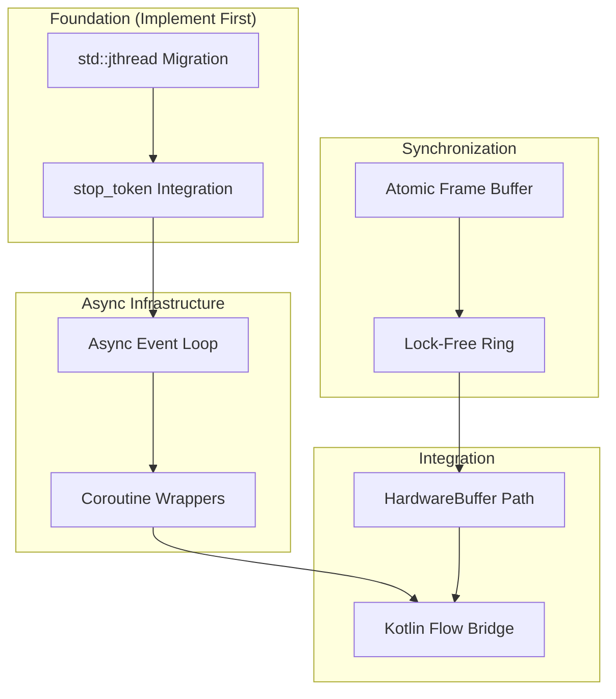
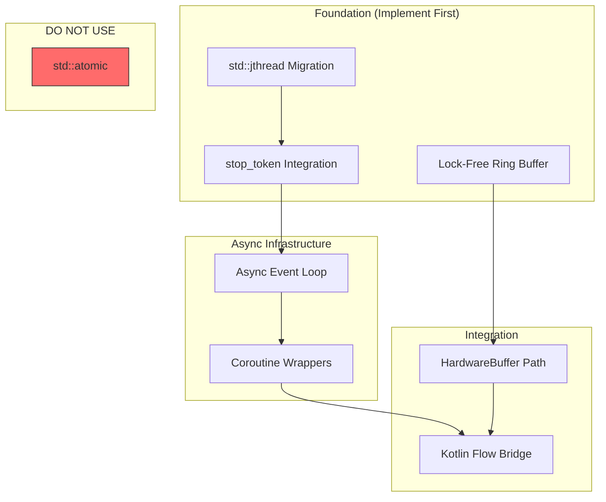

# AUDIT-003: Concurrency Analysis

**Status:** Draft
**Created:** 2026-01-11
**Author:** Jeffrey Litecky / Claude
**Project:** ScopeCam - UVCCamera Library Modernization
**Target:** Android 16 (API 36) / C++20/23 / NDK r28+
**Prerequisites:** AUDIT-001 (Codebase Reconnaissance), AUDIT-002 (Memory Safety) Complete

---

## Executive Summary

This audit catalogs all concurrency primitives, synchronization mechanisms, and threading architectures in the UVCCamera codebase. The goal is to map a migration path from legacy pthread-based concurrency to modern C++20/23 structured concurrency that eliminates **Deadlock-on-Disconnect** bugs, **ANR (Application Not Responding)** conditions, and **frame jitter** caused by improper thread scheduling.

**Core Philosophy:** Every thread must have a cooperative cancellation path. Every lock is a potential deadlock. Every blocking call is an ANR waiting to happen.

**Critical Problem Statement:** Legacy USB camera drivers use "fire-and-forget" pthreads that cannot be cleanly cancelled when hardware disconnects. This leads to ghost threads, resource leaks, and the infamous "Device Busy" error on reconnection.

**Audit Scope:** All threading, synchronization, and asynchronous patterns in `/jni`
**Expected Duration:** 4-6 hours for complete concurrency map
**Output Artifacts:** 9 structured deliverables

---

## Table of Contents

1. [Objectives](#1-objectives)
2. [Pre-Audit Requirements](#2-pre-audit-requirements)
3. [Concurrency Hazard Taxonomy](#3-concurrency-hazard-taxonomy)
4. [Audit Tasks](#4-audit-tasks)
   - 4.1 [Thread Creation Inventory](#41-thread-creation-inventory)
   - 4.2 [Synchronization Primitive Catalog](#42-synchronization-primitive-catalog)
   - 4.3 [Blocking Operation Analysis](#43-blocking-operation-analysis)
   - 4.4 [Frame Capture Loop Architecture](#44-frame-capture-loop-architecture)
   - 4.5 [Shutdown and Cancellation Path Analysis](#45-shutdown-and-cancellation-path-analysis)
   - 4.6 [Lock Contention Hot Spots](#46-lock-contention-hot-spots)
   - 4.7 [Thread Scheduling and Priority Analysis](#47-thread-scheduling-and-priority-analysis)
   - 4.8 [JNI Thread Boundary Audit](#48-jni-thread-boundary-audit)
   - 4.9 [Coroutine Migration Feasibility](#49-coroutine-migration-feasibility)
5. [Migration Mapping](#5-migration-mapping)
6. [Deliverables](#6-deliverables)
7. [Verification Criteria](#7-verification-criteria)
8. [Agent Instructions](#8-agent-instructions)

---

## 1. Objectives

### Primary Objectives

| ID | Objective | Success Criteria |
|----|-----------|------------------|
| O1 | Catalog all thread creation sites | 100% of `pthread_create`/`std::thread` identified |
| O2 | Map all synchronization primitives | Every mutex, condvar, semaphore documented |
| O3 | Identify all blocking operations | Every `poll`/`select`/`ioctl`/`read` catalogued |
| O4 | Document frame capture loop architecture | Complete data flow from USB to JNI |
| O5 | Analyze shutdown/cancellation paths | Every thread termination mechanism documented |

### Secondary Objectives

| ID | Objective | Success Criteria |
|----|-----------|------------------|
| O6 | Identify lock contention hot spots | Mutexes accessed from multiple threads mapped |
| O7 | Assess coroutine migration feasibility | Blocking operations ranked by migration difficulty |
| O8 | Document thread scheduling issues | Priority settings and core affinity analyzed |
| O9 | Map JNI thread attachment points | All `AttachCurrentThread` calls documented |

### 2026 Engineering Targets

| Legacy Pattern | C++20/23 Replacement | Benefit |
|----------------|---------------------|---------|
| `pthread_create` | `std::jthread` | Auto-join, built-in stop_token |
| `pthread_mutex_t` | **Lock-free ring buffer** (NOT atomic<shared_ptr>!) | True wait-free, no blocking |
| `pthread_cond_t` | `std::atomic_wait` / `notify_one` | Lower wake-up latency |
| `is_running` boolean | `std::stop_token` | Cooperative cancellation |
| `poll()`/`select()` | Coroutine `co_await` on epoll | Better battery life |
| Manual thread priorities | `AScheduledExecutor` / core pinning | Reduced jitter |
| Blocking `while` loop | `async_generator` | Non-blocking frame stream |

**⚠️ CRITICAL WARNING:** Do NOT use `std::atomic<std::shared_ptr>` for frame buffers. Despite C++20 standardization, libc++ implements it using a **global mutex pool**, making it blocking and unsuitable for high-frequency frame delivery. See Appendix A for corrected implementation.

---

## 2. Pre-Audit Requirements

### 2.1 Prerequisite Artifacts

| Artifact | Source | Required For |
|----------|--------|--------------|
| INVENTORY-002 | AUDIT-001 | Source file list for scanning |
| INVENTORY-005 | AUDIT-001 | Dependency graph for thread boundaries |
| SAFETY-004 | AUDIT-002 | Resource handle lifetime (affects thread cleanup) |

### 2.2 Required Tools

| Tool | Purpose | Installation |
|------|---------|--------------|
| `grep`/`ripgrep` | Pattern searching | System / `cargo install ripgrep` |
| `ThreadSanitizer` | Runtime race detection | Clang/GCC built-in |
| `Helgrind` | Valgrind-based race detector | `apt install valgrind` |
| `ctags` | Symbol extraction | `apt install universal-ctags` |
| `cflow` | Call graph generation | `apt install cflow` |

### 2.3 Environment Setup

```bash
# Verify threading analysis tools
for cmd in grep rg ctags cflow; do
    command -v $cmd >/dev/null 2>&1 && echo "✓ $cmd" || echo "✗ $cmd MISSING"
done

# ThreadSanitizer requires clang
clang++ --version | head -1

# Define scan scope
JNI_PATH="/path/to/jni"
```

### 2.4 Key Files to Prioritize

Based on typical UVCCamera structure, prioritize analysis of:

| File Pattern | Expected Content |
|--------------|------------------|
| `*Preview*.cpp` | Frame capture thread |
| `*Camera*.cpp` | Device management, JNI bridge |
| `stream.c` | libuvc streaming implementation |
| `device.c` | USB device handle management |

---

## 3. Concurrency Hazard Taxonomy

### 3.1 Hazard Categories

| Category | Code | Description | Severity Range |
|----------|------|-------------|----------------|
| Deadlock | DL | Circular lock dependency | Critical |
| Race Condition | RC | Unsynchronized shared access | Critical |
| Ghost Thread | GT | Thread survives owner destruction | High |
| Priority Inversion | PI | Low-priority thread blocks high-priority | Medium-High |
| ANR Risk | ANR | Main/UI thread blocked >5s | Critical |
| Starvation | ST | Thread never acquires resource | Medium |
| Spurious Wakeup | SW | Condvar wakeup without predicate | Low-Medium |
| Lock Convoy | LC | Threads serialize on hot lock | Medium |
| ABA Problem | ABA | Lock-free CAS hazard | High |

### 3.2 USB Camera-Specific Hazards

| Hazard | Description | Typical Cause |
|--------|-------------|---------------|
| **Deadlock-on-Disconnect** | Thread blocks forever on disconnected device | Blocking `ioctl`/`read` without timeout |
| **Device Busy on Reconnect** | Previous instance didn't release handle | Ghost thread holding USB handle |
| **Frame Stutter** | Visible jitter at 60fps | Mutex contention in hot path |
| **ANR on Close** | App hangs when closing camera | `pthread_join` waiting for blocked thread |
| **Thermal Throttle Jitter** | Inconsistent frame timing | OS migrating thread between cores |

### 3.3 Risk Severity Matrix

| Severity | User Impact | Examples |
|----------|-------------|----------|
| **Critical** | App crash, data loss, ANR dialog | Deadlock in JNI, uncancellable thread |
| **High** | Functional degradation, requires restart | Ghost thread, device busy error |
| **Medium** | Visible quality issues | Frame stutter, inconsistent timing |
| **Low** | Suboptimal performance | Unnecessary wakeups, extra copies |

---

## 4. Audit Tasks

### 4.1 Thread Creation Inventory

**Objective:** Catalog every thread creation and document lifecycle

#### 4.1.1 Thread Creation Detection

```bash
# POSIX thread creation
grep -rn 'pthread_create\s*(' $JNI_PATH --include="*.c" --include="*.cpp" > audit/pthread-create.txt

# C++ thread creation
grep -rn 'std::thread\s*(' $JNI_PATH --include="*.cpp" > audit/std-thread.txt

# Java thread creation via JNI (spawning from native)
grep -rn 'NewObject.*Thread\|CallVoidMethod.*start' $JNI_PATH --include="*.cpp" > audit/jni-thread.txt

# Thread function definitions (often named *_thread or *Thread)
grep -rn 'void\s*\*\s*[a-zA-Z_]*[Tt]hread\s*(' $JNI_PATH --include="*.c" --include="*.cpp" > audit/thread-functions.txt

# Summary
echo "=== THREAD CREATION SUMMARY ===" > audit/thread-summary.txt
echo "pthread_create: $(wc -l < audit/pthread-create.txt)" >> audit/thread-summary.txt
echo "std::thread: $(wc -l < audit/std-thread.txt)" >> audit/thread-summary.txt
echo "JNI thread: $(wc -l < audit/jni-thread.txt)" >> audit/thread-summary.txt
```

#### 4.1.2 Thread Lifecycle Analysis

For each thread creation site, document:

| Field | Description |
|-------|-------------|
| Location | `file:line` |
| Thread Name | Variable or identifier |
| Entry Function | The function pointer passed to `pthread_create` |
| Creation Context | Where/when is this thread spawned? |
| Join Site | Where is `pthread_join` called? |
| Detach? | Is `pthread_detach` called? |
| Cancellation Mechanism | How is this thread signaled to stop? |
| Resources Held | What handles/memory does this thread own? |

#### 4.1.3 Thread Catalog Template

```markdown
### Thread: [THREAD_NAME]

**Location:** `UVCCamera/UVCPreview.cpp:156`
**Entry Function:** `capture_thread_func`
**Creation Context:** Called from `startPreview()` when camera opens

**Lifecycle:**
- Created: `startPreview()` line 156
- Joined: `stopPreview()` line 289 — **BUT** join can block indefinitely
- Detached: NO

**Cancellation Mechanism:**
```cpp
// Current implementation
volatile bool is_running = true;  // Shared boolean
while (is_running) {
    int ret = ioctl(fd, VIDIOC_DQBUF, &buf);  // BLOCKS HERE
    // ...
}
```

**Hazards:**
1. `ioctl` blocks indefinitely if device disconnects → **DEADLOCK-ON-DISCONNECT**
2. `is_running` is `volatile` not `atomic` → **RACE CONDITION**
3. No timeout on blocking call → **ANR RISK**

**2026 Migration:**
```cpp
void capture_thread_func(std::stop_token st) {
    while (!st.stop_requested()) {
        auto result = co_await async_ioctl(fd, VIDIOC_DQBUF, &buf, 100ms);
        if (!result) continue;  // Timeout or stop requested
        // ...
    }
}

std::jthread capture_thread{capture_thread_func};
// Destructor automatically requests stop and joins
```

**Risk Level:** CRITICAL (ANR, Deadlock-on-Disconnect)
**Migration Effort:** HIGH (requires coroutine infrastructure)
```

#### 4.1.4 Deliverable: CONCURRENCY-001-thread-inventory.md

Complete catalog of all threads with lifecycle analysis.

---

### 4.2 Synchronization Primitive Catalog

**Objective:** Document all locks, condition variables, and atomics

#### 4.2.1 Mutex Detection

```bash
# POSIX mutexes
grep -rn 'pthread_mutex_t\|pthread_mutex_init\|pthread_mutex_lock\|pthread_mutex_unlock\|pthread_mutex_destroy' $JNI_PATH --include="*.c" --include="*.cpp" > audit/pthread-mutex.txt

# C++ mutexes
grep -rn 'std::mutex\|std::lock_guard\|std::unique_lock\|std::scoped_lock' $JNI_PATH --include="*.cpp" > audit/std-mutex.txt

# Recursive mutexes (often a code smell)
grep -rn 'pthread_mutex.*RECURSIVE\|std::recursive_mutex' $JNI_PATH --include="*.c" --include="*.cpp" > audit/recursive-mutex.txt
```

#### 4.2.2 Condition Variable Detection

```bash
# POSIX condition variables
grep -rn 'pthread_cond_t\|pthread_cond_init\|pthread_cond_wait\|pthread_cond_signal\|pthread_cond_broadcast' $JNI_PATH --include="*.c" --include="*.cpp" > audit/pthread-cond.txt

# C++ condition variables
grep -rn 'std::condition_variable\|\.wait\s*(\|\.notify_' $JNI_PATH --include="*.cpp" > audit/std-condvar.txt
```

#### 4.2.3 Atomic Operations Detection

```bash
# C atomics
grep -rn 'atomic_\|_Atomic\|__atomic_\|__sync_' $JNI_PATH --include="*.c" --include="*.cpp" > audit/c-atomics.txt

# C++ atomics
grep -rn 'std::atomic\|\.load\s*(\|\.store\s*(\|\.exchange\s*(\|\.compare_exchange' $JNI_PATH --include="*.cpp" > audit/cpp-atomics.txt

# Volatile (often misused for synchronization)
grep -rn '\bvolatile\b' $JNI_PATH --include="*.c" --include="*.cpp" > audit/volatile-usage.txt
```

#### 4.2.4 Other Synchronization Primitives

```bash
# Semaphores
grep -rn 'sem_t\|sem_init\|sem_wait\|sem_post\|std::counting_semaphore\|std::binary_semaphore' $JNI_PATH --include="*.c" --include="*.cpp" > audit/semaphores.txt

# Read-write locks
grep -rn 'pthread_rwlock\|std::shared_mutex\|std::shared_lock' $JNI_PATH --include="*.c" --include="*.cpp" > audit/rwlocks.txt

# Spinlocks (usually problematic on mobile)
grep -rn 'pthread_spin\|spinlock' $JNI_PATH --include="*.c" --include="*.cpp" > audit/spinlocks.txt

# Barriers
grep -rn 'pthread_barrier\|std::barrier\|std::latch' $JNI_PATH --include="*.c" --include="*.cpp" > audit/barriers.txt
```

#### 4.2.5 Synchronization Primitive Catalog Template

```markdown
### Primitive: [MUTEX_NAME]

**Type:** `pthread_mutex_t`
**Location:** `UVCPreview.h:45` (declaration), initialized at `UVCPreview.cpp:67`

**Protected Resource:** `mFrameBuffer` — shared frame data between capture and render threads

**Lock Sites:**
| Location | Context | Hold Duration |
|----------|---------|---------------|
| `UVCPreview.cpp:178` | Capture thread writes frame | ~1ms (memcpy) |
| `UVCPreview.cpp:234` | JNI thread reads frame | ~0.5ms (GetByteArrayRegion) |
| `UVCPreview.cpp:312` | Render thread draws | ~2ms (GL upload) |

**Contention Analysis:**
- At 60fps, capture writes every 16.6ms
- JNI reads triggered by Java at ~60Hz
- Potential for lock convoy if JNI and render collide

**Hazards:**
1. Three-way contention → **LOCK CONVOY** at high frame rates
2. JNI thread holds lock during Java callback → **PRIORITY INVERSION**
3. No timeout on lock acquisition → **ANR RISK** if capture stalls

**2026 Migration:**

**⚠️ WARNING:** Do NOT use `std::atomic<std::shared_ptr>` — it uses a global mutex pool in libc++ (see Appendix A).

```cpp
// ✅ CORRECT: Lock-free triple buffer (truly wait-free)
class LockFreeFrameBuffer {
    alignas(64) std::array<FrameBuffer, 3> buffers_;
    alignas(64) std::atomic<uint32_t> write_idx_{0};
    alignas(64) std::atomic<uint32_t> read_idx_{1};

public:
    // Capture thread (producer) - wait-free, never blocks
    FrameBuffer& write_buffer() {
        return buffers_[write_idx_.load(std::memory_order_relaxed)];
    }

    void publish() {
        uint32_t next = (write_idx_.load(std::memory_order_relaxed) + 1) % 3;
        if (next == read_idx_.load(std::memory_order_acquire)) next = (next + 1) % 3;
        write_idx_.store(next, std::memory_order_release);
    }

    // Render/JNI thread (consumer) - wait-free, never blocks capture
    const FrameBuffer* read_buffer() {
        uint32_t latest = write_idx_.load(std::memory_order_acquire);
        read_idx_.store(latest, std::memory_order_release);
        return &buffers_[latest];
    }
};
```

**Risk Level:** MEDIUM (Lock convoy, potential ANR)
**Migration Effort:** MEDIUM (requires lock-free buffer implementation)

#### 4.2.6 Deliverable: CONCURRENCY-002-sync-primitives.md

Complete catalog of synchronization primitives with contention analysis.

---

### 4.3 Blocking Operation Analysis

**Objective:** Identify all operations that can block a thread indefinitely

#### 4.3.1 I/O Blocking Detection

```bash
# File/device I/O
grep -rn '\bread\s*(\|\bwrite\s*(\|readv\|writev' $JNI_PATH --include="*.c" --include="*.cpp" > audit/blocking-io.txt

# ioctl (V4L2 operations)
grep -rn 'ioctl\s*(' $JNI_PATH --include="*.c" --include="*.cpp" > audit/ioctl-calls.txt

# USB transfers
grep -rn 'libusb_bulk_transfer\|libusb_interrupt_transfer\|libusb_control_transfer' $JNI_PATH --include="*.c" --include="*.cpp" > audit/usb-transfers.txt
```

#### 4.3.2 Polling/Select Detection

```bash
# poll/select/epoll
grep -rn '\bpoll\s*(\|\bselect\s*(\|epoll_wait\|epoll_ctl' $JNI_PATH --include="*.c" --include="*.cpp" > audit/poll-select.txt

# Timeout values in poll/select
grep -rn 'poll\s*([^,]*,[^,]*,\s*-1\s*)' $JNI_PATH --include="*.c" --include="*.cpp" > audit/infinite-poll.txt
```

#### 4.3.3 Sleep/Wait Detection

```bash
# Sleep calls
grep -rn 'sleep\s*(\|usleep\s*(\|nanosleep\|std::this_thread::sleep' $JNI_PATH --include="*.c" --include="*.cpp" > audit/sleep-calls.txt

# Timed waits
grep -rn 'pthread_cond_timedwait\|wait_for\|wait_until' $JNI_PATH --include="*.c" --include="*.cpp" > audit/timed-waits.txt
```

#### 4.3.4 V4L2-Specific Blocking Operations

```bash
# V4L2 ioctls that block
grep -rn 'VIDIOC_DQBUF\|VIDIOC_QBUF\|VIDIOC_STREAMON\|VIDIOC_STREAMOFF' $JNI_PATH --include="*.c" --include="*.cpp" > audit/v4l2-blocking.txt

# Memory mapping (blocks during setup)
grep -rn 'mmap\s*(' $JNI_PATH --include="*.c" --include="*.cpp" > audit/mmap-calls.txt
```

#### 4.3.5 Blocking Operation Catalog Template

```markdown
### Blocking Operation: [OPERATION]

**Location:** `libuvc/src/stream.c:342`
**Operation:** `ioctl(fd, VIDIOC_DQBUF, &buf)`
**Blocking Duration:** Indefinite (waits for next frame or device disconnect)

**Context:**
```c
// Current implementation
while (strmh->running) {
    ret = ioctl(strmh->fd, VIDIOC_DQBUF, &buf);  // Blocks here
    if (ret < 0) {
        if (errno == EAGAIN) continue;
        break;  // Device error or disconnect
    }
    // Process frame
}
```

**Hazards:**
1. If device disconnects, `ioctl` may block forever → **DEADLOCK-ON-DISCONNECT**
2. No way to interrupt from another thread → **ANR on stopPreview()**
3. Thread cannot respond to `stop_token` while blocked

**Timeout Analysis:**
- Current timeout: NONE (infinite block)
- Required for safe operation: 100-500ms

**2026 Migration Options:**

**Option A: Non-blocking with poll**
```cpp
// Set O_NONBLOCK on fd
int flags = fcntl(fd, F_GETFL);
fcntl(fd, F_SETFL, flags | O_NONBLOCK);

while (!st.stop_requested()) {
    pollfd pfd = {fd, POLLIN, 0};
    int ret = poll(&pfd, 1, 100);  // 100ms timeout
    if (ret == 0) continue;  // Timeout, check stop_token
    if (ret < 0) break;      // Error

    ret = ioctl(fd, VIDIOC_DQBUF, &buf);  // Now non-blocking
    // ...
}
```

**Option B: Coroutine with async epoll**
```cpp
async_generator<Frame> stream_frames(int fd, std::stop_token st) {
    while (!st.stop_requested()) {
        auto ready = co_await async_poll(fd, POLLIN, 100ms);
        if (!ready) continue;

        v4l2_buffer buf{};
        if (ioctl(fd, VIDIOC_DQBUF, &buf) == 0) {
            co_yield Frame{buf};
        }
    }
}
```

**Risk Level:** CRITICAL (Deadlock-on-Disconnect, ANR)
**Migration Effort:** HIGH (requires async infrastructure)
```

#### 4.3.6 Deliverable: CONCURRENCY-003-blocking-ops.md

Complete catalog of blocking operations with timeout analysis.

---

### 4.4 Frame Capture Loop Architecture

**Objective:** Document the complete data flow from USB to JNI

#### 4.4.1 Capture Loop Detection

```bash
# Main capture loops (while + running patterns)
grep -rn 'while\s*(\s*[a-zA-Z_]*running\|while\s*(\s*!\s*[a-zA-Z_]*stop\|while\s*(\s*true\s*)' $JNI_PATH --include="*.c" --include="*.cpp" > audit/capture-loops.txt

# Frame callback patterns
grep -rn 'frame_callback\|onFrame\|frameCallback\|FrameCallback' $JNI_PATH --include="*.c" --include="*.cpp" --include="*.h" > audit/frame-callbacks.txt

# Frame processing functions
grep -rn 'process.*[Ff]rame\|handle.*[Ff]rame\|decode.*[Ff]rame' $JNI_PATH --include="*.c" --include="*.cpp" > audit/frame-processing.txt
```

#### 4.4.2 Data Flow Mapping

Document the complete frame journey:

```
┌─────────────────────────────────────────────────────────────────────────────┐
│                        FRAME DATA FLOW ANALYSIS                              │
├─────────────────────────────────────────────────────────────────────────────┤
│                                                                              │
│  ┌──────────────┐    ┌──────────────┐    ┌──────────────┐    ┌────────────┐ │
│  │  USB Bulk    │───▶│  libusb      │───▶│  libuvc      │───▶│  Callback  │ │
│  │  Transfer    │    │  buffer      │    │  frame       │    │  function  │ │
│  └──────────────┘    └──────────────┘    └──────────────┘    └─────┬──────┘ │
│                                                                     │        │
│                                          ┌──────────────────────────┘        │
│                                          │                                   │
│                                          ▼                                   │
│  ┌──────────────┐    ┌──────────────┐    ┌──────────────┐    ┌────────────┐ │
│  │  GPU/Surface │◀───│  JNI         │◀───│  Mutex-      │◀───│  JPEG      │ │
│  │  Render      │    │  Boundary    │    │  guarded buf │    │  Decode    │ │
│  └──────────────┘    └──────────────┘    └──────────────┘    └────────────┘ │
│                                                                              │
│  Thread boundaries: ─ ─ ─ ─ ─ ─ ─ ─ ─ ─ ─ ─ ─ ─ ─ ─ ─ ─ ─ ─ ─ ─ ─ ─ ─ ─ ─  │
│                                                                              │
│  [USB IRQ] → [libusb event thread] → [capture thread] → [JNI/Java thread]   │
│                                                                              │
└─────────────────────────────────────────────────────────────────────────────┘
```

#### 4.4.3 Capture Loop Analysis Template

```markdown
### Capture Loop: [COMPONENT]

**Location:** `UVCCamera/UVCPreview.cpp:167-245`
**Thread:** `capture_thread` (spawned by `startPreview()`)

**Loop Structure:**
```cpp
void* capture_thread_func(void* arg) {
    UVCPreview* preview = (UVCPreview*)arg;

    while (preview->mIsRunning) {                    // [1] Loop control
        pthread_mutex_lock(&preview->capture_mutex); // [2] Lock acquisition

        // [3] Blocking operation
        int ret = uvc_stream_get_frame(
            preview->mStreamHandle,
            &frame,
            10000  // 10ms timeout... but often ignored
        );

        if (ret == 0 && frame) {
            // [4] Frame processing (under lock!)
            preview->processFrame(frame);
        }

        pthread_mutex_unlock(&preview->capture_mutex); // [5] Lock release
    }

    return NULL;
}
```

**Analysis:**

| Step | Issue | Severity |
|------|-------|----------|
| [1] | `mIsRunning` is not atomic | Medium (RC) |
| [2] | Lock held during blocking operation | High (ANR) |
| [3] | Timeout may not be respected by libuvc | Critical (DL) |
| [4] | Frame processing under lock increases contention | Medium (LC) |
| [5] | Lock release doesn't happen if exception thrown | Medium (RL) |

**Frame Rate Impact:**
- At 60fps: 16.6ms per frame
- Lock hold time: ~5-10ms (includes memcpy + potential JPEG decode)
- Theoretical max throughput: ~60-100fps
- Actual observed: ~45fps due to contention

**2026 Target Architecture:**
```cpp
async_generator<Frame> capture_frames(std::stop_token st) {
    while (!st.stop_requested()) {
        // Non-blocking frame acquisition with timeout
        auto frame_result = co_await uvc_async_get_frame(stream_handle, 100ms);

        if (!frame_result) continue;  // Timeout or error

        // Decode without holding any locks
        auto decoded = decode_frame(*frame_result);

        // Yield to consumer (atomic swap, no mutex)
        co_yield std::move(decoded);
    }
}
```

**Risk Level:** HIGH (Multiple concurrency hazards)
**Migration Effort:** HIGH (Complete architectural change)
```

#### 4.4.4 Deliverable: CONCURRENCY-004-capture-architecture.md

Complete frame capture loop documentation with data flow diagrams.

---

### 4.5 Shutdown and Cancellation Path Analysis

**Objective:** Document how threads are stopped and resources released

#### 4.5.1 Shutdown Signal Detection

```bash
# Boolean flags used for shutdown
grep -rn 'is_running\|isRunning\|mRunning\|m_running\|bRunning\|running_\|_running' $JNI_PATH --include="*.c" --include="*.cpp" --include="*.h" > audit/running-flags.txt

# Stop/shutdown functions
grep -rn 'stop\|Stop\|shutdown\|Shutdown\|terminate\|Terminate\|cancel\|Cancel' $JNI_PATH --include="*.c" --include="*.cpp" --include="*.h" | grep -v '//' > audit/stop-functions.txt

# Thread join operations
grep -rn 'pthread_join\|\.join\s*(' $JNI_PATH --include="*.c" --include="*.cpp" > audit/thread-joins.txt
```

#### 4.5.2 Cancellation Mechanism Analysis

```bash
# pthread_cancel (dangerous, often broken)
grep -rn 'pthread_cancel\|pthread_setcancelstate\|pthread_setcanceltype' $JNI_PATH --include="*.c" --include="*.cpp" > audit/pthread-cancel.txt

# Signal-based interruption
grep -rn 'pthread_kill\|raise\s*(\|signal\s*(' $JNI_PATH --include="*.c" --include="*.cpp" > audit/signal-interruption.txt

# Eventfd/pipe for wakeup
grep -rn 'eventfd\|pipe\s*(' $JNI_PATH --include="*.c" --include="*.cpp" > audit/wakeup-mechanisms.txt
```

#### 4.5.3 Shutdown Path Trace

For each thread, trace the complete shutdown sequence:

```markdown
### Shutdown Path: [THREAD_NAME]

**Trigger:** `Java_com_example_UVCCamera_nativeStopPreview()` called

**Expected Sequence:**
1. JNI calls `stopPreview()`
2. `stopPreview()` sets `mIsRunning = false`
3. Capture thread checks flag, exits loop
4. `stopPreview()` calls `pthread_join(capture_thread, NULL)`
5. Resources released, function returns

**Actual Behavior (Hazardous):**
```
JNI Thread                     Capture Thread
    │                               │
    │  stopPreview()                │
    │      │                        │
    │      ▼                        │
    │  mIsRunning = false           │  while(mIsRunning) {
    │      │                        │      │
    │      │                        │      ▼
    │      │                        │  ioctl(VIDIOC_DQBUF) ← BLOCKED
    │      │                        │      │
    │      ▼                        │      │ (device disconnected)
    │  pthread_join() ─────────────────────│ (waits forever)
    │      │                        │      │
    │      ▼                        │      │
    │  ╔═══════════════════════════════════╧════╗
    │  ║           ANR AFTER 5 SECONDS          ║
    │  ╚════════════════════════════════════════╝
```

**Hazards:**
1. `pthread_join` blocks calling thread (JNI/main thread)
2. Blocked `ioctl` prevents flag check
3. No timeout on join operation
4. ANR if capture thread doesn't exit within 5s

**2026 Migration:**
```cpp
class CaptureController {
    std::jthread capture_thread_;

public:
    void stop() {
        // Request stop (non-blocking)
        capture_thread_.request_stop();

        // jthread destructor will join, but we can also
        // detach if we want immediate return
    }

    ~CaptureController() {
        // Destructor automatically:
        // 1. Calls request_stop()
        // 2. Joins the thread
        // Thread function checks stop_token and exits promptly
    }
};
```

**Risk Level:** CRITICAL (ANR on normal shutdown path)
**Migration Effort:** MEDIUM (jthread + stop_token)
```

#### 4.5.4 Deliverable: CONCURRENCY-005-shutdown-paths.md

Complete shutdown path analysis for all threads.

---

### 4.6 Lock Contention Hot Spots

**Objective:** Identify high-frequency lock acquisitions that cause stutter

#### 4.6.1 Lock Frequency Estimation

```bash
# Count lock operations per file
for file in $(find $JNI_PATH -name "*.c" -o -name "*.cpp"); do
    locks=$(grep -c 'pthread_mutex_lock\|\.lock\s*(' "$file" 2>/dev/null || echo 0)
    if [ "$locks" -gt 0 ]; then
        echo "$locks $file"
    fi
done | sort -rn > audit/lock-frequency.txt

# Find functions with multiple lock operations
grep -B5 -A5 'pthread_mutex_lock' $JNI_PATH --include="*.c" --include="*.cpp" > audit/lock-context.txt
```

#### 4.6.2 Contention Point Identification

For high-traffic mutexes, identify all accessor threads:

| Mutex | Thread A | Thread B | Thread C | Frequency | Contention Risk |
|-------|----------|----------|----------|-----------|-----------------|
| `frame_mutex` | Capture (write) | JNI (read) | Render (read) | 60/sec | HIGH |
| `device_mutex` | Init (write) | Status (read) | - | 1/sec | LOW |
| `callback_mutex` | Capture | JNI callback | - | 60/sec | MEDIUM |

#### 4.6.3 Lock Hold Time Analysis

```bash
# Find lock/unlock pairs and estimate hold time
# Look for long operations between lock and unlock
grep -A50 'pthread_mutex_lock' $JNI_PATH --include="*.c" --include="*.cpp" | \
    grep -B50 'pthread_mutex_unlock' > audit/lock-hold-analysis.txt
```

#### 4.6.4 Contention Hot Spot Template

```markdown
### Hot Spot: [MUTEX_NAME]

**Location:** `UVCPreview.cpp` - `mFrameMutex`
**Contention Threads:** Capture, JNI, Render (3-way)

**Access Pattern:**
```
Timeline (16.6ms frame period at 60fps):
├─ 0ms: Capture acquires lock, writes frame (~3ms)
├─ 3ms: Capture releases lock
├─ 4ms: JNI acquires lock, copies to ByteArray (~2ms)
├─ 6ms: JNI releases lock
├─ 7ms: Render acquires lock, uploads to GPU (~4ms)
├─ 11ms: Render releases lock
├─ 12ms: (5ms idle before next frame)
└─ 16.6ms: Next frame arrives

Serialization overhead: 9ms / 16.6ms = 54% of frame time!
```

**Impact:**
- Frame drops when any operation overruns
- Micro-stutter visible in preview
- Battery drain from unnecessary thread wake/sleep cycles

**2026 Lock-Free Migration:**
```cpp
// Triple-buffer with atomic index
struct TripleBuffer {
    std::array<FrameBuffer, 3> buffers;
    std::atomic<int> write_idx{0};
    std::atomic<int> read_idx{1};

    FrameBuffer& get_write_buffer() {
        return buffers[write_idx.load(std::memory_order_acquire)];
    }

    void publish() {
        int next = (write_idx.load() + 1) % 3;
        if (next == read_idx.load(std::memory_order_acquire)) {
            next = (next + 1) % 3;  // Skip buffer being read
        }
        write_idx.store(next, std::memory_order_release);
    }

    const FrameBuffer& get_read_buffer() {
        read_idx.store(write_idx.load(std::memory_order_acquire),
                       std::memory_order_release);
        return buffers[read_idx.load()];
    }
};
```

**Risk Level:** MEDIUM (Performance degradation, stutter)
**Migration Effort:** MEDIUM (Lock-free data structure)
```

#### 4.6.5 Deliverable: CONCURRENCY-006-lock-contention.md

Lock contention analysis with serialization overhead calculations.

---

### 4.7 Thread Scheduling and Priority Analysis

**Objective:** Document thread priorities and core affinity settings

#### 4.7.1 Priority Setting Detection

```bash
# POSIX thread attributes
grep -rn 'pthread_attr_\|sched_param\|sched_setscheduler\|setpriority\|nice\s*(' $JNI_PATH --include="*.c" --include="*.cpp" > audit/thread-priority.txt

# Android-specific scheduling
grep -rn 'ANDROID_PRIORITY\|androidSetThreadPriority\|set_sched_policy' $JNI_PATH --include="*.c" --include="*.cpp" > audit/android-priority.txt

# CPU affinity
grep -rn 'sched_setaffinity\|CPU_SET\|CPU_ZERO\|pthread_setaffinity' $JNI_PATH --include="*.c" --include="*.cpp" > audit/cpu-affinity.txt
```

#### 4.7.2 Thread Priority Inventory

| Thread | Current Priority | Recommended | Rationale |
|--------|-----------------|-------------|-----------|
| Capture | Default (Normal) | High / RT | Must not miss USB packets |
| Decode | Default | Above Normal | CPU-intensive but not time-critical |
| Render | Default | High | Needs consistent frame delivery |
| JNI Callback | Java default | Normal | Java manages this |

#### 4.7.3 Core Affinity Analysis

```markdown
### Thread Scheduling: [CAPTURE_THREAD]

**Current Configuration:**
- Priority: Not set (inherits default)
- Affinity: Not set (OS decides)
- Scheduler: SCHED_OTHER (time-sharing)

**Observed Problems on Pixel 9:**
1. OS migrates capture thread to Little core during "light" workload
2. Frame processing latency spikes when moved back to Big core
3. Thermal throttling causes inconsistent scheduling

**2026 Recommendations:**

**For NDK r28+ with AScheduledExecutor:**
```cpp
#include <android/scheduled_executor.h>

// Pin capture to performance cores
AScheduledExecutor* executor = AScheduledExecutor_create(
    ASCHEDULED_EXECUTOR_TYPE_PERFORMANCE
);

AScheduledExecutor_execute(executor, [&](std::stop_token st) {
    while (!st.stop_requested()) {
        capture_frame();
    }
});
```

**Alternative: Manual affinity (API 28+):**
```cpp
#include <sched.h>

void set_high_performance_affinity() {
    cpu_set_t cpuset;
    CPU_ZERO(&cpuset);

    // Assume cores 4-7 are Big cores (device-specific!)
    for (int i = 4; i < 8; i++) {
        CPU_SET(i, &cpuset);
    }

    sched_setaffinity(0, sizeof(cpuset), &cpuset);

    // Also set real-time priority
    struct sched_param param;
    param.sched_priority = sched_get_priority_max(SCHED_FIFO);
    sched_setscheduler(0, SCHED_FIFO, &param);
}
```

**Risk Level:** MEDIUM (Frame jitter, thermal issues)
**Migration Effort:** LOW (Configuration change)
```

#### 4.7.4 Deliverable: CONCURRENCY-007-thread-scheduling.md

Thread scheduling analysis with Android-specific recommendations.

---

### 4.8 JNI Thread Boundary Audit

**Objective:** Document all cross-JNI thread operations

#### 4.8.1 JNI Thread Attachment Detection

```bash
# Thread attachment
grep -rn 'AttachCurrentThread\|DetachCurrentThread\|GetEnv' $JNI_PATH --include="*.cpp" --include="*.c" > audit/jni-thread-attach.txt

# JNI calls from native threads
grep -rn 'CallVoidMethod\|CallObjectMethod\|CallIntMethod\|CallBooleanMethod' $JNI_PATH --include="*.cpp" > audit/jni-callbacks.txt

# Global references (often held across threads)
grep -rn 'NewGlobalRef\|DeleteGlobalRef' $JNI_PATH --include="*.cpp" > audit/jni-global-refs.txt
```

#### 4.8.2 JNI Thread Safety Analysis

```markdown
### JNI Boundary: [FRAME_CALLBACK]

**Location:** `UVCCamera.cpp:234`
**Context:** Native capture thread calling Java callback

**Current Implementation:**
```cpp
void frame_callback(uvc_frame_t* frame, void* user_ptr) {
    UVCCamera* camera = (UVCCamera*)user_ptr;

    JNIEnv* env;
    bool attached = false;

    // Attach to JVM from native thread
    if (camera->jvm->GetEnv((void**)&env, JNI_VERSION_1_6) != JNI_OK) {
        camera->jvm->AttachCurrentThread(&env, NULL);
        attached = true;
    }

    // Copy frame to Java byte array
    jbyteArray jarray = env->NewByteArray(frame->data_bytes);
    env->SetByteArrayRegion(jarray, 0, frame->data_bytes,
                            (jbyte*)frame->data);

    // Call Java callback
    env->CallVoidMethod(camera->callback_obj, camera->onFrame_method, jarray);

    // Cleanup
    env->DeleteLocalRef(jarray);

    if (attached) {
        camera->jvm->DetachCurrentThread();  // EXPENSIVE!
    }
}
```

**Hazards:**
1. `AttachCurrentThread`/`DetachCurrentThread` per frame is EXPENSIVE (~50μs each)
2. At 60fps: 100μs × 60 = 6ms overhead per second just for attach/detach
3. `callback_obj` global ref could be invalidated if Java GC runs
4. No exception check after `CallVoidMethod` — exception on Java side crashes native

**2026 Migration:**

**Option A: Persistent Thread Attachment**
```cpp
class JniThreadGuard {
    JavaVM* jvm_;
    bool attached_ = false;

public:
    JniThreadGuard(JavaVM* jvm) : jvm_(jvm) {
        JNIEnv* env;
        if (jvm_->GetEnv((void**)&env, JNI_VERSION_1_6) != JNI_OK) {
            jvm_->AttachCurrentThread(&env, NULL);
            attached_ = true;
        }
    }

    ~JniThreadGuard() {
        if (attached_) {
            jvm_->DetachCurrentThread();
        }
    }
};

// Attach once at thread start, detach at thread end
void capture_thread_func(std::stop_token st) {
    JniThreadGuard jni_guard(g_jvm);  // Attach for thread lifetime

    while (!st.stop_requested()) {
        auto frame = get_frame();
        deliver_to_java(frame);  // No attach/detach per frame
    }
}  // Detach happens here
```

**Option B: Use AHardwareBuffer (no JNI callback)**
```cpp
// Pass HardwareBuffer directly to Java via return value
// No callback needed, Java polls for frames via ImageReader
```

**Risk Level:** MEDIUM (Performance overhead, potential crashes)
**Migration Effort:** LOW-MEDIUM
```

#### 4.8.3 Deliverable: CONCURRENCY-008-jni-threads.md

JNI thread boundary audit with optimization strategies.

---

### 4.9 Coroutine Migration Feasibility

**Objective:** Assess which blocking patterns can migrate to C++20 coroutines

#### 4.9.1 Coroutine Candidate Identification

For each blocking operation identified in Task 4.3, assess:

| Operation | Coroutine Candidate | Complexity | Benefit |
|-----------|--------------------|-----------| --------|
| `ioctl(VIDIOC_DQBUF)` | YES | HIGH | Eliminates blocking |
| `libusb_bulk_transfer` | YES | HIGH | Async USB I/O |
| `poll()` | YES | MEDIUM | Native async support |
| `pthread_cond_wait` | MAYBE | LOW | std::atomic_wait simpler |
| `sleep()` | YES | LOW | std::this_thread::sleep_for |

#### 4.9.2 Async Infrastructure Requirements

```cpp
// Required infrastructure for coroutine-based capture

// 1. Epoll-based event loop
class AsyncEventLoop {
    int epoll_fd_;
    std::jthread event_thread_;

public:
    // Register fd for async notification
    void register_fd(int fd, std::coroutine_handle<> continuation);

    // Awaitable for poll-like behavior
    struct PollAwaiter {
        AsyncEventLoop& loop;
        int fd;
        int events;
        std::chrono::milliseconds timeout;

        bool await_ready() { return false; }
        void await_suspend(std::coroutine_handle<> h);
        int await_resume();  // Returns poll result
    };
};

// 2. Async ioctl wrapper
template<typename... Args>
struct AsyncIoctl {
    int fd;
    unsigned long request;
    std::tuple<Args...> args;

    bool await_ready() { return false; }
    void await_suspend(std::coroutine_handle<> h) {
        // Submit to event loop, resume when fd is ready
    }
    int await_resume() {
        return std::apply([this](auto&&... a) {
            return ioctl(fd, request, std::forward<decltype(a)>(a)...);
        }, args);
    }
};

// 3. Frame generator coroutine
async_generator<Frame> stream_frames(int fd, std::stop_token st) {
    AsyncEventLoop loop;

    while (!st.stop_requested()) {
        // Await readability with timeout
        auto poll_result = co_await loop.poll(fd, POLLIN, 100ms);

        if (poll_result <= 0) continue;  // Timeout or error

        v4l2_buffer buf{};
        int ret = ioctl(fd, VIDIOC_DQBUF, &buf);
        if (ret < 0) continue;

        co_yield Frame{buf};

        ioctl(fd, VIDIOC_QBUF, &buf);  // Return buffer
    }
}
```

#### 4.9.3 Migration Complexity Assessment

| Component | Current State | Coroutine Migration | Effort |
|-----------|--------------|--------------------| -------|
| Frame capture loop | pthread + blocking | async_generator | HIGH |
| USB transfer | libusb sync | libusb async + coroutine wrapper | HIGH |
| Frame delivery to Java | JNI callback | Flow bridge or polling | MEDIUM |
| Shutdown signaling | volatile bool | stop_token | LOW |
| Mutex contention | pthread_mutex | Lock-free + atomic | MEDIUM |

#### 4.9.4 Coroutine Architecture Diagram

```
┌─────────────────────────────────────────────────────────────────────────────┐
│                     2026 COROUTINE-BASED ARCHITECTURE                        │
├─────────────────────────────────────────────────────────────────────────────┤
│                                                                              │
│  Kotlin Layer (Flow-based)                                                   │
│  ┌────────────────────────────────────────────────────────────────────────┐ │
│  │  cameraFlow.collect { frame ->                                         │ │
│  │      imageView.setImageBitmap(frame.toBitmap())                        │ │
│  │  }                                                                     │ │
│  └────────────────────────────────────────────────────────────────────────┘ │
│                              ▲                                               │
│                              │ (Flow bridge via HardwareBuffer)              │
│  ════════════════════════════╪══════════════════════════════════════════════ │
│                              │                                               │
│  Native Layer (Coroutine-based)                                             │
│  ┌────────────────────────────────────────────────────────────────────────┐ │
│  │                                                                        │ │
│  │  async_generator<Frame> capture_frames(stop_token st) {                │ │
│  │      while (!st.stop_requested()) {                                    │ │
│  │          auto ready = co_await async_poll(usb_fd, 100ms);              │ │
│  │          if (!ready) continue;                                         │ │
│  │                                                                        │ │
│  │          auto raw = co_await async_usb_transfer(endpoint);             │ │
│  │          auto decoded = decode_mjpeg(raw);                             │ │
│  │          auto hwbuf = copy_to_hardware_buffer(decoded);                │ │
│  │                                                                        │ │
│  │          co_yield hwbuf;  // Zero-copy to Kotlin                       │ │
│  │      }                                                                 │ │
│  │  }                                                                     │ │
│  │                                                                        │ │
│  └────────────────────────────────────────────────────────────────────────┘ │
│                              ▲                                               │
│                              │ (epoll event loop)                            │
│  ════════════════════════════╪══════════════════════════════════════════════ │
│                              │                                               │
│  Hardware Layer                                                              │
│  ┌────────────────────────────────────────────────────────────────────────┐ │
│  │  USB Bulk Endpoint ──▶ V4L2 Device ──▶ DMA Buffer                      │ │
│  └────────────────────────────────────────────────────────────────────────┘ │
│                                                                              │
└─────────────────────────────────────────────────────────────────────────────┘
```

#### 4.9.5 Deliverable: CONCURRENCY-009-coroutine-feasibility.md

Coroutine migration feasibility study with infrastructure requirements.

---

## 5. Migration Mapping

### 5.1 Master Concurrency Catalog Format

```csv
id,location,file,line,primitive_type,legacy_pattern,migration_target,risk,impact,effort,status,notes
GT-001,UVCPreview.cpp,UVCPreview.cpp,156,Thread,pthread_create,std::jthread,Critical,ANR elimination,Medium,Pending,"Capture thread"
DL-001,stream.c,stream.c,342,Blocking,ioctl(VIDIOC_DQBUF),async_poll + ioctl,Critical,Deadlock elimination,High,Pending,"Main blocking point"
LC-001,UVCPreview.cpp,UVCPreview.cpp,180,Mutex,pthread_mutex_t,atomic + lock-free,Medium,60fps stability,Medium,Pending,"Frame buffer contention"
```

### 5.2 Migration Priority Matrix

| Priority | Criteria | Examples |
|----------|----------|----------|
| **P0** | Causes ANR or crash | Ghost threads, deadlock-on-disconnect |
| **P1** | Functional regression | Frame drops, device busy errors |
| **P2** | Performance degradation | Stutter, excessive battery drain |
| **P3** | Code quality | Volatile misuse, unnecessary locks |

### 5.3 Implementation Dependencies



### 5.4 Quick Wins vs. Major Refactors

| Category | Item | Effort | Impact |
|----------|------|--------|--------|
| **Quick Win** | `volatile bool` → `std::atomic<bool>` | 1 hour | Fixes race conditions |
| **Quick Win** | Add timeout to `ioctl` via `poll()` | 2 hours | Prevents deadlock |
| **Quick Win** | Persistent JNI thread attachment | 2 hours | 6ms/sec performance gain |
| **Medium** | `pthread_create` → `std::jthread` | 1 day | Enables stop_token |
| **Medium** | Lock-free triple buffer for frames | 2 days | Eliminates mutex contention |
| ~~**Medium**~~ | ~~`pthread_mutex` → `atomic<shared_ptr>`~~ | ~~N/A~~ | **⚠️ AVOID: Not lock-free in libc++** |
| **Major** | Full coroutine capture loop | 1-2 weeks | Complete async architecture |
| **Major** | Kotlin Flow integration | 1 week | Unified async pipeline |

---

## 6. Deliverables

### 6.1 Deliverable Checklist

| ID | Deliverable | Format | Status |
|----|-------------|--------|--------|
| CONCURRENCY-001 | Thread Inventory | Markdown | ☐ |
| CONCURRENCY-002 | Sync Primitives | Markdown | ☐ |
| CONCURRENCY-003 | Blocking Operations | Markdown | ☐ |
| CONCURRENCY-004 | Capture Architecture | Markdown + Diagrams | ☐ |
| CONCURRENCY-005 | Shutdown Paths | Markdown | ☐ |
| CONCURRENCY-006 | Lock Contention | Markdown | ☐ |
| CONCURRENCY-007 | Thread Scheduling | Markdown | ☐ |
| CONCURRENCY-008 | JNI Threads | Markdown | ☐ |
| CONCURRENCY-009 | Coroutine Feasibility | Markdown | ☐ |
| CONCURRENCY-010 | Master Catalog | CSV | ☐ |

### 6.2 Deliverable Output Structure

```
audit/
├── AUDIT-003-concurrency.md              # This document
├── CONCURRENCY-001-thread-inventory.md
├── CONCURRENCY-002-sync-primitives.md
├── CONCURRENCY-003-blocking-ops.md
├── CONCURRENCY-004-capture-architecture.md
├── CONCURRENCY-005-shutdown-paths.md
├── CONCURRENCY-006-lock-contention.md
├── CONCURRENCY-007-thread-scheduling.md
├── CONCURRENCY-008-jni-threads.md
├── CONCURRENCY-009-coroutine-feasibility.md
├── CONCURRENCY-010-master-catalog.csv
├── diagrams/
│   ├── frame-flow.mmd
│   ├── thread-interactions.mmd
│   └── coroutine-architecture.mmd
└── raw/
    ├── pthread-create.txt
    ├── pthread-mutex.txt
    ├── blocking-io.txt
    ├── ioctl-calls.txt
    └── [all other grep outputs]
```

---

## 7. Verification Criteria

### 7.1 Completeness Verification

| Criterion | Verification Method | Pass/Fail |
|-----------|-------------------|-----------|
| All `pthread_create` catalogued | Compare grep count to CONCURRENCY-001 | ☐ |
| All mutexes documented | Compare grep count to CONCURRENCY-002 | ☐ |
| All blocking operations identified | Cross-ref with AUDIT-002 resource handles | ☐ |
| Shutdown path for each thread | Every thread in 001 has entry in 005 | ☐ |
| Coroutine assessment complete | Every blocking op has migration assessment | ☐ |

### 7.2 Quality Gates

| Gate | Requirement | Threshold |
|------|-------------|-----------|
| Completeness | All deliverables produced | 10/10 |
| Coverage | % of source files scanned | 100% |
| Thread Coverage | Every thread has shutdown path | 100% |
| Hazard Classification | All entries have risk level | 100% |

### 7.3 Cross-Reference Validation

```bash
# Verify thread count matches
PTHREAD_CREATE=$(grep -rc 'pthread_create' $JNI_PATH --include="*.c" --include="*.cpp" | awk -F: '{sum += $2} END {print sum}')
THREAD_CATALOG=$(grep -c '^### Thread:' audit/CONCURRENCY-001-thread-inventory.md)
echo "Threads: grep=$PTHREAD_CREATE catalog=$THREAD_CATALOG"

# Verify blocking ops coverage
IOCTL_COUNT=$(grep -c 'ioctl' audit/ioctl-calls.txt)
BLOCKING_CATALOG=$(grep -c 'ioctl' audit/CONCURRENCY-003-blocking-ops.md)
echo "ioctl: found=$IOCTL_COUNT documented=$BLOCKING_CATALOG"
```

---

## 8. Agent Instructions

### 8.1 Investigation-First Methodology

**CRITICAL:** Before documenting ANY concurrency issue, agents MUST:

1. **SHOW** the grep/search command executed
2. **SHOW** the raw output (first 20 lines if large)
3. **TRACE** the thread lifecycle (creation → work → termination)
4. **IDENTIFY** all shared state accessed by the thread
5. **ANALYZE** potential race conditions and deadlocks
6. **THEN** document in the catalog format

**Example of correct workflow:**

```
Agent: Searching for thread creation sites...
$ grep -rn 'pthread_create' ./jni --include="*.c" --include="*.cpp"

Output:
UVCCamera/UVCPreview.cpp:156:    pthread_create(&mCaptureThread, NULL, capture_thread_func, this);
libuvc/src/stream.c:234:        pthread_create(&strmh->thread, NULL, uvc_stream_thread, strmh);

Analysis: Found 2 thread creation sites. Tracing first one...

[UVCPreview.cpp:156] - Capture Thread
- Entry function: capture_thread_func (defined at line 167)
- Loop structure: while(mIsRunning) { ... }  (line 172)
- Blocking call: uvc_stream_get_frame (line 189) - can block indefinitely
- Join site: stopPreview() line 289 - pthread_join with no timeout
- Shutdown signal: mIsRunning = false (line 285) - but thread may be blocked!

Tracing shared state...
- mIsRunning: accessed from main thread (write) and capture thread (read)
- mFrameBuffer: written by capture, read by JNI thread
- mStreamHandle: shared between capture and control

HAZARD IDENTIFIED: Deadlock-on-Disconnect
- If device disconnects while in uvc_stream_get_frame
- Thread blocks forever
- stopPreview() calls pthread_join
- Main thread blocks → ANR

Documenting in CONCURRENCY-001...
```

### 8.2 Execution Order

```
1. Verify AUDIT-001 and AUDIT-002 artifacts available
2. Execute thread inventory (Task 4.1)
3. Execute sync primitive catalog (Task 4.2)
4. Execute blocking operation analysis (Task 4.3)
5. Document capture loop architecture (Task 4.4)
6. Analyze shutdown paths (Task 4.5)
7. Identify lock contention hot spots (Task 4.6)
8. Analyze thread scheduling (Task 4.7)
9. Audit JNI thread boundaries (Task 4.8)
10. Assess coroutine migration feasibility (Task 4.9)
11. Consolidate master catalog (Section 5)
12. Verify all deliverables (Section 7)
```

### 8.3 Hazard Classification Rules

| If you find... | Classify as... | Risk default... |
|----------------|----------------|-----------------|
| `pthread_create` without matching `join` | Ghost Thread (GT) | High |
| `pthread_join` on potentially blocked thread | ANR Risk (ANR) | Critical |
| `volatile` used for synchronization | Race Condition (RC) | Medium |
| Mutex held during blocking I/O | Deadlock (DL) | Critical |
| Multiple mutexes acquired in different orders | Deadlock (DL) | Critical |
| Mutex accessed from 3+ threads | Lock Convoy (LC) | Medium |
| No timeout on blocking operation | Deadlock-on-Disconnect | Critical |
| `AttachCurrentThread` per callback | Performance (JNI) | Medium |

### 8.4 Thread Lifecycle Tracing Protocol

For each thread, document:

```
1. CREATION
   - Where is pthread_create called?
   - What function is the entry point?
   - What arguments are passed?

2. EXECUTION
   - What is the main loop structure?
   - What blocking operations does it perform?
   - What shared state does it access?
   - What locks does it acquire?

3. TERMINATION
   - What signals it to stop?
   - How does it exit the main loop?
   - What cleanup does it perform?
   - Where is pthread_join called?

4. HAZARDS
   - Can it block indefinitely?
   - Can it miss the stop signal?
   - Does it properly release resources?
   - Can the join operation cause ANR?
```

### 8.5 Error Handling

| Error | Recovery Action |
|-------|----------------|
| Complex call graph | Use `cflow` to trace function calls |
| Indirect thread creation | Search for function pointers |
| Macro-hidden primitives | Expand macros manually |
| Missing source (binary lib) | Document as external dependency |

### 8.6 Progress Reporting

```
[AUDIT-003] Task 4.1 Complete: Thread Inventory
  - pthread_create sites: N
  - std::thread sites: N
  - Ghost thread risks: N (HIGH)
  - ANR risks: N (CRITICAL)

[AUDIT-003] Task 4.3 Complete: Blocking Operations
  - ioctl calls: N
  - Infinite timeouts: N (CRITICAL)
  - poll/select with timeout: N (OK)
```

---

## Appendix A: C++20/23 Concurrency Quick Reference

### std::jthread with stop_token

```cpp
// Before: pthread with manual shutdown
pthread_t thread;
volatile bool running = true;

void* thread_func(void* arg) {
    while (running) {  // Race condition!
        do_work();
    }
    return NULL;
}

pthread_create(&thread, NULL, thread_func, NULL);
// ... later ...
running = false;
pthread_join(thread, NULL);  // May block forever

// After: jthread with cooperative cancellation
std::jthread thread([](std::stop_token st) {
    while (!st.stop_requested()) {
        do_work();
    }
});
// Destructor automatically:
// 1. Calls request_stop()
// 2. Joins the thread
```

### Lock-Free Frame Buffer

**⚠️ CRITICAL CORRECTION: std::atomic<std::shared_ptr> is NOT Lock-Free in libc++**

The research document "Investigation into Lock-Freedom of std::atomic<std::shared_ptr<T>> in LLVM libc++ on ARMv8.2-A" reveals a critical finding that invalidates the naive atomic shared_ptr migration:

**libc++ Implementation Reality:**
- Uses **global mutex pool** (mutex striping), NOT hardware atomics
- `is_lock_free()` returns **false**
- Even with ARMv8.2 LSE instructions, the algorithm remains **blocking**

```cpp
// ❌ WRONG - This is NOT lock-free despite appearances
std::atomic<std::shared_ptr<FrameBuffer>> current_frame;

// What actually happens internally:
// 1. Hash address of current_frame → bucket index
// 2. Acquire global mutex from pool[bucket]
// 3. Perform non-atomic update
// 4. Release mutex
// If another shared_ptr hashes to same bucket → BLOCKED
```

**Why libc++ Cannot Use True Lock-Free:**
- 128-bit atomics (LDXP/STXP) require 16-byte alignment
- `std::shared_ptr` is only 8-byte aligned
- Changing alignment would break ABI compatibility
- Google/LLVM prioritize ABI stability over performance

**Correct Migration: Hand-Rolled Lock-Free Structures**

```cpp
// ✅ CORRECT - True lock-free triple buffer
class LockFreeFrameBuffer {
    alignas(64) std::array<FrameBuffer, 3> buffers_;  // Cache-line aligned
    alignas(64) std::atomic<uint32_t> write_idx_{0};  // Separate cache line
    alignas(64) std::atomic<uint32_t> read_idx_{1};   // Separate cache line

public:
    // Producer (capture thread) - wait-free
    FrameBuffer& get_write_buffer() noexcept {
        return buffers_[write_idx_.load(std::memory_order_relaxed)];
    }

    void publish() noexcept {
        uint32_t current = write_idx_.load(std::memory_order_relaxed);
        uint32_t next = (current + 1) % 3;

        // Skip buffer being read
        if (next == read_idx_.load(std::memory_order_acquire)) {
            next = (next + 1) % 3;
        }
        write_idx_.store(next, std::memory_order_release);
    }

    // Consumer (render/JNI thread) - wait-free
    const FrameBuffer* get_read_buffer() noexcept {
        uint32_t latest = write_idx_.load(std::memory_order_acquire);
        uint32_t current = read_idx_.load(std::memory_order_relaxed);

        if (latest == current) return nullptr;  // No new frame

        read_idx_.store(latest, std::memory_order_release);
        return &buffers_[latest];
    }
};
```

**Performance Comparison:**

| Metric | libc++ atomic<shared_ptr> | Lock-Free Triple Buffer |
|--------|--------------------------|------------------------|
| Progress Guarantee | **Blocking** | **Wait-Free** |
| Latency Profile | High variance (mutex) | Deterministic |
| Cache Behavior | Thrashing (mutex + control block) | Optimized (padding) |
| Contention | Global (affects unrelated ptrs) | Local (producer/consumer only) |
| Reference Counting | Yes (RMW per access) | No (ownership by slot) |

**Recommendation Priority:**
1. **P0:** Replace mutex-guarded frame buffers with lock-free ring/triple buffers
2. **P1:** Do NOT use `std::atomic<std::shared_ptr>` in hot paths
3. **P2:** For shared ownership needs, use raw pointers in ring buffer + deferred reclamation

### Async Generator Pattern

```cpp
// C++23 async generator for frame streaming
#include <generator>

std::generator<Frame> stream_frames(int fd, std::stop_token st) {
    while (!st.stop_requested()) {
        pollfd pfd = {fd, POLLIN, 0};
        if (poll(&pfd, 1, 100) <= 0) continue;

        v4l2_buffer buf{};
        if (ioctl(fd, VIDIOC_DQBUF, &buf) == 0) {
            co_yield Frame{buf};
            ioctl(fd, VIDIOC_QBUF, &buf);
        }
    }
}

// Usage
for (auto& frame : stream_frames(fd, stop_token)) {
    process(frame);
}
```

---

## Appendix B: Android-Specific Threading

### Thread Priority on Android

```cpp
#include <sys/resource.h>
#include <pthread.h>

// Set thread to high priority (Android)
void set_high_priority() {
    // Range: -20 (highest) to 19 (lowest)
    setpriority(PRIO_PROCESS, 0, -10);

    // Or use Android-specific API
    // androidSetThreadPriority(gettid(), ANDROID_PRIORITY_URGENT_DISPLAY);
}

// Set real-time priority (requires root or CAP_SYS_NICE)
void set_realtime_priority() {
    struct sched_param param;
    param.sched_priority = sched_get_priority_max(SCHED_FIFO);
    pthread_setschedparam(pthread_self(), SCHED_FIFO, &param);
}
```

### JNI Thread Management

```cpp
// Correct pattern for native thread calling Java
class NativeToJavaBridge {
    JavaVM* jvm_;
    jobject callback_obj_;  // Global ref
    jmethodID on_frame_method_;

    // Thread-local JNIEnv cache
    static thread_local JNIEnv* tls_env;
    static thread_local bool tls_attached;

public:
    JNIEnv* getEnv() {
        if (tls_env) return tls_env;

        JNIEnv* env;
        auto status = jvm_->GetEnv((void**)&env, JNI_VERSION_1_6);

        if (status == JNI_EDETACHED) {
            jvm_->AttachCurrentThread(&env, NULL);
            tls_attached = true;
        }

        tls_env = env;
        return env;
    }

    void detachIfNeeded() {
        if (tls_attached) {
            jvm_->DetachCurrentThread();
            tls_env = nullptr;
            tls_attached = false;
        }
    }
};
```

---

## Appendix C: Concurrency Catalog CSV Schema

```csv
id,location,file,line,category,primitive_type,legacy_pattern,migration_target,risk,impact,effort,thread_name,shared_state,status,notes
GT-001,UVCPreview.cpp:156,UVCPreview.cpp,156,Ghost Thread,pthread_create,"pthread_create(&t, NULL, func, arg)",std::jthread,Critical,ANR elimination,Medium,capture_thread,"mFrameBuffer,mIsRunning",Pending,"Main capture thread"
DL-001,stream.c:342,stream.c,342,Deadlock,ioctl,"ioctl(fd, VIDIOC_DQBUF, &buf)","poll() + non-blocking ioctl",Critical,Deadlock prevention,High,capture_thread,stream_handle,Pending,"Blocks indefinitely on disconnect"
RC-001,UVCPreview.h:45,UVCPreview.h,45,Race Condition,volatile,"volatile bool mIsRunning",std::atomic<bool>,Medium,Data race fix,Low,multiple,mIsRunning,Pending,"Accessed from 2 threads"
```

---

## Appendix D: Android 16 USB File Descriptor Persistence

### D.1 Advanced Data Protection and Session Continuity

Android 16 introduces hardware-level USB data pin control under "Advanced Data Protection." This has critical implications for ScopeCam's concurrency model.

**Key Finding:** Established USB sessions persist across lock events.

| User Action | USB Protection Status | NDK File Descriptor |
|-------------|----------------------|---------------------|
| Connect (unlocked) → Lock | Active | **Persists** (read/write OK) |
| Connect while locked | Blocked | **None** (cannot create) |
| Disconnect while locked → Reconnect | Blocked | **Must unlock + re-plug** |

**Implementation Detail:**
```java
// Android 16 UsbService logic (conceptual)
onDeviceLocked() {
    if (AdvancedProtection.isEnabled()) {
        if (UsbManager.hasActiveConnections()) {
            // Session Continuity: Do NOT disable signaling
            Log.i("UsbProtection", "Active connection, keeping data enabled");
        } else {
            // Default Deny: Secure the port
            DevicePolicyManager.setUsbDataSignalingEnabled(false);
        }
    }
}
```

### D.2 Foreground Service Dependency (Critical for ScopeCam)

**The persistence is conditional on app lifecycle management.**

Without proper Foreground Service configuration:
1. Screen locks → Doze mode → App classified as "cached"
2. System kills process to save battery
3. Kernel closes all FDs owned by process
4. USB connection severed

**Required Configuration:**
```xml
<manifest>
    <uses-permission android:name="android.permission.FOREGROUND_SERVICE_CONNECTED_DEVICE"/>

    <service
        android:name=".UsbCameraService"
        android:foregroundServiceType="connectedDevice"
        android:exported="false"/>
</manifest>
```

**Audit Action:** Verify ScopeCam implements `connectedDevice` foreground service type.

### D.3 Error Handling for USB Protection

NDK code must distinguish between:
- **Physical disconnect:** `ENODEV` from read/write
- **Policy disconnect:** Same error, but cannot reconnect while locked

**Recommended Pattern:**
```cpp
ssize_t bytes = read(usb_fd, buffer, size);
if (bytes < 0) {
    if (errno == ENODEV || errno == EIO) {
        // Check if device is locked (via JNI callback)
        if (is_device_locked()) {
            notify_user("Unlock device and re-plug USB to reconnect");
        } else {
            notify_user("USB device disconnected");
        }
        // Do NOT busy-wait for USB_DEVICE_ATTACHED
    }
}
```

---

## Appendix E: CVE-2024-58002 and UVC Async Control Hazards

### E.1 The Vulnerability

A critical kernel vulnerability affects UVC async control handling—directly relevant to ScopeCam's long-exposure use case.

**The Bug:**
1. App initiates async control (e.g., "Start 30s Exposure")
2. App crashes or times out waiting
3. File handle closes, but kernel holds reference for pending interrupt
4. Device finishes exposure, sends status interrupt
5. `uvc_ctrl_status_event` dereferences freed file handle pointer
6. **Kernel panic / Use-After-Free**

**Affected Scenario:**
```
Userspace                          Kernel (uvcvideo)
    │                                   │
    │  SET_CUR(Exposure=30s)            │
    │  ──────────────────────────────▶  │
    │                                   │  Wait for status interrupt
    │  [Timeout after 5s]               │      │
    │      │                            │      │
    │  close(fd)                        │      │
    │      │                            │      │
    │      ▼                            │      │
    │  App crashes/exits                │      │
    │                                   │      │  (25s later...)
    │                                   │      │
    │                                   │  Device sends "Control Complete"
    │                                   │      │
    │                                   │  uvc_ctrl_status_event(stale_fh)
    │                                   │      │
    │                                   │  ╔══════════════════════════╗
    │                                   │  ║  USE-AFTER-FREE / PANIC  ║
    │                                   │  ╚══════════════════════════╝
```

### E.2 Mitigation Status

**Patches by Ricardo Ribalda (2024-2025):**
- Sanitize file handle pointers before dereference
- Use separate async worker thread with proper synchronization
- Backported to kernel 5.15+

**ScopeCam Audit Action:**
1. Check target kernel version (must be patched 5.15+ or 6.1+)
2. Document any async control patterns in libuvc
3. Consider implementing synchronous-only mode for safety

### E.3 UVC Quirk Flags for Long Exposure

Scientific sensors require specific kernel configuration:

```bash
# /etc/modprobe.d/uvc-industrial.conf
options uvcvideo quirks=33408 timeout=60000 nodrop=1
```

**Breakdown:**
| Parameter | Value | Purpose |
|-----------|-------|---------|
| `quirks` | 33408 (0x8280) | FIX_BANDWIDTH + RESTRICT_FRAME_RATE + DISABLE_AUTOSUSPEND |
| `timeout` | 60000ms | Support 60s exposures without timeout |
| `nodrop` | 1 | Don't drop frames with minor header errors |

**Critical Quirks for Industrial Cameras:**
- `UVC_QUIRK_DISABLE_AUTOSUSPEND` (0x8000): Prevents kernel from suspending "idle" device during long exposure
- `UVC_QUIRK_STATUS_INTERVAL` (0x01): Fixes async control completion interrupt polling

---

## Appendix F: Corrected Migration Priority Matrix

Based on research findings, the migration priorities are revised:

### F.1 Revised Quick Wins

| Item | Original Assessment | Revised | Rationale |
|------|--------------------| --------|-----------|
| `volatile bool` → `std::atomic<bool>` | Quick Win | **Quick Win** | Still correct |
| `pthread_mutex` → `std::atomic<shared_ptr>` | Medium | **AVOID** | libc++ is blocking |
| `pthread_mutex` → Lock-free ring buffer | Major | **P0 Priority** | True lock-freedom |
| Add `poll()` timeout before `ioctl` | Quick Win | **Quick Win** | Still correct |

### F.2 Updated Implementation Dependencies



### F.3 Key Takeaway

**The "modern C++" path is not always the performant path.** `std::atomic<std::shared_ptr>` looks elegant but performs worse than hand-rolled solutions due to ABI constraints in libc++. For ScopeCam's 60fps frame delivery, true lock-freedom via triple buffers or SPSC ring queues is mandatory.

---

## Revision History

| Version | Date | Author | Changes |
|---------|------|--------|---------|
| 0.1 | 2026-01-11 | Claude | Initial draft |
| 0.2 | 2026-01-11 | Claude | **CRITICAL:** Corrected atomic<shared_ptr> (NOT lock-free), added Android 16 FD persistence, CVE-2024-58002, revised migration priorities |

---

*End of AUDIT-003*
