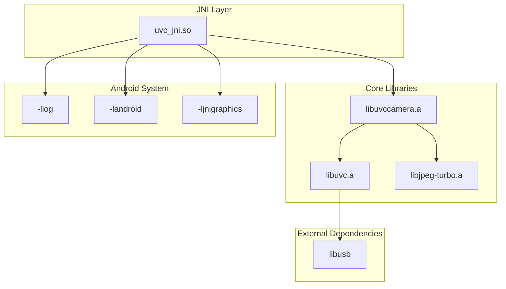

# AUDIT-005: Build System Archaeology

**Status:** Draft
**Created:** 2026-01-11
**Author:** Jeffrey Litecky / Claude
**Project:** ScopeCam - UVCCamera Library Modernization
**Target:** Android 16 (API 36) / NDK r28+ / CMake 3.22+
**Prerequisites:** AUDIT-001 through AUDIT-004 Complete

---

## Executive Summary

This audit performs a comprehensive archaeological analysis of the existing UVCCamera build system (Android.mk/Application.mk), documenting all compiler flags, dependencies, platform configurations, and build artifacts. The goal is to produce a complete dependency graph and migration plan to Modern CMake while **strictly adhering to official Android NDK documentation**.

**Core Philosophy:** Build system migration is **atomic**—you cannot partially migrate. Complete understanding of the existing system is mandatory before writing a single line of CMake.

**Critical Correction Notice:** This document corrects several common misconceptions about Android 16 build requirements that circulate in developer communities but are **not aligned with official NDK documentation**.

**Audit Scope:** All `Android.mk`, `Application.mk`, build scripts, and compiler configurations
**Expected Duration:** 4-6 hours for complete build system mapping
**Output Artifacts:** 10 structured deliverables including verified CMake template

---

## Table of Contents

1. [Objectives](#1-objectives)
2. [Pre-Audit Requirements](#2-pre-audit-requirements)
3. [Official NDK Documentation Alignment](#3-official-ndk-documentation-alignment)
4. [Audit Tasks](#4-audit-tasks)
   - 4.1 [Android.mk Inventory](#41-androidmk-inventory)
   - 4.2 [Application.mk Analysis](#42-applicationmk-analysis)
   - 4.3 [Compiler Flag Extraction](#43-compiler-flag-extraction)
   - 4.4 [Dependency Graph Construction](#44-dependency-graph-construction)
   - 4.5 [Platform-Specific Configuration](#45-platform-specific-configuration)
   - 4.6 [Security Flag Verification](#46-security-flag-verification)
   - 4.7 [ABI Configuration Analysis](#47-abi-configuration-analysis)
   - 4.8 [Build Artifact Mapping](#48-build-artifact-mapping)
   - 4.9 [CMake Migration Planning](#49-cmake-migration-planning)
   - 4.10 [Verified CMake Template Generation](#410-verified-cmake-template-generation)
5. [Migration Architecture](#5-migration-architecture)
6. [Deliverables](#6-deliverables)
7. [Verification Criteria](#7-verification-criteria)
8. [Agent Instructions](#8-agent-instructions)

---

## 1. Objectives

### Primary Objectives

| ID | Objective | Success Criteria |
|----|-----------|------------------|
| O1 | Inventory all Android.mk files | 100% of makefiles catalogued |
| O2 | Extract all compiler flags | Complete flag inventory with rationale |
| O3 | Map all dependencies | Dependency graph produced |
| O4 | Document platform configs | All ABI-specific settings captured |
| O5 | Produce verified CMake template | Template aligned with official NDK docs |

### Secondary Objectives

| ID | Objective | Success Criteria |
|----|-----------|------------------|
| O6 | Identify anti-patterns | Build issues documented |
| O7 | Document security posture | Hardening flags verified |
| O8 | Plan migration sequence | Phased migration roadmap |
| O9 | Verify NDK compatibility | NDK r28+ requirements met |
| O10 | Create reproducible build | Deterministic dependency management |

### Official Documentation Alignment

| Claim | Official Status | Source |
|-------|-----------------|--------|
| ndk-build deprecated | **FALSE** - Still officially supported | Build System Maintainers Guide |
| CMake required for Android 16 | **FALSE** - Project choice, not requirement | NDK CMake Guide |
| `_FORTIFY_SOURCE=3` standard | **FALSE** - Level 2 is documented default | Build System Maintainers Guide |
| RISC-V Tier-1 ABI | **FALSE** - Provisional, not yet supported | NDK Release Notes |
| `-mfloat-abi=softfp` anti-pattern | **FALSE** - Correct for armeabi-v7a | Android ABIs Guide |

---

## 2. Pre-Audit Requirements

### 2.1 Prerequisite Artifacts

| Artifact | Source | Required For |
|----------|--------|--------------|
| INVENTORY-001 | AUDIT-001 | Source file list |
| INVENTORY-005 | AUDIT-001 | Dependency graph baseline |
| SECURITY-009 | AUDIT-004 | Clang-Tidy integration requirements |

### 2.2 Required Tools

| Tool | Purpose | Installation |
|------|---------|--------------|
| `grep`/`ripgrep` | Pattern searching | System |
| `make` | Makefile parsing | System |
| `ndk-build` | Build verification | NDK |
| `cmake` (3.22+) | Migration target | NDK / System |
| `graphviz` | Dependency visualization | `apt install graphviz` |

### 2.3 Official Documentation References

| Document | URL | Critical For |
|----------|-----|--------------|
| Build System Maintainers Guide | android.googlesource.com/platform/ndk | Default flags, hardening |
| CMake Guide | developer.android.com/ndk/guides/cmake | Toolchain usage |
| Android ABIs | developer.android.com/ndk/guides/abis | ABI requirements |
| Arm MTE Guide | developer.android.com/ndk/guides/arm-mte | Memory tagging |

### 2.4 Scan Configuration

```bash
# Define paths
PROJECT_ROOT="/path/to/UVCCamera"
JNI_PATH="$PROJECT_ROOT/jni"
NDK_PATH="$ANDROID_NDK_HOME"

# Verify NDK version
cat $NDK_PATH/source.properties | grep "Pkg.Revision"
```

---

## 3. Official NDK Documentation Alignment

### 3.1 Common Misconceptions vs. Official Guidance

This section explicitly corrects misinformation that frequently appears in developer forums and AI-generated content.

#### 3.1.1 ndk-build Status

**MISCONCEPTION:** "ndk-build is deprecated; Android 16 requires CMake"

**OFFICIAL REALITY:**
> Google still documents and ships **both** ndk-build and the NDK CMake toolchain workflow. The Build System Maintainers Guide references both as current defaults.

**Our Position:** We are migrating to CMake as a **project standard** for:
- Target-based dependency management
- Better IDE integration
- Consistent CI/CD pipelines

This is **our engineering choice**, not an Android requirement.

#### 3.1.2 MTE Flag Configuration

**MISCONCEPTION:** "Use `-march=armv9-a+memtag` for MTE"

**OFFICIAL REALITY:**
> NDK guidance for app-side MTE uses **`-march=armv8-a+memtag`** together with **`-fsanitize=memtag`** (and mode selection via runtime mechanisms).

**Correct Configuration:**
```cmake
# Official NDK MTE workflow
if(ANDROID_ABI STREQUAL "arm64-v8a")
    target_compile_options(target PRIVATE -march=armv8-a+memtag -fsanitize=memtag)
    target_link_options(target PRIVATE -fsanitize=memtag)
endif()
```

**Note:** MTE is **not "zero overhead"**—the official docs discuss tradeoffs between sync/async modes.

#### 3.1.3 FORTIFY_SOURCE Level

**MISCONCEPTION:** "`_FORTIFY_SOURCE=3` is the 2026 standard"

**OFFICIAL REALITY:**
> The NDK's Build System Maintainers Guide documents **`_FORTIFY_SOURCE=2`** as the way to enable FORTIFY and notes it's **enabled by default** by ndk-build and the NDK CMake toolchain.

**Our Position:** Verify `_FORTIFY_SOURCE=2` is not disabled. Do not assert level 3 as a standard.

#### 3.1.4 Stack Protector Defaults

**MISCONCEPTION:** "You must add `-fstack-protector-strong`"

**OFFICIAL REALITY:**
> The NDK guide recommends `-fstack-protector-strong` and says **ndk-build and the NDK CMake toolchain enable it by default**.

**Our Position:** Audit for flags that **disable** defaults (`-fno-stack-protector`), not missing additions.

#### 3.1.5 Float ABI for 32-bit ARM

**MISCONCEPTION:** "`-mfloat-abi=softfp` is an anti-pattern"

**OFFICIAL REALITY:**
> The Android ABI docs explicitly explain why **armeabi-v7a uses `-mfloat-abi=softfp`** (hard-float ABI compatibility).

**Our Position:** If shipping 32-bit ARM, this flag is **correct**, not a smell.

#### 3.1.6 RISC-V Support Status

**MISCONCEPTION:** "RISC-V 64 is Tier-1 for Android 16"

**OFFICIAL REALITY:**
> NDK release notes (Oct 2025) describe adding a riscv64 sysroot but **explicitly say it is not yet a supported Android ABI**.

**Our Position:** Design for portability (avoid unguarded NEON assumptions), but don't treat riscv64 as a shipping ABI.

### 3.2 NDK Default Flags Reference

According to the Build System Maintainers Guide, the following are **enabled by default** in ndk-build and NDK CMake toolchain:

| Flag | Default Status | Purpose |
|------|----------------|---------|
| `-fstack-protector-strong` | **ON** | Stack buffer overflow protection |
| `_FORTIFY_SOURCE=2` | **ON** | Buffer overflow detection |
| `-fPIC` / `-fPIE` | **ON** | Position-independent code |
| `-Wl,-z,relro` | **ON** | Read-only relocations |
| `-Wl,-z,now` | **ON** | Immediate binding |
| `-Wl,--no-undefined` | **ON** | Reject undefined symbols |

**Audit Focus:** Detect flags that **disable** these defaults.

---

## 4. Audit Tasks

### 4.1 Android.mk Inventory

**Objective:** Catalog all Android.mk files and their module definitions

#### 4.1.1 Makefile Discovery

```bash
# Find all Android.mk files
find $PROJECT_ROOT -name "Android.mk" -type f > audit/android-mk-files.txt

# Find all Application.mk files
find $PROJECT_ROOT -name "Application.mk" -type f > audit/application-mk-files.txt

# Count makefiles
echo "Android.mk files: $(wc -l < audit/android-mk-files.txt)"
echo "Application.mk files: $(wc -l < audit/application-mk-files.txt)"
```

#### 4.1.2 Module Extraction

```bash
# Extract LOCAL_MODULE definitions
grep -rh 'LOCAL_MODULE\s*:=' $JNI_PATH --include="Android.mk" | \
    sed 's/.*:=\s*//' | sort -u > audit/module-names.txt

# Extract module types
grep -rh 'include \$(BUILD_' $JNI_PATH --include="Android.mk" | \
    sed 's/.*BUILD_//' | tr -d ')' | sort | uniq -c > audit/module-types.txt

# Extract prebuilt modules
grep -rh 'PREBUILT_' $JNI_PATH --include="Android.mk" > audit/prebuilt-modules.txt
```

#### 4.1.3 Android.mk Structure Template

```markdown
### Android.mk: [PATH]

**Location:** `jni/Android.mk`
**Modules Defined:** 3

**Module 1: libuvccamera**
- Type: `BUILD_SHARED_LIBRARY`
- Sources: `LOCAL_SRC_FILES := ...`
- Dependencies: `LOCAL_SHARED_LIBRARIES := ...`
- Flags: `LOCAL_CFLAGS := ...`

**Module 2: libuvc**
- Type: `BUILD_STATIC_LIBRARY`
- Sources: ...

**Includes:**
- `$(call import-module,third_party/libusb)`

**Issues Identified:**
1. Uses `LOCAL_CFLAGS += -fno-stack-protector` → **DISABLES DEFAULT PROTECTION**
2. Missing `LOCAL_LDFLAGS := -Wl,--exclude-libs,ALL` for symbol hiding
```

#### 4.1.4 Deliverable: BUILD-001-android-mk-inventory.md

Complete Android.mk inventory with module definitions.

---

### 4.2 Application.mk Analysis

**Objective:** Document global build configuration

#### 4.2.1 Application.mk Extraction

```bash
# Extract all settings from Application.mk
for file in $(cat audit/application-mk-files.txt); do
    echo "=== $file ===" >> audit/application-mk-settings.txt
    grep -v '^#' "$file" | grep -v '^$' >> audit/application-mk-settings.txt
done
```

#### 4.2.2 Critical Settings Detection

```bash
# APP_ABI setting
grep -h 'APP_ABI' $PROJECT_ROOT --include="Application.mk" -r > audit/app-abi.txt

# APP_PLATFORM / APP_PLATFORM_LEVEL
grep -h 'APP_PLATFORM' $PROJECT_ROOT --include="Application.mk" -r > audit/app-platform.txt

# APP_STL setting
grep -h 'APP_STL' $PROJECT_ROOT --include="Application.mk" -r > audit/app-stl.txt

# APP_CPPFLAGS / APP_CFLAGS
grep -h 'APP_C.*FLAGS' $PROJECT_ROOT --include="Application.mk" -r > audit/app-flags.txt

# APP_OPTIM
grep -h 'APP_OPTIM' $PROJECT_ROOT --include="Application.mk" -r > audit/app-optim.txt
```

#### 4.2.3 Application.mk Compliance Checklist

| Setting | Current Value | Android 16 Requirement | Status |
|---------|--------------|------------------------|--------|
| `APP_ABI` | ? | `arm64-v8a` minimum | ☐ |
| `APP_PLATFORM` | ? | `android-21` minimum | ☐ |
| `APP_STL` | ? | `c++_shared` or `c++_static` | ☐ |
| `APP_CPPFLAGS` | ? | No `-fno-exceptions` if using C++23 | ☐ |

#### 4.2.4 Deliverable: BUILD-002-application-mk.md

Complete Application.mk analysis with compliance assessment.

---

### 4.3 Compiler Flag Extraction

**Objective:** Document all compiler flags and their rationale

#### 4.3.1 Flag Detection Scripts

```bash
# Extract all CFLAGS
grep -rh 'LOCAL_CFLAGS\|LOCAL_CPPFLAGS\|APP_CFLAGS\|APP_CPPFLAGS' $JNI_PATH --include="*.mk" > audit/all-cflags.txt

# Extract all LDFLAGS
grep -rh 'LOCAL_LDFLAGS\|LOCAL_LDLIBS\|APP_LDFLAGS' $JNI_PATH --include="*.mk" > audit/all-ldflags.txt

# Detect DANGEROUS flag overrides (disabling NDK defaults)
grep -rn '\-fno-stack-protector\|-D_FORTIFY_SOURCE=0\|-fno-exceptions\|-fno-rtti' $JNI_PATH --include="*.mk" > audit/dangerous-flags.txt

# Detect deprecated flags
grep -rn '\-mfpu=\|-marm\|-mthumb' $JNI_PATH --include="*.mk" > audit/deprecated-flags.txt
```

#### 4.3.2 Flag Classification

| Category | Flags | Impact |
|----------|-------|--------|
| **Security (Keep)** | `-fstack-protector-strong`, `-D_FORTIFY_SOURCE=2` | NDK defaults |
| **Optimization** | `-O2`, `-Os`, `-flto` | Performance |
| **Warnings** | `-Wall`, `-Wextra`, `-Werror` | Code quality |
| **ABI** | `-mfloat-abi=softfp` (32-bit only) | Correct for armeabi-v7a |
| **DANGEROUS** | `-fno-stack-protector`, `-D_FORTIFY_SOURCE=0` | **REMOVE** |
| **Deprecated** | `-mfpu=neon` (implicit in ABI) | Clean up |

#### 4.3.3 Flag Audit Template

```markdown
### Flag: [FLAG_NAME]

**Location:** `jni/Android.mk:45`
**Context:** `LOCAL_CFLAGS += -fno-exceptions`

**Analysis:**
- **Intent:** Reduce binary size by disabling C++ exceptions
- **Impact:** Cannot use `std::expected` (C++23) or exception-based error handling
- **NDK Default:** Exceptions enabled by default with `c++_shared` STL

**Recommendation:**
- **Remove** if migrating to C++23 with `std::expected`
- **Keep** only if deliberately using error-code-only patterns

**Risk Level:** MEDIUM
**Migration Action:** Remove, enable exceptions for C++23 compatibility
```

#### 4.3.4 Deliverable: BUILD-003-compiler-flags.md

Complete compiler flag inventory with classification.

---

### 4.4 Dependency Graph Construction

**Objective:** Map all module dependencies and external libraries

#### 4.4.1 Dependency Extraction

```bash
# Internal dependencies (LOCAL_STATIC_LIBRARIES, LOCAL_SHARED_LIBRARIES)
grep -rh 'LOCAL_STATIC_LIBRARIES\|LOCAL_SHARED_LIBRARIES' $JNI_PATH --include="*.mk" > audit/internal-deps.txt

# External module imports
grep -rh 'import-module' $JNI_PATH --include="*.mk" > audit/external-imports.txt

# System libraries (LOCAL_LDLIBS)
grep -rh 'LOCAL_LDLIBS' $JNI_PATH --include="*.mk" > audit/system-libs.txt

# Prebuilt library paths
grep -rh 'LOCAL_SRC_FILES.*\.a\|LOCAL_SRC_FILES.*\.so' $JNI_PATH --include="*.mk" > audit/prebuilt-paths.txt
```

#### 4.4.2 Dependency Graph (Mermaid)



#### 4.4.3 Dependency Version Matrix

| Dependency | Current Version | Required Version | Source |
|------------|-----------------|------------------|--------|
| libusb | ? | 1.0.27+ | FD injection support |
| libjpeg-turbo | ? | 3.0+ | Performance |
| libuvc | ? | Fork required | Custom patches |
| NDK | ? | r28+ | C++23, MTE |

#### 4.4.4 Deliverable: BUILD-004-dependency-graph.md

Complete dependency graph with version requirements.

---

### 4.5 Platform-Specific Configuration

**Objective:** Document ABI-specific and API-level-specific configurations

#### 4.5.1 ABI Detection

```bash
# Find ABI-conditional code in makefiles
grep -rn 'TARGET_ARCH\|TARGET_ARCH_ABI\|ifeq.*arm\|ifeq.*x86' $JNI_PATH --include="*.mk" > audit/abi-conditionals.txt

# Find ABI-conditional code in source
grep -rn '__arm__\|__aarch64__\|__x86_64__\|__i386__' $JNI_PATH --include="*.c" --include="*.cpp" --include="*.h" > audit/abi-source-conditionals.txt

# Find NEON-specific code
grep -rn 'neon\|NEON\|vld1\|vst1\|vmul\|vadd' $JNI_PATH --include="*.c" --include="*.cpp" --include="*.h" > audit/neon-usage.txt
```

#### 4.5.2 API Level Detection

```bash
# Find API level conditionals
grep -rn '__ANDROID_API__\|android-\|API_LEVEL' $JNI_PATH --include="*.c" --include="*.cpp" --include="*.h" --include="*.mk" > audit/api-level-conditionals.txt

# Find deprecated API usage
grep -rn 'AHardwareBuffer\|ASurfaceTexture\|AImage' $JNI_PATH --include="*.c" --include="*.cpp" > audit/api-features.txt
```

#### 4.5.3 Platform Configuration Matrix

| Feature | arm64-v8a | armeabi-v7a | x86_64 | Notes |
|---------|-----------|-------------|--------|-------|
| MTE Support | Yes (optional) | No | No | ARMv8+ only |
| NEON | Implicit | Implicit | N/A | Always available |
| 16KB Pages | Required | N/A | Required | Android 15+ |
| Float ABI | Hard | softfp | N/A | Per ABI spec |

#### 4.5.4 Deliverable: BUILD-005-platform-config.md

Complete platform-specific configuration documentation.

---

### 4.6 Security Flag Verification

**Objective:** Verify security hardening flags match NDK defaults

#### 4.6.1 Security Flag Detection

```bash
# Flags that DISABLE NDK security defaults (CRITICAL)
echo "=== SECURITY FLAG VIOLATIONS ===" > audit/security-violations.txt

# Stack protector disabled
grep -rn '\-fno-stack-protector' $JNI_PATH --include="*.mk" >> audit/security-violations.txt

# FORTIFY disabled
grep -rn '_FORTIFY_SOURCE=0\|_FORTIFY_SOURCE=1' $JNI_PATH --include="*.mk" >> audit/security-violations.txt

# RELRO disabled
grep -rn '\-Wl,-z,norelro\|\-Wl,--no-relro' $JNI_PATH --include="*.mk" >> audit/security-violations.txt

# Immediate binding disabled
grep -rn '\-Wl,-z,lazy' $JNI_PATH --include="*.mk" >> audit/security-violations.txt

# Executable stack (CRITICAL VULNERABILITY)
grep -rn '\-z execstack\|execstack' $JNI_PATH --include="*.mk" >> audit/security-violations.txt

echo "=== Violations found: $(grep -c '.' audit/security-violations.txt)"
```

#### 4.6.2 Security Compliance Matrix

| Security Feature | NDK Default | Current Status | Violation? |
|------------------|-------------|----------------|------------|
| Stack Protector | ON (`-fstack-protector-strong`) | ? | ☐ |
| FORTIFY_SOURCE | ON (level 2) | ? | ☐ |
| RELRO | ON (`-Wl,-z,relro`) | ? | ☐ |
| Immediate Binding | ON (`-Wl,-z,now`) | ? | ☐ |
| No Undefined Symbols | ON | ? | ☐ |
| Non-Executable Stack | ON | ? | ☐ |

#### 4.6.3 Deliverable: BUILD-006-security-flags.md

Security flag compliance report.

---

### 4.7 ABI Configuration Analysis

**Objective:** Analyze and recommend ABI configuration for Android 16

#### 4.7.1 Current ABI Detection

```bash
# Extract APP_ABI settings
grep -h 'APP_ABI' $PROJECT_ROOT --include="Application.mk" -r

# Check for deprecated ABIs
grep -rn 'armeabi[^-]\|mips\|mips64' $JNI_PATH --include="*.mk"
```

#### 4.7.2 Android 16 ABI Requirements

| ABI | Status | Notes |
|-----|--------|-------|
| `arm64-v8a` | **Required** | Primary target for modern devices |
| `armeabi-v7a` | Optional | Legacy 32-bit, declining market share |
| `x86_64` | Recommended | Emulator, ChromeOS |
| `x86` | Deprecated | Remove for new projects |
| `riscv64` | **Experimental** | Not yet a supported shipping ABI |

#### 4.7.3 Recommended APP_ABI Configuration

```makefile
# Application.mk - Android 16 recommended
APP_ABI := arm64-v8a armeabi-v7a x86_64

# For new projects (arm64 only):
# APP_ABI := arm64-v8a

# INCORRECT - Do not use:
# APP_ABI := all  # Includes deprecated ABIs
# APP_ABI := riscv64  # Not yet supported for app distribution
```

#### 4.7.4 Deliverable: BUILD-007-abi-config.md

ABI configuration analysis and recommendations.

---

### 4.8 Build Artifact Mapping

**Objective:** Document all build outputs and their purposes

#### 4.8.1 Output Detection

```bash
# Find all library outputs
find $PROJECT_ROOT -name "*.so" -o -name "*.a" 2>/dev/null > audit/library-outputs.txt

# Find intermediate objects
find $PROJECT_ROOT -name "*.o" -o -name "*.d" 2>/dev/null > audit/intermediate-objects.txt

# Check libs directory structure
ls -la $PROJECT_ROOT/libs/ 2>/dev/null > audit/libs-structure.txt
```

#### 4.8.2 Build Artifact Matrix

| Artifact | Type | Purpose | CMake Target |
|----------|------|---------|--------------|
| `libuvc_jni.so` | Shared | JNI bridge for Java | `uvc_jni` |
| `libuvccamera.a` | Static | Core camera logic | `uvc_core` |
| `libuvc.a` | Static | UVC protocol | `libuvc` |
| `libjpeg-turbo.a` | Static | JPEG decoding | `turbojpeg-static` |

#### 4.8.3 Deliverable: BUILD-008-artifacts.md

Build artifact inventory and CMake target mapping.

---

### 4.9 CMake Migration Planning

**Objective:** Plan phased migration from ndk-build to CMake

#### 4.9.1 Migration Complexity Assessment

| Component | ndk-build Complexity | CMake Complexity | Migration Risk |
|-----------|---------------------|------------------|----------------|
| Core library | Medium | Low | Low |
| JNI bindings | Medium | Medium | Medium |
| External deps | High (import-module) | Medium (FetchContent) | Medium |
| Platform configs | High | Low | Low |
| Security flags | N/A (defaults) | Explicit required | Low |

#### 4.9.2 Migration Sequence

```mermaid
graph LR
    subgraph "Phase 1: Foundation"
        A[Create CMakeLists.txt skeleton]
        B[Configure toolchain]
    end

    subgraph "Phase 2: Core"
        C[Migrate uvc_core]
        D[Migrate libuvc]
    end

    subgraph "Phase 3: Dependencies"
        E[FetchContent for libusb]
        F[FetchContent for libjpeg-turbo]
    end

    subgraph "Phase 4: JNI"
        G[Migrate uvc_jni]
        H[Integrate Clang-Tidy]
    end

    subgraph "Phase 5: Validation"
        I[Parallel build verification]
        J[Remove ndk-build]
    end

    A --> B --> C --> D --> E --> F --> G --> H --> I --> J
```



#### 4.9.3 Parallel Build Strategy

During migration, maintain both build systems:

```bash
# ndk-build (legacy)
cd $PROJECT_ROOT
ndk-build -j$(nproc)

# CMake (new)
cmake -B build -DANDROID_ABI=arm64-v8a -DANDROID_PLATFORM=android-21 \
      -DCMAKE_TOOLCHAIN_FILE=$NDK/build/cmake/android.toolchain.cmake
cmake --build build -j$(nproc)

# Compare outputs
diff <(nm -D libs/arm64-v8a/libuvc_jni.so | sort) \
     <(nm -D build/libuvc_jni.so | sort)
```

#### 4.9.4 Deliverable: BUILD-009-migration-plan.md

Phased CMake migration roadmap.

---

### 4.10 Verified CMake Template Generation

**Objective:** Produce a CMake template aligned with official NDK documentation

#### 4.10.1 Official NDK CMake Guidance

**Key Points from NDK CMake Guide:**

1. Use the NDK-provided toolchain file: `-DCMAKE_TOOLCHAIN_FILE=$NDK/build/cmake/android.toolchain.cmake`
2. Android does **NOT** support CMake's built-in NDK workflow
3. Pass `-DANDROID_PLATFORM=android-<minSdk>` for API level
4. The "legacy" toolchain file is the **recommended default**

#### 4.10.2 The Verified CMake Template

```cmake
# CMakeLists.txt - ScopeCam Native Build
# Aligned with official Android NDK documentation (Jan 2026)
#
# Usage:
# cmake -B build \
#   -DCMAKE_TOOLCHAIN_FILE=$ANDROID_NDK/build/cmake/android.toolchain.cmake \
#   -DANDROID_ABI=arm64-v8a \
#   -DANDROID_PLATFORM=android-21
# cmake --build build

cmake_minimum_required(VERSION 3.22)  # NDK r25+ bundles 3.22

project(ScopeCamNative
    VERSION 1.0.0
    LANGUAGES C CXX
    DESCRIPTION "UVCCamera library for ScopeCam Android app"
)

# ===========================================================================
# C++ Standard Configuration
# ===========================================================================
set(CMAKE_CXX_STANDARD 23)
set(CMAKE_CXX_STANDARD_REQUIRED ON)
set(CMAKE_CXX_EXTENSIONS OFF)  # Use -std=c++23, not -std=gnu++23

set(CMAKE_C_STANDARD 11)
set(CMAKE_C_STANDARD_REQUIRED ON)

# ===========================================================================
# NDK Security Defaults Verification
# ===========================================================================
# Per Build System Maintainers Guide:
# - -fstack-protector-strong: ENABLED BY DEFAULT
# - _FORTIFY_SOURCE=2: ENABLED BY DEFAULT
# - RELRO and NOW: ENABLED BY DEFAULT
#
# We add warnings but DO NOT override security defaults.
# The audit should detect any flags that DISABLE these.

add_compile_options(
    -Wall
    -Wextra
    -Wpedantic
    -Werror=return-type
    -Werror=format-security
)

# Verify we're not accidentally disabling protections
# (This would be caught by BUILD-006 audit)

# ===========================================================================
# Optional: Memory Tagging Extension (MTE)
# ===========================================================================
# Official NDK MTE workflow:
# - Use -march=armv8-a+memtag (NOT armv9-a)
# - Use -fsanitize=memtag
# - Control mode via manifest or runtime API
#
# Reference: developer.android.com/ndk/guides/arm-mte

option(ENABLE_MTE "Build with Arm MTE for supported devices (arm64 only)" OFF)

if(ENABLE_MTE)
    if(NOT ANDROID)
        message(FATAL_ERROR "MTE is only available for Android builds")
    endif()

    if(NOT ANDROID_ABI STREQUAL "arm64-v8a")
        message(WARNING "MTE requested but ABI is ${ANDROID_ABI}, not arm64-v8a. Ignoring.")
    else()
        message(STATUS "Enabling MTE with -march=armv8-a+memtag -fsanitize=memtag")
        add_compile_options(-march=armv8-a+memtag -fsanitize=memtag)
        add_link_options(-fsanitize=memtag)
    endif()
endif()

# ===========================================================================
# Dependency Management
# ===========================================================================
include(FetchContent)

# libusb - Required for USB device communication
# Pin to specific version for reproducibility (NOT main branch)
FetchContent_Declare(
    libusb
    GIT_REPOSITORY https://github.com/libusb/libusb.git
    GIT_TAG        v1.0.27
    GIT_SHALLOW    TRUE
)

# libjpeg-turbo - Required for MJPEG decoding
# Pin to specific version
FetchContent_Declare(
    libjpeg_turbo
    GIT_REPOSITORY https://github.com/libjpeg-turbo/libjpeg-turbo.git
    GIT_TAG        3.0.1
    GIT_SHALLOW    TRUE
)

# NOTE: FetchContent downloads at configure time.
# For CI reproducibility, consider vendoring or using a package mirror.
FetchContent_MakeAvailable(libusb libjpeg_turbo)

# ===========================================================================
# Target: uvc_core (Static Library - Core Logic)
# ===========================================================================
add_library(uvc_core STATIC
    src/libuvccamera.cpp
    src/UVCPreview.cpp
    src/UVCCamera.cpp
    src/UVCControl.cpp
    src/frame_processor.cpp
)

target_include_directories(uvc_core
    PUBLIC
        $<BUILD_INTERFACE:${CMAKE_CURRENT_SOURCE_DIR}/include>
        $<INSTALL_INTERFACE:include>
    PRIVATE
        ${libusb_SOURCE_DIR}/libusb
)

target_link_libraries(uvc_core
    PRIVATE
        usb-1.0  # libusb target from FetchContent
)

# Compile features instead of raw flags
target_compile_features(uvc_core PUBLIC cxx_std_23)

# ===========================================================================
# Target: uvc_jni (Shared Library - JNI Bridge)
# ===========================================================================
add_library(uvc_jni SHARED
    jni/uvc_jni_bridge.cpp
    jni/handle_registry.cpp
    jni/jni_utils.cpp
)

target_link_libraries(uvc_jni
    PRIVATE
        uvc_core
        turbojpeg-static  # From libjpeg-turbo FetchContent
    PUBLIC
        android           # For AHardwareBuffer, etc.
        log               # For __android_log_print
        jnigraphics       # For ANativeWindow_fromSurface
)

# Symbol visibility - hide internal symbols, export only JNI functions
set_target_properties(uvc_jni PROPERTIES
    CXX_VISIBILITY_PRESET hidden
    C_VISIBILITY_PRESET hidden
    VISIBILITY_INLINES_HIDDEN ON
)

# JNI functions must be visible
target_compile_definitions(uvc_jni PRIVATE
    JNIEXPORT=__attribute__\(\(visibility\(\"default\"\)\)\)
)

# ===========================================================================
# Clang-Tidy Integration (Phase 4 Security Enforcement)
# ===========================================================================
option(ENABLE_CLANG_TIDY "Enable Clang-Tidy static analysis" OFF)

if(ENABLE_CLANG_TIDY)
    find_program(CLANG_TIDY_EXE NAMES clang-tidy clang-tidy-20)
    if(CLANG_TIDY_EXE)
        set(CMAKE_CXX_CLANG_TIDY
            ${CLANG_TIDY_EXE}
            -config-file=${CMAKE_SOURCE_DIR}/.clang-tidy
        )
        message(STATUS "Clang-Tidy enabled: ${CLANG_TIDY_EXE}")
    else()
        message(WARNING "Clang-Tidy requested but not found")
    endif()
endif()

# ===========================================================================
# Installation Rules (for AAR packaging)
# ===========================================================================
include(GNUInstallDirs)

install(TARGETS uvc_jni
    LIBRARY DESTINATION ${CMAKE_INSTALL_LIBDIR}/${ANDROID_ABI}
)

install(DIRECTORY include/
    DESTINATION ${CMAKE_INSTALL_INCLUDEDIR}
)

# ===========================================================================
# Build Summary
# ===========================================================================
message(STATUS "")
message(STATUS "=== ScopeCam Native Build Configuration ===")
message(STATUS "Android ABI:     ${ANDROID_ABI}")
message(STATUS "Android Platform: ${ANDROID_PLATFORM}")
message(STATUS "C++ Standard:    ${CMAKE_CXX_STANDARD}")
message(STATUS "MTE Enabled:     ${ENABLE_MTE}")
message(STATUS "Clang-Tidy:      ${ENABLE_CLANG_TIDY}")
message(STATUS "Build Type:      ${CMAKE_BUILD_TYPE}")
message(STATUS "")
```

#### 4.10.3 Gradle Integration

```kotlin
// app/build.gradle.kts
android {
    externalNativeBuild {
        cmake {
            path = file("src/main/jni/CMakeLists.txt")
            version = "3.22.1"
        }
    }

    defaultConfig {
        ndk {
            abiFilters += listOf("arm64-v8a", "armeabi-v7a", "x86_64")
        }

        externalNativeBuild {
            cmake {
                arguments += listOf(
                    "-DANDROID_STL=c++_shared",
                    "-DENABLE_CLANG_TIDY=ON"
                )

                // Enable MTE for debug builds on supported devices
                if (buildType == "debug") {
                    arguments += "-DENABLE_MTE=ON"
                }
            }
        }
    }
}
```

#### 4.10.4 Deliverable: BUILD-010-cmake-template/

Directory containing:
- `CMakeLists.txt` - Verified template
- `build.gradle.kts.example` - Gradle integration
- `toolchain-usage.md` - NDK toolchain documentation

---

## 5. Migration Architecture

### 5.1 ndk-build to CMake Mapping

| ndk-build Concept | CMake Equivalent |
|-------------------|------------------|
| `LOCAL_MODULE` | `add_library(name ...)` |
| `LOCAL_SRC_FILES` | Source files in `add_library()` |
| `LOCAL_C_INCLUDES` | `target_include_directories()` |
| `LOCAL_CFLAGS` | `target_compile_options()` |
| `LOCAL_LDFLAGS` | `target_link_options()` |
| `LOCAL_LDLIBS` | `target_link_libraries()` |
| `LOCAL_STATIC_LIBRARIES` | `target_link_libraries(PRIVATE ...)` |
| `LOCAL_SHARED_LIBRARIES` | `target_link_libraries(PUBLIC ...)` |
| `$(call import-module,...)` | `FetchContent` or `find_package()` |
| `BUILD_SHARED_LIBRARY` | `add_library(name SHARED ...)` |
| `BUILD_STATIC_LIBRARY` | `add_library(name STATIC ...)` |

### 5.2 Application.mk to CMake Mapping

| Application.mk | CMake/Gradle |
|----------------|--------------|
| `APP_ABI := arm64-v8a` | `abiFilters += "arm64-v8a"` |
| `APP_PLATFORM := android-21` | `-DANDROID_PLATFORM=android-21` |
| `APP_STL := c++_shared` | `-DANDROID_STL=c++_shared` |
| `APP_CPPFLAGS` | `add_compile_options()` |
| `APP_OPTIM := release` | `-DCMAKE_BUILD_TYPE=Release` |

### 5.3 Dependency Migration Strategy

| ndk-build Pattern | CMake Pattern | Notes |
|-------------------|---------------|-------|
| `$(call import-module,...)` | `FetchContent_Declare()` | Pin specific version |
| Prebuilt .a/.so | `add_library(IMPORTED)` | Or migrate to source |
| NDK-provided libs | `find_library()` | log, android, etc. |

### 5.4 Validation Checklist

| Check | Command | Expected Result |
|-------|---------|-----------------|
| Library exists | `file build/libuvc_jni.so` | ELF shared object |
| Symbols exported | `nm -D libuvc_jni.so \| grep Java_` | JNI functions visible |
| No undefined symbols | `nm -u libuvc_jni.so` | Empty or expected |
| Security flags | `checksec --file=libuvc_jni.so` | All protections ON |
| ABI correct | `file libuvc_jni.so` | ARM aarch64 |

---

## 6. Deliverables

### 6.1 Deliverable Checklist

| ID | Deliverable | Format | Status |
|----|-------------|--------|--------|
| BUILD-001 | Android.mk Inventory | Markdown | ☐ |
| BUILD-002 | Application.mk Analysis | Markdown | ☐ |
| BUILD-003 | Compiler Flags | Markdown | ☐ |
| BUILD-004 | Dependency Graph | Markdown + Mermaid | ☐ |
| BUILD-005 | Platform Config | Markdown | ☐ |
| BUILD-006 | Security Flags | Markdown | ☐ |
| BUILD-007 | ABI Config | Markdown | ☐ |
| BUILD-008 | Build Artifacts | Markdown | ☐ |
| BUILD-009 | Migration Plan | Markdown + Mermaid | ☐ |
| BUILD-010 | CMake Template | Directory | ☐ |
| BUILD-011 | Master Catalog | CSV | ☐ |

### 6.2 Deliverable Output Structure

```
audit/
├── AUDIT-005-build-system.md             # This document
├── BUILD-001-android-mk-inventory.md
├── BUILD-002-application-mk.md
├── BUILD-003-compiler-flags.md
├── BUILD-004-dependency-graph.md
├── BUILD-005-platform-config.md
├── BUILD-006-security-flags.md
├── BUILD-007-abi-config.md
├── BUILD-008-artifacts.md
├── BUILD-009-migration-plan.md
├── BUILD-010-cmake-template/
│   ├── CMakeLists.txt
│   ├── build.gradle.kts.example
│   └── toolchain-usage.md
├── BUILD-011-master-catalog.csv
├── diagrams/
│   ├── dependency-graph.mmd
│   └── migration-sequence.mmd
└── raw/
    ├── android-mk-files.txt
    ├── all-cflags.txt
    ├── dangerous-flags.txt
    ├── security-violations.txt
    └── [all other grep outputs]
```

---

## 7. Verification Criteria

### 7.1 Completeness Verification

| Criterion | Verification Method | Pass/Fail |
|-----------|-------------------|-----------|
| All Android.mk files catalogued | Compare find count to BUILD-001 | ☐ |
| All compiler flags documented | Compare grep to BUILD-003 | ☐ |
| No security violations | BUILD-006 shows 0 violations | ☐ |
| CMake builds successfully | `cmake --build` returns 0 | ☐ |
| Output matches ndk-build | Symbol comparison passes | ☐ |

### 7.2 Quality Gates

| Gate | Requirement | Threshold |
|------|-------------|-----------|
| Completeness | All deliverables produced | 11/11 |
| Security | No disabled protections | 0 violations |
| CMake | Template compiles | Success |
| ABI | arm64-v8a supported | Required |

### 7.3 Build Verification Tests

```bash
# Test 1: CMake configuration
cmake -B build \
    -DCMAKE_TOOLCHAIN_FILE=$NDK/build/cmake/android.toolchain.cmake \
    -DANDROID_ABI=arm64-v8a \
    -DANDROID_PLATFORM=android-21
# Expected: Configure succeeds

# Test 2: Build
cmake --build build -j$(nproc)
# Expected: Build succeeds

# Test 3: Security verification
checksec --file=build/libuvc_jni.so
# Expected: RELRO=Full, Stack Canary=Yes, NX=Yes, PIE=Yes

# Test 4: Symbol export
nm -D build/libuvc_jni.so | grep -c "Java_"
# Expected: >0 (JNI functions exported)
```

---

## 8. Agent Instructions

### 8.1 Investigation-First Methodology

**CRITICAL:** Before documenting ANY build configuration, agents MUST:

1. **SHOW** the grep/find command executed
2. **SHOW** the raw output
3. **VERIFY** against official NDK documentation
4. **CLASSIFY** using the build system taxonomy
5. **THEN** document with official references

### 8.2 Execution Order

```
1. Verify AUDIT-001 through AUDIT-004 artifacts available
2. Execute Android.mk inventory (Task 4.1)
3. Execute Application.mk analysis (Task 4.2)
4. Execute compiler flag extraction (Task 4.3)
5. Construct dependency graph (Task 4.4)
6. Document platform configurations (Task 4.5)
7. Verify security flags (Task 4.6)
8. Analyze ABI configuration (Task 4.7)
9. Map build artifacts (Task 4.8)
10. Plan CMake migration (Task 4.9)
11. Generate verified CMake template (Task 4.10)
12. Verify all deliverables (Section 7)
```

### 8.3 Flag Classification Rules

| If you find... | Classify as... | Action... |
|----------------|----------------|-----------|
| `-fno-stack-protector` | SECURITY_VIOLATION | REMOVE immediately |
| `_FORTIFY_SOURCE=0` | SECURITY_VIOLATION | REMOVE immediately |
| `-fno-exceptions` | COMPATIBILITY_ISSUE | Review for C++23 |
| `-mfloat-abi=softfp` (32-bit) | CORRECT | Keep for armeabi-v7a |
| `-march=armv9-a` | INCORRECT_MTE | Use `-march=armv8-a+memtag` |
| `APP_ABI := all` | DEPRECATED | Specify explicit ABIs |

### 8.4 Error Handling

| Error | Recovery Action |
|-------|----------------|
| Android.mk not found | Check for Gradle-only project |
| Unknown flag | Research in NDK docs |
| Prebuilt without source | Document as external dependency |
| Circular dependency | Flag for architectural review |

### 8.5 Progress Reporting

```
[AUDIT-005] Task 4.1 Complete: Android.mk Inventory
  - Android.mk files: N
  - Modules defined: N
  - Import-module calls: N

[AUDIT-005] Task 4.6 Complete: Security Flags
  - Violations found: N
  - -fno-stack-protector: N occurrences
  - _FORTIFY_SOURCE disabled: N occurrences
```

---

## Appendix A: ndk-build vs CMake Quick Reference

### A.1 Module Definition Comparison

**ndk-build:**
```makefile
LOCAL_PATH := $(call my-dir)
include $(CLEAR_VARS)

LOCAL_MODULE := uvc_jni
LOCAL_SRC_FILES := bridge.cpp utils.cpp
LOCAL_C_INCLUDES := $(LOCAL_PATH)/include
LOCAL_LDLIBS := -llog -landroid
LOCAL_STATIC_LIBRARIES := uvc_core

include $(BUILD_SHARED_LIBRARY)
```

**CMake:**
```cmake
add_library(uvc_jni SHARED
    bridge.cpp
    utils.cpp
)

target_include_directories(uvc_jni PRIVATE include)
target_link_libraries(uvc_jni PRIVATE uvc_core log android)
```

### A.2 Platform Configuration Comparison

**ndk-build (Application.mk):**
```makefile
APP_ABI := arm64-v8a armeabi-v7a
APP_PLATFORM := android-21
APP_STL := c++_shared
APP_CPPFLAGS := -std=c++23
```

**CMake (command line or Gradle):**
```bash
cmake -B build \
    -DCMAKE_TOOLCHAIN_FILE=$NDK/build/cmake/android.toolchain.cmake \
    -DANDROID_ABI=arm64-v8a \
    -DANDROID_PLATFORM=android-21 \
    -DANDROID_STL=c++_shared
```

---

## Appendix B: Security Flag Verification Script

```bash
#!/bin/bash
# verify-security.sh - Check for security flag violations

JNI_PATH="${1:-.}"
VIOLATIONS=0

echo "=== Security Flag Verification ==="

# Check for stack protector disabled
if grep -rq '\-fno-stack-protector' "$JNI_PATH" --include="*.mk"; then
    echo "❌ CRITICAL: -fno-stack-protector found"
    grep -rn '\-fno-stack-protector' "$JNI_PATH" --include="*.mk"
    ((VIOLATIONS++))
else
    echo "✓ Stack protector not disabled"
fi

# Check for FORTIFY disabled
if grep -rq '_FORTIFY_SOURCE=0' "$JNI_PATH" --include="*.mk"; then
    echo "❌ CRITICAL: _FORTIFY_SOURCE=0 found"
    grep -rn '_FORTIFY_SOURCE=0' "$JNI_PATH" --include="*.mk"
    ((VIOLATIONS++))
else
    echo "✓ FORTIFY not disabled"
fi

# Check for RELRO disabled
if grep -rq 'norelro\|--no-relro' "$JNI_PATH" --include="*.mk"; then
    echo "❌ CRITICAL: RELRO disabled"
    grep -rn 'norelro\|--no-relro' "$JNI_PATH" --include="*.mk"
    ((VIOLATIONS++))
else
    echo "✓ RELRO not disabled"
fi

# Check for executable stack
if grep -rq 'execstack' "$JNI_PATH" --include="*.mk"; then
    echo "❌ CRITICAL: Executable stack enabled"
    grep -rn 'execstack' "$JNI_PATH" --include="*.mk"
    ((VIOLATIONS++))
else
    echo "✓ No executable stack"
fi

echo ""
echo "=== Summary: $VIOLATIONS violations found ==="
exit $VIOLATIONS
```

---

## Appendix C: Build Catalog CSV Schema

```csv
id,file,line,type,setting,value,status,migration_action,notes
MK-001,jni/Android.mk,15,MODULE,LOCAL_MODULE,uvc_jni,OK,add_library(uvc_jni SHARED),JNI bridge
MK-002,jni/Android.mk,23,FLAG,LOCAL_CFLAGS,-fno-stack-protector,VIOLATION,REMOVE,Security violation
MK-003,jni/Application.mk,3,CONFIG,APP_ABI,all,DEPRECATED,Specify explicit ABIs,Includes deprecated ABIs
MK-004,jni/Android.mk,45,IMPORT,import-module,libusb,OK,FetchContent_Declare,Pin version
```

---

## Appendix D: Official NDK Documentation Links

| Topic | URL |
|-------|-----|
| Build System Maintainers Guide | android.googlesource.com/platform/ndk/+/master/docs/BuildSystemMaintainers.md |
| CMake Guide | developer.android.com/ndk/guides/cmake |
| Android ABIs | developer.android.com/ndk/guides/abis |
| Arm MTE | developer.android.com/ndk/guides/arm-mte |
| ndk-build | developer.android.com/ndk/guides/ndk-build |

---

## Revision History

| Version | Date | Author | Changes |
|---------|------|--------|---------|
| 0.1 | 2026-01-11 | Claude | Initial draft with official NDK documentation alignment |

---

*End of AUDIT-005*
