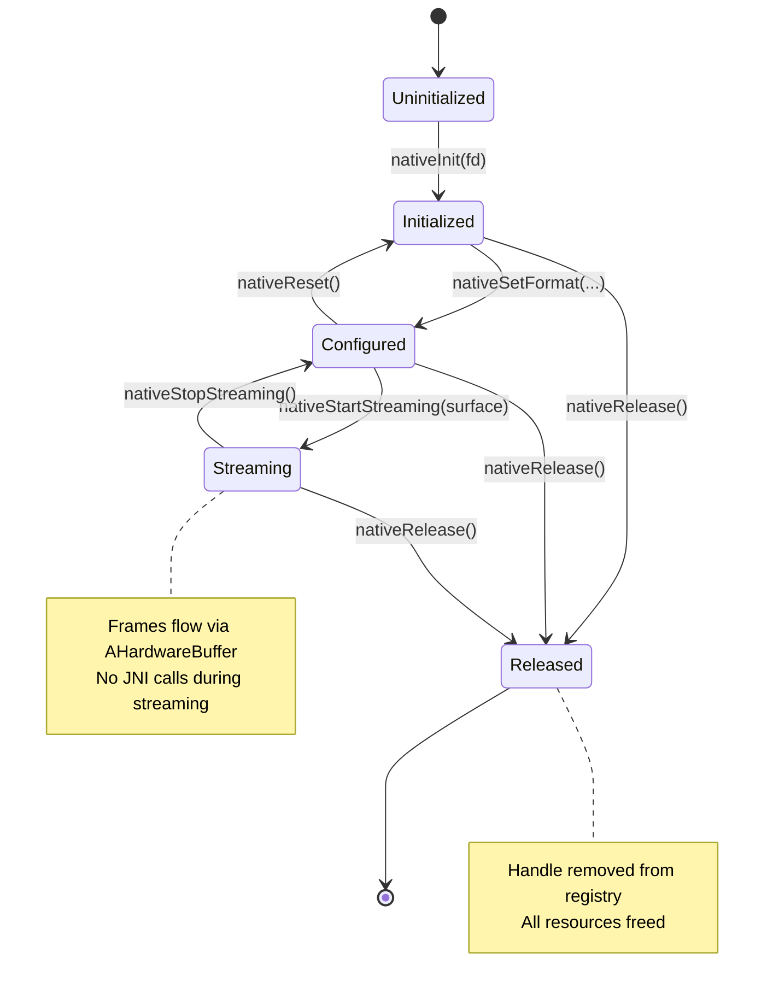

# AUDIT-006: JNI Interface Design

**Status:** Draft
**Created:** 2026-01-11
**Author:** Jeffrey Litecky / Claude
**Project:** ScopeCam - UVCCamera Library Modernization
**Target:** Android 16 (API 36) / NDK r28+ / C++23
**Prerequisites:** AUDIT-001 through AUDIT-005 Complete

---

## Executive Summary

This audit designs the modernized JNI interface layer for UVCCamera, transitioning from the legacy "High-Volume" chatty pattern (byte array copying every frame) to a "Low-Volume" architecture using `AHardwareBuffer` injection for zero-copy pixel delivery. The design integrates all security requirements from Phase 4 (Handle/Map Registry, MTE compliance) and build system patterns from Phase 5 (Modern CMake).

**Core Philosophy:** The JNI boundary should be **thin and infrequent**. Native code should receive resources (file descriptors, hardware buffers) from the managed layer—it should never discover, allocate, or own them directly.

**Gap Analysis Summary:**

| Aspect | Legacy State | 2026 Target | Gap Severity |
|--------|--------------|-------------|--------------|
| Handle Management | `jlong` pointer casts | Handle/Map Registry | **CRITICAL** |
| Frame Delivery | `byte[]` copy per frame | `AHardwareBuffer` zero-copy | **HIGH** |
| JNI Call Frequency | ~60 calls/sec (per frame) | ~1 call/sec (control only) | **HIGH** |
| Memory Safety | Manual `malloc`/`free` | RAII + `std::span` | **HIGH** |
| Error Handling | Return codes, crashes | `std::expected` + JNI exceptions | **MEDIUM** |

**Audit Scope:** All JNI function signatures, data transfer patterns, lifecycle management
**Expected Duration:** 6-8 hours for complete interface redesign
**Output Artifacts:** 12 structured deliverables including implementation templates

---

## Table of Contents

1. [Objectives](#1-objectives)
2. [Pre-Audit Requirements](#2-pre-audit-requirements)
3. [Legacy JNI Architecture Analysis](#3-legacy-jni-architecture-analysis)
4. [2026 JNI Architecture Design](#4-2026-jni-architecture-design)
5. [Audit Tasks](#5-audit-tasks)
   - 5.1 [Legacy JNI Function Inventory](#51-legacy-jni-function-inventory)
   - 5.2 [Handle Leak Detection](#52-handle-leak-detection)
   - 5.3 [Frame Delivery Pattern Analysis](#53-frame-delivery-pattern-analysis)
   - 5.4 [Lifecycle Management Audit](#54-lifecycle-management-audit)
   - 5.5 [Error Handling Assessment](#55-error-handling-assessment)
   - 5.6 [Thread Attachment Analysis](#56-thread-attachment-analysis)
   - 5.7 [AHardwareBuffer Integration Design](#57-ahardwarebuffer-integration-design)
   - 5.8 [Handle Registry Implementation](#58-handle-registry-implementation)
   - 5.9 [New JNI Interface Specification](#59-new-jni-interface-specification)
   - 5.10 [Migration Bridge Design](#510-migration-bridge-design)
6. [Implementation Templates](#6-implementation-templates)
7. [Deliverables](#7-deliverables)
8. [Verification Criteria](#8-verification-criteria)
9. [Agent Instructions](#9-agent-instructions)

---

## 1. Objectives

### Primary Objectives

| ID | Objective | Success Criteria |
|----|-----------|------------------|
| O1 | Inventory legacy JNI functions | 100% of native methods catalogued |
| O2 | Identify all Handle Leaks | Every `jlong` pointer cast documented |
| O3 | Design zero-copy frame path | `AHardwareBuffer` integration spec complete |
| O4 | Implement Handle Registry | Thread-safe registry with Clang-Tidy compliance |
| O5 | Specify new JNI interface | Complete function signatures for 2026 architecture |

### Secondary Objectives

| ID | Objective | Success Criteria |
|----|-----------|------------------|
| O6 | Design migration bridge | Parallel old/new operation possible |
| O7 | Document thread model | All JNI thread attachments mapped |
| O8 | Error handling strategy | `std::expected` to JNI exception mapping |
| O9 | Performance baseline | Frame delivery latency targets defined |
| O10 | Clang-Tidy integration | All new code passes custom checks |

### Gap Closure Targets

| Gap Category | Current State | Target State | Closure Metric |
|--------------|---------------|--------------|----------------|
| JNI Calls/Frame | 1-3 per frame | 0 per frame | 100% reduction |
| Memory Copies | 2 per frame | 0 per frame | 100% reduction |
| Handle Safety | 0% (raw casts) | 100% (registry) | Full migration |
| MTE Compliance | 0% | 100% | No pointer casts |

---

## 2. Pre-Audit Requirements

### 2.1 Prerequisite Artifacts

| Artifact | Source | Required For |
|----------|--------|--------------|
| SAFETY-006 | AUDIT-002 | JNI boundary inventory |
| SECURITY-003 | AUDIT-004 | jlong pointer cast catalog |
| SECURITY-009 | AUDIT-004 | Clang-Tidy configuration |
| BUILD-010 | AUDIT-005 | CMake template |

### 2.2 Required Tools

| Tool | Purpose | Installation |
|------|---------|--------------|
| `javap` | JNI signature extraction | JDK |
| `nm` | Symbol analysis | System |
| `grep`/`ripgrep` | Pattern searching | System |
| Android Studio | Layout/binding preview | IDE |

### 2.3 Reference Documentation

| Document | URL | Purpose |
|----------|-----|---------|
| JNI Tips | developer.android.com/training/articles/perf-jni | Best practices |
| AHardwareBuffer | developer.android.com/ndk/reference/group/a-hardware-buffer | Zero-copy API |
| SurfaceTexture | developer.android.com/reference/android/graphics/SurfaceTexture | Frame delivery |

### 2.4 Scan Configuration

```bash
# Define paths
JNI_PATH="/path/to/jni"
KOTLIN_PATH="/path/to/src/main/kotlin"
JAVA_PATH="/path/to/src/main/java"
```

---

## 3. Legacy JNI Architecture Analysis

### 3.1 The "High-Volume Chatty" Anti-Pattern

The legacy UVCCamera library exhibits the classic JNI anti-pattern: **high-frequency boundary crossings with data copying**.

```
┌─────────────────────────────────────────────────────────────────────────────┐
│                    LEGACY JNI ARCHITECTURE (Anti-Pattern)                    │
├─────────────────────────────────────────────────────────────────────────────┤
│                                                                              │
│  ┌─────────────────┐                          ┌─────────────────┐           │
│  │   Kotlin/Java   │                          │   Native C++    │           │
│  │                 │                          │                 │           │
│  │  UVCCamera.kt   │◄─────── 60 FPS ─────────►│  UVCCamera.cpp  │           │
│  │                 │    JNI calls/sec         │                 │           │
│  └────────┬────────┘                          └────────┬────────┘           │
│           │                                            │                    │
│           │  ┌──────────────────────────────────────┐  │                    │
│           │  │         Per-Frame Operations         │  │                    │
│           │  ├──────────────────────────────────────┤  │                    │
│           │  │ 1. nativeGetFrame() → byte[]         │  │                    │
│           │  │    - Allocates Java byte array       │  │                    │
│           │  │    - memcpy from native buffer       │  │                    │
│           │  │    - GC pressure accumulates         │  │                    │
│           │  │                                      │  │                    │
│           │  │ 2. byte[] → Bitmap conversion        │  │                    │
│           │  │    - Another allocation              │  │                    │
│           │  │    - Another memcpy                  │  │                    │
│           │  │                                      │  │                    │
│           │  │ 3. Bitmap → Surface rendering        │  │                    │
│           │  │    - Yet another copy to GPU         │  │                    │
│           │  └──────────────────────────────────────┘  │                    │
│           │                                            │                    │
│           ▼                                            ▼                    │
│  ┌─────────────────────────────────────────────────────────────────────┐   │
│  │                        CONSEQUENCES                                  │   │
│  │  • 3 memory copies per frame (CPU-bound)                            │   │
│  │  • 60+ JNI transitions per second                                   │   │
│  │  • GC pauses cause frame drops                                      │   │
│  │  • Thermal throttling during 4K streaming                           │   │
│  │  • Timestamp jitter from JNI scheduling latency                     │   │
│  └─────────────────────────────────────────────────────────────────────┘   │
│                                                                              │
└─────────────────────────────────────────────────────────────────────────────┘
```

### 3.2 The Four Legacy "Leaks"

Based on the strategic assessment, the legacy architecture has four critical failure modes:

#### 3.2.1 The "Handle" Leak (Security)

```cpp
// LEGACY PATTERN: Direct pointer casting
JNIEXPORT jlong JNICALL Java_..._nativeCreate(JNIEnv* env, jobject) {
    UVCCamera* camera = new UVCCamera();
    return (jlong)(intptr_t)camera;  // ❌ HANDLE LEAK
}

JNIEXPORT void JNICALL Java_..._nativeProcess(JNIEnv* env, jobject, jlong handle) {
    UVCCamera* camera = (UVCCamera*)(intptr_t)handle;  // ❌ MTE VIOLATION
    camera->process();
}
```

**Risks:**
- MTE hard fault on ARMv9 (pointer has no tag)
- 32-bit truncation on ILP32 architectures
- Use-after-free if Java holds stale handle
- No validation of handle validity

#### 3.2.2 The "Efficiency" Leak (Performance)

```cpp
// LEGACY PATTERN: Blocking capture loop
void* capture_thread(void* arg) {
    UVCPreview* preview = (UVCPreview*)arg;
    while (preview->is_running) {
        // Blocks entire thread waiting for USB
        v4l2_dequeue_buffer(preview->fd, &buffer);  // ❌ BLOCKING

        // Copy to Java-accessible memory
        memcpy(preview->java_buffer, buffer.data, buffer.size);  // ❌ COPY

        // Signal Java (another JNI transition)
        preview->notify_frame_ready();  // ❌ JNI CALL
    }
}
```

**Risks:**
- Thread fully occupied even when idle
- Battery drain from polling
- ANR if USB stutters
- Latency from blocking I/O

#### 3.2.3 The "Sync" Leak (Timing)

```cpp
// LEGACY PATTERN: Host-side timestamp
void on_frame_received(frame_t* frame) {
    // Timestamp is when we received it, not when camera captured it
    frame->timestamp = get_system_time_ms();  // ❌ WRONG TIMESTAMP

    // UVC PTS/SCR headers are discarded!
    // Real capture time is lost forever
}
```

**Risks:**
- Sub-millisecond sync impossible
- USB jitter appears as timing error
- Scientific data chronologically misaligned
- Cannot correlate with external sensors

#### 3.2.4 The "Bit-Rot" Leak (Build System)

```makefile
# LEGACY PATTERN: Deprecated build configuration
APP_ABI := armeabi-v7a arm64-v8a x86  # Includes deprecated x86
APP_STL := gnustl_static              # ❌ REMOVED FROM NDK
LOCAL_CFLAGS := -fno-exceptions       # ❌ BLOCKS C++23 FEATURES
```

**Risks:**
- Won't compile with modern NDK
- Missing security hardening
- No ARMv9 optimizations
- No MTE support

### 3.3 Legacy JNI Function Categories

| Category | Example Functions | Call Frequency | Problem |
|----------|-------------------|----------------|---------|
| **Lifecycle** | `nativeCreate`, `nativeDestroy` | Once | Handle leaks |
| **Control** | `nativeSetExposure`, `nativeGetFps` | Occasional | Acceptable |
| **Streaming** | `nativeGetFrame`, `nativeStartPreview` | Per-frame | Efficiency leak |
| **Status** | `nativeIsConnected`, `nativeGetError` | Polling | Unnecessary |

---

## 4. 2026 JNI Architecture Design

### 4.1 The "Low-Volume" Target Architecture

```
┌─────────────────────────────────────────────────────────────────────────────┐
│                    2026 JNI ARCHITECTURE (Zero-Copy)                         │
├─────────────────────────────────────────────────────────────────────────────┤
│                                                                              │
│  ┌─────────────────┐                          ┌─────────────────┐           │
│  │   Kotlin/Java   │                          │   Native C++    │           │
│  │                 │                          │                 │           │
│  │  UVCCamera.kt   │◄─────── 1 call/sec ─────►│  UVCCamera.cpp  │           │
│  │                 │    (control only)        │                 │           │
│  └────────┬────────┘                          └────────┬────────┘           │
│           │                                            │                    │
│           │                                            │                    │
│  ┌────────▼────────┐                          ┌────────▼────────┐           │
│  │  SurfaceTexture │◄════════════════════════►│ AHardwareBuffer │           │
│  │   (GPU-side)    │     Zero-Copy Path       │   (Native)      │           │
│  └────────┬────────┘     No JNI needed!       └────────┬────────┘           │
│           │                                            │                    │
│           │  ┌──────────────────────────────────────┐  │                    │
│           │  │      Per-Frame Operations            │  │                    │
│           │  ├──────────────────────────────────────┤  │                    │
│           │  │ 1. USB → AHardwareBuffer (DMA)       │  │                    │
│           │  │    - Zero CPU involvement            │  │                    │
│           │  │                                      │  │                    │
│           │  │ 2. AHardwareBuffer → SurfaceTexture  │  │                    │
│           │  │    - GPU composition only            │  │                    │
│           │  │    - No memcpy                       │  │                    │
│           │  │                                      │  │                    │
│           │  │ 3. SurfaceTexture → Display          │  │                    │
│           │  │    - Hardware composer               │  │                    │
│           │  └──────────────────────────────────────┘  │                    │
│           │                                            │                    │
│           ▼                                            ▼                    │
│  ┌─────────────────────────────────────────────────────────────────────┐   │
│  │                        BENEFITS                                      │   │
│  │  • 0 memory copies per frame (GPU-only)                             │   │
│  │  • ~1 JNI transition per second (control only)                      │   │
│  │  • No GC pressure from frame data                                   │   │
│  │  • Thermal stability during 4K streaming                            │   │
│  │  • Timestamps from UVC headers (sub-ms accuracy)                    │   │
│  └─────────────────────────────────────────────────────────────────────┘   │
│                                                                              │
└─────────────────────────────────────────────────────────────────────────────┘
```

### 4.2 JNI Interface Design Principles

| Principle | Implementation | Rationale |
|-----------|---------------|-----------|
| **Thin Boundary** | Minimal data crossing JNI | Reduce transition overhead |
| **Infrequent Calls** | Control-plane only | Avoid per-frame JNI |
| **Resource Injection** | FD from managed layer | Security compliance |
| **Handle Registry** | ID-based, not pointer-based | MTE compliance |
| **Async Notifications** | Callbacks via Handler | Avoid blocking |
| **Error Propagation** | JNI exceptions | Kotlin-native error handling |

### 4.3 New JNI Function Classification

| Category | Functions | Frequency | Direction |
|----------|-----------|-----------|-----------|
| **Initialization** | `nativeInit(fd)` | Once | Kotlin → Native |
| **Configuration** | `nativeSetFormat(w, h, fps)` | Rare | Kotlin → Native |
| **Control** | `nativeStartStreaming(surface)` | Rare | Kotlin → Native |
| **Adjustment** | `nativeSetExposure(value)` | Occasional | Kotlin → Native |
| **Query** | `nativeGetTimestampInfo()` | Rare | Native → Kotlin |
| **Cleanup** | `nativeRelease()` | Once | Kotlin → Native |

**Notably Absent:** `nativeGetFrame()` — frames flow through `AHardwareBuffer` without JNI.

### 4.4 Data Flow Comparison

| Data Type | Legacy Flow | 2026 Flow |
|-----------|-------------|-----------|
| **Frame pixels** | Native → `byte[]` → Bitmap → Surface | Native → AHardwareBuffer → Surface (zero-copy) |
| **Timestamps** | System time at JNI call | UVC PTS/SCR from payload headers |
| **Errors** | Return codes checked in Kotlin | JNI exceptions thrown |
| **Handle** | `jlong` pointer cast | Registry ID lookup |
| **USB access** | Native opens `/dev/` | Kotlin provides FD |

---

## 5. Audit Tasks

### 5.1 Legacy JNI Function Inventory

**Objective:** Catalog all native methods in the legacy codebase

#### 5.1.1 Native Method Detection

```bash
# Find all native method declarations in Java/Kotlin
grep -rn 'external fun\|native ' $KOTLIN_PATH $JAVA_PATH --include="*.kt" --include="*.java" > audit/native-methods-kotlin.txt

# Find all JNIEXPORT functions in C++
grep -rn 'JNIEXPORT\|Java_' $JNI_PATH --include="*.cpp" --include="*.c" > audit/jni-exports.txt

# Extract function signatures
grep -h 'JNIEXPORT.*JNICALL' $JNI_PATH --include="*.cpp" | \
    sed 's/JNIEXPORT \(.*\) JNICALL \(Java_[^(]*\).*/\2: \1/' > audit/jni-signatures.txt
```

#### 5.1.2 JNI Function Catalog Template

```markdown
### JNI Function: [FUNCTION_NAME]

**Native Declaration:** `external fun nativeSetExposure(handle: Long, exposure: Int): Int`
**JNI Signature:** `Java_com_example_UVCCamera_nativeSetExposure`
**Return Type:** `jint`
**Parameters:** `(JNIEnv*, jobject, jlong, jint)`

**Category:** Control
**Call Frequency:** Occasional (user-initiated)
**Data Transfer:** Minimal (two integers)

**Legacy Implementation:**
```cpp
JNIEXPORT jint JNICALL Java_..._nativeSetExposure(
    JNIEnv* env, jobject thiz, jlong handle, jint exposure)
{
    UVCCamera* camera = (UVCCamera*)(intptr_t)handle;  // ❌ HANDLE LEAK
    return camera->setExposure(exposure);
}
```

**Issues:**
1. Raw pointer cast from `jlong`
2. No handle validation
3. No error propagation

**2026 Refactor:**
```cpp
JNIEXPORT void JNICALL Java_..._nativeSetExposure(
    JNIEnv* env, jobject thiz, jlong handle, jint exposure)
{
    auto result = CameraRegistry::Get(handle);
    if (!result) {
        ThrowJniException(env, "java/lang/IllegalStateException",
                          result.error().c_str());
        return;
    }

    auto setResult = (*result)->setExposure(exposure);
    if (!setResult) {
        ThrowJniException(env, "java/io/IOException",
                          setResult.error().c_str());
    }
}
```

**Migration Status:** ☐ Pending
```

#### 5.1.3 Deliverable: JNI-001-function-inventory.md

Complete JNI function catalog with signatures and categories.

---

### 5.2 Handle Leak Detection

**Objective:** Identify all `jlong` pointer casts for Handle Registry migration

#### 5.2.1 Handle Leak Detection Scripts

```bash
# Find all jlong-to-pointer casts (the "Handle Leak")
grep -rn '(.*\*)\s*(intptr_t)\s*\|reinterpret_cast.*jlong' $JNI_PATH --include="*.cpp" > audit/handle-leaks-cast.txt

# Find all pointer-to-jlong casts (allocation returns)
grep -rn '(jlong)\s*(intptr_t)\|reinterpret_cast<jlong>' $JNI_PATH --include="*.cpp" > audit/handle-leaks-alloc.txt

# Find field access patterns (storing handles in Java objects)
grep -rn 'GetLongField\|SetLongField' $JNI_PATH --include="*.cpp" > audit/handle-field-access.txt

# Count total handle leaks
echo "Total handle leaks: $(cat audit/handle-leaks-*.txt | wc -l)"
```

#### 5.2.2 Handle Leak Severity Classification

| Pattern | Example | Severity | MTE Impact |
|---------|---------|----------|------------|
| Direct cast in JNI | `(Camera*)(intptr_t)handle` | CRITICAL | Hard fault |
| Stored in Java field | `SetLongField(obj, fieldId, (jlong)ptr)` | CRITICAL | Provenance loss |
| Returned from native | `return (jlong)(intptr_t)new Camera()` | HIGH | Allocation leak |
| Cast with validation | `if (handle != 0) ...` | HIGH | False safety |

#### 5.2.3 Handle Leak Catalog Template

```markdown
### Handle Leak: [ID]

**Location:** `UVCCamera.cpp:156`
**Function:** `Java_com_example_UVCCamera_nativeProcess`
**Pattern:** Direct jlong-to-pointer cast

**Code:**
```cpp
UVCCamera* camera = (UVCCamera*)(intptr_t)handle;  // ❌ LINE 156
```

**Risks:**
1. **MTE:** Pointer has no tag → SIGSEGV on Tensor G5/G6
2. **ILP32:** Truncation if handle exceeds 32 bits
3. **UAF:** No validation that handle is still valid
4. **Provenance:** Optimizer cannot track pointer origin

**Registry Migration:**
```cpp
auto result = CameraRegistry::Get(handle);  // ✓ Safe lookup
if (!result) {
    ThrowJniException(env, "java/lang/IllegalStateException",
                      result.error().c_str());
    return;
}
UVCCamera* camera = *result;  // Pointer has valid provenance
```

**Clang-Tidy Check:** `jni-no-raw-pointer-cast`
**Migration Status:** ☐ Pending
```

#### 5.2.4 Deliverable: JNI-002-handle-leaks.md

Complete handle leak catalog with migration instructions.

---

### 5.3 Frame Delivery Pattern Analysis

**Objective:** Document current frame delivery and design zero-copy replacement

#### 5.3.1 Legacy Frame Delivery Detection

```bash
# Find frame buffer allocations
grep -rn 'NewByteArray\|GetByteArrayElements\|SetByteArrayRegion' $JNI_PATH --include="*.cpp" > audit/frame-byte-arrays.txt

# Find memcpy operations (the copies)
grep -rn 'memcpy\|memmove\|std::copy' $JNI_PATH --include="*.cpp" > audit/frame-memcpy.txt

# Find callback invocations (per-frame JNI calls)
grep -rn 'CallVoidMethod\|CallObjectMethod.*[Ff]rame' $JNI_PATH --include="*.cpp" > audit/frame-callbacks.txt

# Find Surface/ANativeWindow usage
grep -rn 'ANativeWindow\|Surface\|AHardwareBuffer' $JNI_PATH --include="*.cpp" > audit/surface-usage.txt
```

#### 5.3.2 Frame Delivery Cost Analysis

| Operation | Legacy Cost | Zero-Copy Cost | Savings |
|-----------|-------------|----------------|---------|
| USB → Native buffer | DMA (free) | DMA (free) | 0 |
| Native → Java byte[] | memcpy (~2ms @ 4K) | N/A | 2ms |
| byte[] → Bitmap | memcpy + format (~3ms) | N/A | 3ms |
| Bitmap → Surface | GPU upload (~1ms) | Direct (~0ms) | 1ms |
| JNI transitions | ~0.02ms × 60 = 1.2ms | ~0.02ms × 1 | 1.2ms |
| **Total per frame** | **~7ms** | **~0ms** | **~7ms** |

At 60 FPS, legacy pattern consumes **420ms of CPU time per second** (70% of a core).

#### 5.3.3 Zero-Copy Frame Path Design

```cpp
// 2026 PATTERN: AHardwareBuffer zero-copy

class ZeroCopyFrameDelivery {
private:
    AHardwareBuffer* buffer_pool_[3];  // Triple buffer
    std::atomic<int> write_idx_{0};
    std::atomic<int> read_idx_{1};
    ANativeWindow* surface_;

public:
    // Called once at stream start (from JNI)
    void initialize(ANativeWindow* surface) {
        surface_ = surface;

        // Allocate GPU-accessible buffers
        AHardwareBuffer_Desc desc = {
            .width = 1920,
            .height = 1080,
            .layers = 1,
            .format = AHARDWAREBUFFER_FORMAT_Y8Cb8Cr8_420,  // NV12
            .usage = AHARDWAREBUFFER_USAGE_GPU_SAMPLED_IMAGE |
                     AHARDWAREBUFFER_USAGE_CPU_WRITE_OFTEN,
        };

        for (int i = 0; i < 3; i++) {
            AHardwareBuffer_allocate(&desc, &buffer_pool_[i]);
        }
    }

    // Called from USB callback thread (NO JNI)
    void on_frame_received(const uint8_t* usb_data, size_t size,
                           uint64_t pts, uint64_t scr) {
        int idx = write_idx_.load(std::memory_order_relaxed);
        AHardwareBuffer* buffer = buffer_pool_[idx];

        // Map buffer for CPU write
        void* mapped;
        AHardwareBuffer_lock(buffer,
                             AHARDWAREBUFFER_USAGE_CPU_WRITE_OFTEN,
                             -1, nullptr, &mapped);

        // Single copy: USB → GPU buffer (DMA-capable memory)
        memcpy(mapped, usb_data, size);

        AHardwareBuffer_unlock(buffer, nullptr);

        // Store timestamp for later query
        frame_timestamps_[idx] = {pts, scr};

        // Publish buffer (lock-free)
        int next = (idx + 1) % 3;
        if (next != read_idx_.load(std::memory_order_acquire)) {
            write_idx_.store(next, std::memory_order_release);
        }

        // Queue to surface (NO JNI CALL)
        ANativeWindow_Buffer window_buffer;
        ANativeWindow_lock(surface_, &window_buffer, nullptr);
        // ... compositor handles the rest
        ANativeWindow_unlockAndPost(surface_);
    }
};
```

#### 5.3.4 Deliverable: JNI-003-frame-delivery.md

Frame delivery analysis with zero-copy implementation design.

---

### 5.4 Lifecycle Management Audit

**Objective:** Document object lifecycle and ensure proper cleanup

#### 5.4.1 Lifecycle Detection

```bash
# Find creation patterns
grep -rn 'new\s\+UVC\|make_unique.*UVC\|malloc.*sizeof' $JNI_PATH --include="*.cpp" > audit/lifecycle-create.txt

# Find destruction patterns
grep -rn 'delete\s\|free(\|release(\|destroy(' $JNI_PATH --include="*.cpp" > audit/lifecycle-destroy.txt

# Find reference counting
grep -rn 'ref_count\|AddRef\|Release\|shared_ptr' $JNI_PATH --include="*.cpp" > audit/lifecycle-refcount.txt
```

#### 5.4.2 Lifecycle State Machine



#### 5.4.3 Lifecycle Validation Rules

| Transition | Precondition | Postcondition | Error Handling |
|------------|--------------|---------------|----------------|
| Init | Handle = 0 | Handle valid | IllegalStateException |
| Configure | Initialized | Configured | IllegalStateException |
| Start | Configured | Streaming | IOException |
| Stop | Streaming | Configured | (always succeeds) |
| Release | Any | Released | (always succeeds) |

#### 5.4.4 Deliverable: JNI-004-lifecycle.md

Lifecycle management analysis with state machine.

---

### 5.5 Error Handling Assessment

**Objective:** Design error propagation from native to Kotlin

#### 5.5.1 Legacy Error Pattern Detection

```bash
# Find return code patterns
grep -rn 'return\s*-\|return\s*0\s*;\|return\s*NULL' $JNI_PATH --include="*.cpp" > audit/error-return-codes.txt

# Find existing exception throwing
grep -rn 'ThrowNew\|ExceptionCheck\|ExceptionClear' $JNI_PATH --include="*.cpp" > audit/error-exceptions.txt

# Find error logging
grep -rn 'LOGE\|__android_log.*error\|perror' $JNI_PATH --include="*.cpp" > audit/error-logging.txt
```

#### 5.5.2 Error Propagation Strategy

```cpp
// 2026 PATTERN: std::expected to JNI exception mapping

// Error category enumeration
enum class UvcError {
    InvalidHandle,
    DeviceDisconnected,
    PermissionDenied,
    UnsupportedFormat,
    StreamingFailed,
    Timeout,
    Unknown
};

// Map errors to Java exception types
const char* GetExceptionClass(UvcError error) {
    switch (error) {
        case UvcError::InvalidHandle:
            return "java/lang/IllegalStateException";
        case UvcError::DeviceDisconnected:
            return "android/hardware/usb/UsbDeviceConnection$DeviceDisconnectedException";
        case UvcError::PermissionDenied:
            return "java/lang/SecurityException";
        case UvcError::UnsupportedFormat:
            return "java/lang/IllegalArgumentException";
        case UvcError::StreamingFailed:
        case UvcError::Timeout:
            return "java/io/IOException";
        default:
            return "java/lang/RuntimeException";
    }
}

// Helper to throw JNI exception from std::expected error
template<typename T>
bool CheckResult(JNIEnv* env, const std::expected<T, UvcError>& result,
                 const char* operation) {
    if (result) return true;

    const char* exceptionClass = GetExceptionClass(result.error());
    std::string message = std::format("{} failed: {}", operation,
                                       ErrorToString(result.error()));
    env->ThrowNew(env->FindClass(exceptionClass), message.c_str());
    return false;
}

// Usage in JNI function
JNIEXPORT void JNICALL Java_..._nativeSetExposure(
    JNIEnv* env, jobject, jlong handle, jint exposure)
{
    auto camera = CameraRegistry::Get(handle);
    if (!CheckResult(env, camera, "Get camera")) return;

    auto result = (*camera)->setExposure(exposure);
    CheckResult(env, result, "Set exposure");
}
```

#### 5.5.3 Deliverable: JNI-005-error-handling.md

Error handling assessment with exception mapping design.

---

### 5.6 Thread Attachment Analysis

**Objective:** Document all native threads that interact with JNI

#### 5.6.1 Thread Attachment Detection

```bash
# Find thread creation
grep -rn 'pthread_create\|std::thread\|std::jthread' $JNI_PATH --include="*.cpp" > audit/thread-creation.txt

# Find JNI attachment
grep -rn 'AttachCurrentThread\|DetachCurrentThread\|GetEnv' $JNI_PATH --include="*.cpp" > audit/thread-attachment.txt

# Find callback invocations from native threads
grep -rn 'CallVoidMethod\|CallObjectMethod\|CallStaticMethod' $JNI_PATH --include="*.cpp" > audit/thread-callbacks.txt
```

#### 5.6.2 Thread Model Comparison

| Thread | Legacy Pattern | 2026 Pattern |
|--------|---------------|--------------|
| USB Callback | Attaches to JVM, calls Java callback | No JNI, writes to AHardwareBuffer |
| Preview Render | Copies data to Java, triggers render | No JNI, posts to ANativeWindow |
| Control | Direct JNI calls | Direct JNI calls (unchanged) |
| Main (Kotlin) | Frequent JNI calls | Infrequent JNI calls |

#### 5.6.3 Thread Attachment Rules

| Rule | Rationale |
|------|-----------|
| No attachment in hot path | AttachCurrentThread is expensive (~10μs) |
| Detach on thread exit | Prevents memory leaks |
| Cache JNIEnv per thread | Avoid repeated GetEnv calls |
| Prefer callback-free design | AHardwareBuffer eliminates need |

#### 5.6.4 Deliverable: JNI-006-threads.md

Thread attachment analysis with model comparison.

---

### 5.7 AHardwareBuffer Integration Design

**Objective:** Design the zero-copy frame delivery using AHardwareBuffer

#### 5.7.1 AHardwareBuffer API Requirements

```cpp
// Required includes
#include <android/hardware_buffer.h>
#include <android/hardware_buffer_jni.h>
#include <android/native_window.h>
#include <android/native_window_jni.h>

// Minimum API level
#if __ANDROID_API__ < 26
    #error "AHardwareBuffer requires API 26+"
#endif

// For HardwareBuffer Java interop (API 26+)
#if __ANDROID_API__ >= 26
    AHardwareBuffer* AHardwareBuffer_fromHardwareBuffer(JNIEnv* env, jobject hardwareBuffer);
    jobject AHardwareBuffer_toHardwareBuffer(JNIEnv* env, AHardwareBuffer* buffer);
#endif
```

#### 5.7.2 Buffer Format Selection

| UVC Format | AHardwareBuffer Format | Notes |
|------------|----------------------|-------|
| YUYV (MJPEG decoded) | `AHARDWAREBUFFER_FORMAT_Y8Cb8Cr8_420` | Most efficient |
| NV12 | `AHARDWAREBUFFER_FORMAT_Y8Cb8Cr8_420` | Native camera format |
| RGB | `AHARDWAREBUFFER_FORMAT_R8G8B8A8_UNORM` | Requires conversion |
| MJPEG (raw) | N/A | Decode first |

#### 5.7.3 Triple Buffer Architecture

```cpp
class HardwareBufferPool {
public:
    static constexpr int BUFFER_COUNT = 3;  // Triple buffer

    struct BufferSlot {
        AHardwareBuffer* buffer{nullptr};
        uint64_t pts{0};
        uint64_t scr{0};
        std::atomic<bool> in_use{false};
    };

private:
    std::array<BufferSlot, BUFFER_COUNT> slots_;
    std::atomic<int> write_idx_{0};
    std::atomic<int> latest_idx_{-1};

public:
    // Allocate all buffers upfront
    std::expected<void, std::string> initialize(uint32_t width, uint32_t height) {
        AHardwareBuffer_Desc desc{
            .width = width,
            .height = height,
            .layers = 1,
            .format = AHARDWAREBUFFER_FORMAT_Y8Cb8Cr8_420,
            .usage = AHARDWAREBUFFER_USAGE_GPU_SAMPLED_IMAGE |
                     AHARDWAREBUFFER_USAGE_CPU_WRITE_OFTEN |
                     AHARDWAREBUFFER_USAGE_COMPOSER_OVERLAY,
        };

        for (auto& slot : slots_) {
            int result = AHardwareBuffer_allocate(&desc, &slot.buffer);
            if (result != 0) {
                release();
                return std::unexpected("Failed to allocate AHardwareBuffer");
            }
        }

        return {};
    }

    // Get next write buffer (producer side, USB thread)
    BufferSlot* acquireWriteBuffer() {
        int idx = write_idx_.load(std::memory_order_relaxed);
        BufferSlot* slot = &slots_[idx];

        // Wait if buffer still in use by consumer
        while (slot->in_use.load(std::memory_order_acquire)) {
            idx = (idx + 1) % BUFFER_COUNT;
            slot = &slots_[idx];
        }

        return slot;
    }

    // Publish written buffer (producer side)
    void publishBuffer(BufferSlot* slot) {
        int idx = slot - slots_.data();
        latest_idx_.store(idx, std::memory_order_release);
        write_idx_.store((idx + 1) % BUFFER_COUNT, std::memory_order_relaxed);
    }

    // Get latest buffer for display (consumer side, render thread)
    BufferSlot* acquireReadBuffer() {
        int idx = latest_idx_.load(std::memory_order_acquire);
        if (idx < 0) return nullptr;

        BufferSlot* slot = &slots_[idx];
        slot->in_use.store(true, std::memory_order_release);
        return slot;
    }

    // Release read buffer (consumer side)
    void releaseReadBuffer(BufferSlot* slot) {
        slot->in_use.store(false, std::memory_order_release);
    }

    void release() {
        for (auto& slot : slots_) {
            if (slot.buffer) {
                AHardwareBuffer_release(slot.buffer);
                slot.buffer = nullptr;
            }
        }
    }
};
```

#### 5.7.4 Kotlin Integration

```kotlin
// Kotlin side: Receive AHardwareBuffer for display

class UvcFrameReceiver(private val surfaceTexture: SurfaceTexture) {

    // Called from native via callback (or poll in render loop)
    fun onFrameAvailable(hardwareBuffer: HardwareBuffer, pts: Long, scr: Long) {
        // Create Image from HardwareBuffer
        val image = Image.createHardwareImage(hardwareBuffer, ImageFormat.YUV_420_888)

        // Update SurfaceTexture (triggers GPU composition)
        // Note: This may require ImageReader or similar bridge

        // Store timestamp for sync
        lastFramePts = pts
        lastFrameScr = scr
    }
}
```

#### 5.7.5 Deliverable: JNI-007-ahardwarebuffer.md

AHardwareBuffer integration design with buffer pool implementation.

---

### 5.8 Handle Registry Implementation

**Objective:** Implement the thread-safe Handle Registry from AUDIT-004

#### 5.8.1 Registry Requirements

| Requirement | Implementation |
|-------------|----------------|
| Thread-safe | `std::shared_mutex` for concurrent reads |
| MTE-compliant | No pointer casts, provenance preserved |
| Clang-Tidy clean | Passes `jni-no-raw-pointer-cast` |
| Multi-type | Template-based for Camera, Preview, etc. |
| Graceful errors | `std::expected` return type |

#### 5.8.2 Complete Implementation

```cpp
// handle_registry.h

#pragma once

#include <atomic>
#include <expected>
#include <memory>
#include <shared_mutex>
#include <string>
#include <unordered_map>
#include <jni.h>

namespace scopecam {

/**
 * Thread-safe registry for native objects accessed via JNI.
 *
 * Implements the Handle/Map pattern required for:
 * - MTE compliance (no jlong-to-pointer casts)
 * - 32-bit safety (no truncation risk)
 * - Use-after-free protection (handle validation)
 *
 * @tparam T The type of object to manage
 */
template<typename T>
class HandleRegistry {
public:
    using Handle = jlong;
    using Pointer = T*;
    using UniquePtr = std::unique_ptr<T>;

    /**
     * Register an object and return its handle.
     *
     * @param object Unique ownership of object
     * @return Handle ID (never 0, never a pointer)
     */
    static Handle Register(UniquePtr object) {
        std::unique_lock lock(mutex_);

        Handle id = next_id_.fetch_add(1, std::memory_order_relaxed);
        instances_[id] = std::move(object);

        return id;
    }

    /**
     * Look up an object by handle.
     *
     * @param handle Handle ID from Java
     * @return Pointer on success, error message on failure
     */
    static std::expected<Pointer, std::string> Get(Handle handle) {
        std::shared_lock lock(mutex_);

        auto it = instances_.find(handle);
        if (it == instances_.end()) {
            return std::unexpected(
                "Invalid handle: " + std::to_string(handle));
        }

        return it->second.get();
    }

    /**
     * Unregister and destroy an object.
     *
     * @param handle Handle to unregister
     * @return true if handle existed
     */
    static bool Unregister(Handle handle) {
        std::unique_lock lock(mutex_);
        return instances_.erase(handle) > 0;
    }

    /**
     * Check if a handle is valid.
     */
    static bool IsValid(Handle handle) {
        std::shared_lock lock(mutex_);
        return instances_.contains(handle);
    }

    /**
     * Get count of registered objects.
     */
    static size_t Count() {
        std::shared_lock lock(mutex_);
        return instances_.size();
    }

    /**
     * Clear all registered objects.
     * Use only for testing or emergency cleanup.
     */
    static void Clear() {
        std::unique_lock lock(mutex_);
        instances_.clear();
    }

private:
    // Start at 1 so 0 can indicate "no handle"
    static inline std::atomic<Handle> next_id_{1};
    static inline std::unordered_map<Handle, UniquePtr> instances_;
    static inline std::shared_mutex mutex_;
};

// Type aliases for specific registries
class UVCCamera;
class UVCPreview;
class HardwareBufferPool;

using CameraRegistry = HandleRegistry<UVCCamera>;
using PreviewRegistry = HandleRegistry<UVCPreview>;
using BufferPoolRegistry = HandleRegistry<HardwareBufferPool>;

} // namespace scopecam
```

#### 5.8.3 JNI Helper Macros

```cpp
// jni_helpers.h

#pragma once

#include <jni.h>
#include <string>
#include "handle_registry.h"

namespace scopecam {

/**
 * Throw a JNI exception with the given class and message.
 */
inline void ThrowJniException(JNIEnv* env, const char* className,
                              const char* message) {
    jclass exClass = env->FindClass(className);
    if (exClass != nullptr) {
        env->ThrowNew(exClass, message);
        env->DeleteLocalRef(exClass);
    }
}

/**
 * Throw a JNI exception with the given class and message.
 */
inline void ThrowJniException(JNIEnv* env, const char* className,
                              const std::string& message) {
    ThrowJniException(env, className, message.c_str());
}

/**
 * Get object from registry, throwing exception on failure.
 *
 * @return Pointer if valid, nullptr if exception thrown
 */
template<typename Registry>
auto GetOrThrow(JNIEnv* env, typename Registry::Handle handle,
                const char* operation)
    -> typename Registry::Pointer
{
    auto result = Registry::Get(handle);
    if (!result) {
        ThrowJniException(env, "java/lang/IllegalStateException",
                          std::format("{}: {}", operation, result.error()));
        return nullptr;
    }
    return *result;
}

/**
 * Macro for common pattern of getting object and returning on failure.
 */
#define GET_CAMERA_OR_RETURN(env, handle) \
    auto* camera = GetOrThrow<CameraRegistry>(env, handle, __func__); \
    if (!camera) return

#define GET_CAMERA_OR_RETURN_VALUE(env, handle, value) \
    auto* camera = GetOrThrow<CameraRegistry>(env, handle, __func__); \
    if (!camera) return value

} // namespace scopecam
```

#### 5.8.4 Deliverable: JNI-008-handle-registry/

Directory containing:
- `handle_registry.h` - Template implementation
- `jni_helpers.h` - JNI utility functions
- `handle_registry_test.cpp` - Unit tests

---

### 5.9 New JNI Interface Specification

**Objective:** Define the complete JNI interface for the 2026 architecture

#### 5.9.1 Kotlin Native Interface

```kotlin
// UvcCameraNative.kt

package com.scopecam.uvc

import android.hardware.HardwareBuffer
import android.view.Surface

/**
 * Native interface for UVC camera operations.
 *
 * Design principles:
 * - Handles are opaque IDs, not pointers
 * - FD injection for USB access (security)
 * - Surface injection for zero-copy rendering
 * - Exceptions for error propagation
 */
object UvcCameraNative {

    init {
        System.loadLibrary("uvc_jni")
    }

    // ========== Lifecycle ==========

    /**
     * Initialize camera with USB file descriptor.
     *
     * @param usbFd File descriptor from UsbDeviceConnection.getFileDescriptor()
     * @return Handle ID for subsequent operations
     * @throws SecurityException if FD is invalid
     * @throws IOException if device initialization fails
     */
    @Throws(SecurityException::class, IOException::class)
    external fun nativeInit(usbFd: Int): Long

    /**
     * Release camera and all associated resources.
     *
     * @param handle Camera handle
     */
    external fun nativeRelease(handle: Long)

    // ========== Configuration ==========

    /**
     * Configure video format.
     *
     * @param handle Camera handle
     * @param width Frame width
     * @param height Frame height
     * @param fps Target frame rate
     * @throws IllegalStateException if handle invalid
     * @throws IllegalArgumentException if format not supported
     */
    @Throws(IllegalStateException::class, IllegalArgumentException::class)
    external fun nativeSetFormat(handle: Long, width: Int, height: Int, fps: Int)

    /**
     * Get supported formats.
     *
     * @param handle Camera handle
     * @return Array of format descriptors
     */
    external fun nativeGetSupportedFormats(handle: Long): Array<FormatDescriptor>

    // ========== Streaming ==========

    /**
     * Start streaming to surface.
     *
     * @param handle Camera handle
     * @param surface Target surface for rendering
     * @throws IllegalStateException if not configured
     * @throws IOException if streaming fails to start
     */
    @Throws(IllegalStateException::class, IOException::class)
    external fun nativeStartStreaming(handle: Long, surface: Surface)

    /**
     * Stop streaming.
     *
     * @param handle Camera handle
     */
    external fun nativeStopStreaming(handle: Long)

    // ========== Control ==========

    /**
     * Set exposure value.
     *
     * @param handle Camera handle
     * @param exposure Exposure value (device-specific units)
     * @throws IllegalStateException if handle invalid
     * @throws IOException if control fails
     */
    @Throws(IllegalStateException::class, IOException::class)
    external fun nativeSetExposure(handle: Long, exposure: Int)

    /**
     * Get current exposure value.
     */
    external fun nativeGetExposure(handle: Long): Int

    /**
     * Set gain value.
     */
    @Throws(IllegalStateException::class, IOException::class)
    external fun nativeSetGain(handle: Long, gain: Int)

    /**
     * Get current gain value.
     */
    external fun nativeGetGain(handle: Long): Int

    // ========== Timestamp Info ==========

    /**
     * Get timestamp information for the latest frame.
     *
     * @param handle Camera handle
     * @return Timestamp info with PTS, SCR, and system time
     */
    external fun nativeGetTimestampInfo(handle: Long): TimestampInfo

    // ========== Data Classes ==========

    data class FormatDescriptor(
        val width: Int,
        val height: Int,
        val fps: Int,
        val formatType: Int  // YUYV, MJPEG, NV12, etc.
    )

    data class TimestampInfo(
        val pts: Long,           // Presentation timestamp from UVC header
        val scr: Long,           // Source clock reference from UVC header
        val systemTimeNs: Long,  // System time when frame received
        val frameNumber: Long    // Monotonic frame counter
    )
}
```

#### 5.9.2 Native Implementation Signatures

```cpp
// uvc_jni_bridge.cpp

#include <jni.h>
#include "handle_registry.h"
#include "jni_helpers.h"
#include "uvc_camera.h"

extern "C" {

// ========== Lifecycle ==========

JNIEXPORT jlong JNICALL
Java_com_scopecam_uvc_UvcCameraNative_nativeInit(
    JNIEnv* env, jobject, jint usbFd)
{
    auto camera = UVCCamera::Create(usbFd);
    if (!camera) {
        ThrowJniException(env, "java/io/IOException", camera.error());
        return 0;
    }

    return CameraRegistry::Register(std::move(*camera));
}

JNIEXPORT void JNICALL
Java_com_scopecam_uvc_UvcCameraNative_nativeRelease(
    JNIEnv* env, jobject, jlong handle)
{
    CameraRegistry::Unregister(handle);
}

// ========== Configuration ==========

JNIEXPORT void JNICALL
Java_com_scopecam_uvc_UvcCameraNative_nativeSetFormat(
    JNIEnv* env, jobject, jlong handle, jint width, jint height, jint fps)
{
    GET_CAMERA_OR_RETURN(env, handle);

    auto result = camera->setFormat(width, height, fps);
    if (!result) {
        ThrowJniException(env, "java/lang/IllegalArgumentException",
                          result.error());
    }
}

// ========== Streaming ==========

JNIEXPORT void JNICALL
Java_com_scopecam_uvc_UvcCameraNative_nativeStartStreaming(
    JNIEnv* env, jobject, jlong handle, jobject surface)
{
    GET_CAMERA_OR_RETURN(env, handle);

    // Get native window from Surface (FD injection pattern)
    ANativeWindow* window = ANativeWindow_fromSurface(env, surface);
    if (!window) {
        ThrowJniException(env, "java/lang/IllegalArgumentException",
                          "Invalid surface");
        return;
    }

    auto result = camera->startStreaming(window);
    if (!result) {
        ANativeWindow_release(window);
        ThrowJniException(env, "java/io/IOException", result.error());
    }
}

JNIEXPORT void JNICALL
Java_com_scopecam_uvc_UvcCameraNative_nativeStopStreaming(
    JNIEnv* env, jobject, jlong handle)
{
    GET_CAMERA_OR_RETURN(env, handle);
    camera->stopStreaming();
}

// ========== Control ==========

JNIEXPORT void JNICALL
Java_com_scopecam_uvc_UvcCameraNative_nativeSetExposure(
    JNIEnv* env, jobject, jlong handle, jint exposure)
{
    GET_CAMERA_OR_RETURN(env, handle);

    auto result = camera->setExposure(exposure);
    if (!result) {
        ThrowJniException(env, "java/io/IOException", result.error());
    }
}

JNIEXPORT jint JNICALL
Java_com_scopecam_uvc_UvcCameraNative_nativeGetExposure(
    JNIEnv* env, jobject, jlong handle)
{
    GET_CAMERA_OR_RETURN_VALUE(env, handle, 0);
    return camera->getExposure();
}

// ========== Timestamp ==========

JNIEXPORT jobject JNICALL
Java_com_scopecam_uvc_UvcCameraNative_nativeGetTimestampInfo(
    JNIEnv* env, jobject, jlong handle)
{
    GET_CAMERA_OR_RETURN_VALUE(env, handle, nullptr);

    auto info = camera->getTimestampInfo();

    // Create TimestampInfo object
    jclass clazz = env->FindClass("com/scopecam/uvc/UvcCameraNative$TimestampInfo");
    jmethodID ctor = env->GetMethodID(clazz, "<init>", "(JJJJ)V");

    return env->NewObject(clazz, ctor,
                          info.pts, info.scr, info.systemTimeNs, info.frameNumber);
}

} // extern "C"
```

#### 5.9.3 JNI Function Comparison

| Function | Legacy | 2026 | Change |
|----------|--------|------|--------|
| `nativeCreate()` | Returns pointer as jlong | N/A (use nativeInit) | **Removed** |
| `nativeInit(fd)` | N/A | Returns handle ID | **New** |
| `nativeGetFrame()` | Returns byte[] | N/A | **Removed** (zero-copy) |
| `nativeStartStreaming(surface)` | N/A | Frames flow via surface | **New** |
| `nativeSetExposure(handle, value)` | Casts handle to pointer | Registry lookup | **Refactored** |
| `nativeRelease(handle)` | Casts handle, deletes | Registry unregister | **Refactored** |

#### 5.9.4 Deliverable: JNI-009-interface-spec.md

Complete JNI interface specification with Kotlin and C++ signatures.

---

### 5.10 Migration Bridge Design

**Objective:** Enable parallel operation of legacy and new implementations

#### 5.10.1 Migration Strategy

```
┌─────────────────────────────────────────────────────────────────────────────┐
│                         MIGRATION BRIDGE ARCHITECTURE                        │
├─────────────────────────────────────────────────────────────────────────────┤
│                                                                              │
│  Phase 1: Adapter Layer                                                      │
│  ┌─────────────────────────────────────────────────────────────────────────┐│
│  │  UvcCameraAdapter                                                       ││
│  │  ├─ Implements new interface                                            ││
│  │  ├─ Delegates to legacy implementation                                  ││
│  │  └─ Adds Handle Registry wrapper                                        ││
│  └─────────────────────────────────────────────────────────────────────────┘│
│                                                                              │
│  Phase 2: Gradual Replacement                                                │
│  ┌─────────────────────────────────────────────────────────────────────────┐│
│  │  Replace one component at a time:                                       ││
│  │  1. Handle management (Registry)         ✓                              ││
│  │  2. Error handling (Exceptions)          ✓                              ││
│  │  3. Frame delivery (AHardwareBuffer)     ← Current                      ││
│  │  4. Control path (std::expected)         Pending                        ││
│  │  5. USB access (FD injection)            Pending                        ││
│  └─────────────────────────────────────────────────────────────────────────┘│
│                                                                              │
│  Phase 3: Legacy Removal                                                     │
│  ┌─────────────────────────────────────────────────────────────────────────┐│
│  │  • Remove adapter layer                                                 ││
│  │  • Delete legacy JNI functions                                          ││
│  │  • Update Kotlin to use new interface directly                          ││
│  └─────────────────────────────────────────────────────────────────────────┘│
│                                                                              │
└─────────────────────────────────────────────────────────────────────────────┘
```

#### 5.10.2 Adapter Implementation

```kotlin
// UvcCameraAdapter.kt - Bridge between old and new interfaces

class UvcCameraAdapter(
    private val usbConnection: UsbDeviceConnection
) : UvcCamera {

    private var handle: Long = 0
    private var useNewImpl = false  // Feature flag

    override fun init(): Boolean {
        return if (useNewImpl) {
            try {
                handle = UvcCameraNative.nativeInit(usbConnection.fileDescriptor)
                true
            } catch (e: Exception) {
                Log.e(TAG, "New init failed, falling back to legacy", e)
                useNewImpl = false
                legacyInit()
            }
        } else {
            legacyInit()
        }
    }

    override fun startPreview(surface: Surface) {
        if (useNewImpl) {
            UvcCameraNative.nativeStartStreaming(handle, surface)
        } else {
            // Legacy path with byte[] copying
            legacyStartPreview(surface)
        }
    }

    override fun setExposure(value: Int) {
        if (useNewImpl) {
            UvcCameraNative.nativeSetExposure(handle, value)
        } else {
            legacySetExposure(handle, value)
        }
    }

    override fun release() {
        if (useNewImpl) {
            UvcCameraNative.nativeRelease(handle)
        } else {
            legacyRelease(handle)
        }
        handle = 0
    }

    // Legacy methods (to be removed in Phase 3)
    private external fun legacyInit(): Boolean
    private external fun legacyStartPreview(surface: Surface)
    private external fun legacySetExposure(handle: Long, value: Int)
    private external fun legacyRelease(handle: Long)

    companion object {
        private const val TAG = "UvcCameraAdapter"

        init {
            System.loadLibrary("uvc_jni")
        }
    }
}
```

#### 5.10.3 Feature Flag Configuration

```kotlin
// BuildConfig or remote config
object UvcFeatureFlags {
    // Enable new Handle Registry (Phase 1)
    val USE_HANDLE_REGISTRY = true

    // Enable AHardwareBuffer (Phase 2)
    val USE_ZERO_COPY = Build.VERSION.SDK_INT >= 26

    // Enable full new implementation (Phase 3)
    val USE_NEW_IMPL = false  // Flip when ready
}
```

#### 5.10.4 Deliverable: JNI-010-migration-bridge.md

Migration bridge design with adapter implementation.

---

## 6. Implementation Templates

### 6.1 Directory Structure

```
jni/
├── CMakeLists.txt                    # From AUDIT-005
├── include/
│   ├── handle_registry.h             # Handle/Map implementation
│   ├── jni_helpers.h                 # JNI utility functions
│   ├── uvc_camera.h                  # Camera class interface
│   ├── hardware_buffer_pool.h        # AHardwareBuffer management
│   └── frame_delivery.h              # Zero-copy frame path
├── src/
│   ├── uvc_camera.cpp                # Camera implementation
│   ├── hardware_buffer_pool.cpp      # Buffer pool implementation
│   └── frame_delivery.cpp            # Frame delivery implementation
├── jni/
│   └── uvc_jni_bridge.cpp            # JNI function implementations
└── test/
    ├── handle_registry_test.cpp      # Registry unit tests
    └── frame_delivery_test.cpp       # Frame delivery tests
```

### 6.2 Header Template

```cpp
// uvc_camera.h

#pragma once

#include <android/hardware_buffer.h>
#include <android/native_window.h>
#include <expected>
#include <memory>
#include <string>

namespace scopecam {

struct TimestampInfo {
    uint64_t pts;            // Presentation timestamp
    uint64_t scr;            // Source clock reference
    uint64_t systemTimeNs;   // System time
    uint64_t frameNumber;    // Frame counter
};

struct FormatDescriptor {
    uint32_t width;
    uint32_t height;
    uint32_t fps;
    uint32_t formatType;
};

class UVCCamera {
public:
    // Factory method (returns expected, not raw pointer)
    static std::expected<std::unique_ptr<UVCCamera>, std::string>
    Create(int usbFd);

    virtual ~UVCCamera() = default;

    // Configuration
    virtual std::expected<void, std::string>
    setFormat(uint32_t width, uint32_t height, uint32_t fps) = 0;

    virtual std::vector<FormatDescriptor> getSupportedFormats() const = 0;

    // Streaming (zero-copy via ANativeWindow)
    virtual std::expected<void, std::string>
    startStreaming(ANativeWindow* surface) = 0;

    virtual void stopStreaming() = 0;

    // Controls
    virtual std::expected<void, std::string> setExposure(int32_t value) = 0;
    virtual int32_t getExposure() const = 0;

    virtual std::expected<void, std::string> setGain(int32_t value) = 0;
    virtual int32_t getGain() const = 0;

    // Timestamps
    virtual TimestampInfo getTimestampInfo() const = 0;

protected:
    UVCCamera() = default;

    // Non-copyable, non-movable (managed by registry)
    UVCCamera(const UVCCamera&) = delete;
    UVCCamera& operator=(const UVCCamera&) = delete;
};

} // namespace scopecam
```

---

## 7. Deliverables

### 7.1 Deliverable Checklist

| ID | Deliverable | Format | Status |
|----|-------------|--------|--------|
| JNI-001 | Function Inventory | Markdown | ☐ |
| JNI-002 | Handle Leaks | Markdown | ☐ |
| JNI-003 | Frame Delivery | Markdown | ☐ |
| JNI-004 | Lifecycle | Markdown | ☐ |
| JNI-005 | Error Handling | Markdown | ☐ |
| JNI-006 | Threads | Markdown | ☐ |
| JNI-007 | AHardwareBuffer | Markdown | ☐ |
| JNI-008 | Handle Registry | Directory | ☐ |
| JNI-009 | Interface Spec | Markdown | ☐ |
| JNI-010 | Migration Bridge | Markdown | ☐ |
| JNI-011 | Implementation Templates | Directory | ☐ |
| JNI-012 | Master Catalog | CSV | ☐ |

### 7.2 Deliverable Output Structure

```
audit/
├── AUDIT-006-jni-interface.md        # This document
├── JNI-001-function-inventory.md
├── JNI-002-handle-leaks.md
├── JNI-003-frame-delivery.md
├── JNI-004-lifecycle.md
├── JNI-005-error-handling.md
├── JNI-006-threads.md
├── JNI-007-ahardwarebuffer.md
├── JNI-008-handle-registry/
│   ├── handle_registry.h
│   ├── jni_helpers.h
│   └── handle_registry_test.cpp
├── JNI-009-interface-spec.md
├── JNI-010-migration-bridge.md
├── JNI-011-templates/
│   ├── uvc_camera.h
│   ├── uvc_jni_bridge.cpp
│   └── CMakeLists.txt
├── JNI-012-master-catalog.csv
└── raw/
    └── [grep outputs]
```

---

## 8. Verification Criteria

### 8.1 Completeness Verification

| Criterion | Verification Method | Pass/Fail |
|-----------|-------------------|-----------|
| All JNI functions catalogued | Compare grep to JNI-001 | ☐ |
| All handle leaks identified | Compare to SECURITY-003 | ☐ |
| Zero-copy design complete | AHardwareBuffer integration documented | ☐ |
| Registry implementation | Compiles, tests pass | ☐ |
| Interface spec complete | All functions specified | ☐ |

### 8.2 Quality Gates

| Gate | Requirement | Threshold |
|------|-------------|-----------|
| Handle Leaks | All identified | 100% |
| Clang-Tidy | Registry passes | 0 errors |
| Interface Coverage | All legacy functions mapped | 100% |
| Migration Path | Bridge design complete | Yes |

### 8.3 Performance Targets

| Metric | Legacy | Target | Validation |
|--------|--------|--------|------------|
| JNI calls/frame | 1-3 | 0 | Trace logging |
| Memory copies/frame | 2 | 0 | Profiler |
| Frame latency | ~7ms | ~0ms | Timestamp delta |
| Thermal stability | Throttles at 4K | Stable | Temperature monitor |

---

## 9. Agent Instructions

### 9.1 Investigation-First Methodology

**CRITICAL:** Before documenting ANY JNI pattern, agents MUST:

1. **SHOW** the grep/search command executed
2. **SHOW** the raw output (first 20 lines if large)
3. **CLASSIFY** using the JNI pattern taxonomy
4. **ASSESS** impact on zero-copy goal
5. **DOCUMENT** migration requirement
6. **THEN** catalog in standard format

### 9.2 Execution Order

```
1. Verify AUDIT-001 through AUDIT-005 artifacts available
2. Execute JNI function inventory (Task 5.1)
3. Execute handle leak detection (Task 5.2)
4. Execute frame delivery analysis (Task 5.3)
5. Execute lifecycle audit (Task 5.4)
6. Execute error handling assessment (Task 5.5)
7. Execute thread attachment analysis (Task 5.6)
8. Design AHardwareBuffer integration (Task 5.7)
9. Implement handle registry (Task 5.8)
10. Specify new JNI interface (Task 5.9)
11. Design migration bridge (Task 5.10)
12. Verify all deliverables (Section 8)
```

### 9.3 Pattern Classification Rules

| If you find... | Classify as... | Action... |
|----------------|----------------|-----------|
| `(Type*)(intptr_t)handle` | HANDLE_LEAK | Registry migration |
| `NewByteArray` in frame path | EFFICIENCY_LEAK | Zero-copy migration |
| `AttachCurrentThread` in hot path | THREAD_ATTACHMENT | Redesign callback |
| Return code without exception | ERROR_HANDLING | Add exception throw |
| `pthread_create` | LEGACY_THREADING | Consider std::jthread |

### 9.4 Progress Reporting

```
[AUDIT-006] Task 5.1 Complete: JNI Function Inventory
  - Total functions: N
  - Lifecycle: N
  - Control: N
  - Streaming: N (TARGET FOR ZERO-COPY)

[AUDIT-006] Task 5.2 Complete: Handle Leaks
  - Total leaks: N
  - Critical (pointer cast): N
  - High (allocation return): N
```

---

## Appendix A: JNI Best Practices Reference

### A.1 Performance Guidelines

| Practice | Do | Don't |
|----------|----|----|
| JNI Calls | Batch operations | Call per frame |
| Data Transfer | Zero-copy (AHardwareBuffer) | Copy byte[] |
| Thread Attachment | Cache JNIEnv | Attach per call |
| Exceptions | Check after native call | Ignore |
| Global Refs | DeleteGlobalRef when done | Leak |

### A.2 Security Guidelines

| Practice | Do | Don't |
|----------|----|----|
| Handles | Registry with validation | Raw pointer cast |
| USB Access | FD injection from Java | Open /dev directly |
| Storage | SAF with FD injection | Raw /sdcard paths |
| Errors | Throw exceptions | Return error codes |

---

## Appendix B: AHardwareBuffer Format Reference

| Format Constant | Bits/Pixel | Use Case |
|-----------------|------------|----------|
| `AHARDWAREBUFFER_FORMAT_R8G8B8A8_UNORM` | 32 | RGBA display |
| `AHARDWAREBUFFER_FORMAT_R8G8B8_UNORM` | 24 | RGB (no alpha) |
| `AHARDWAREBUFFER_FORMAT_Y8Cb8Cr8_420` | 12 | NV12/YUV420 |
| `AHARDWAREBUFFER_FORMAT_BLOB` | 8 | Raw data |

---

## Revision History

| Version | Date | Author | Changes |
|---------|------|--------|---------|
| 0.1 | 2026-01-11 | Claude | Initial draft |

---

*End of AUDIT-006*
