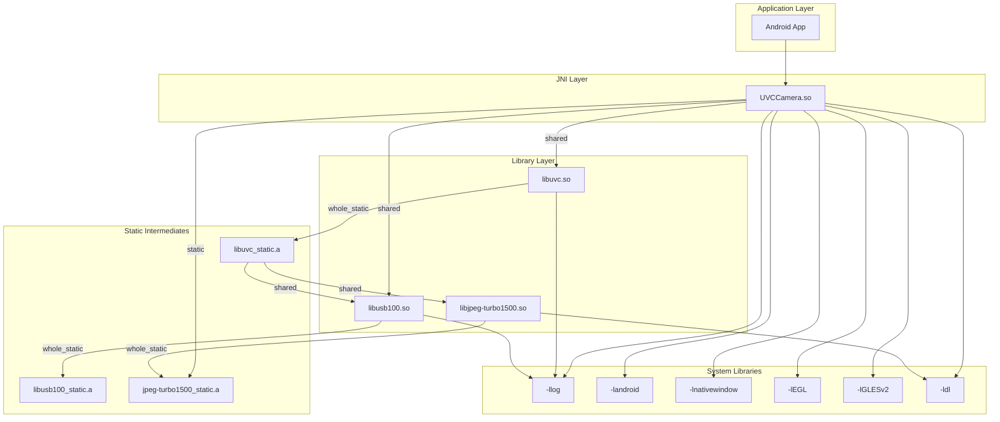
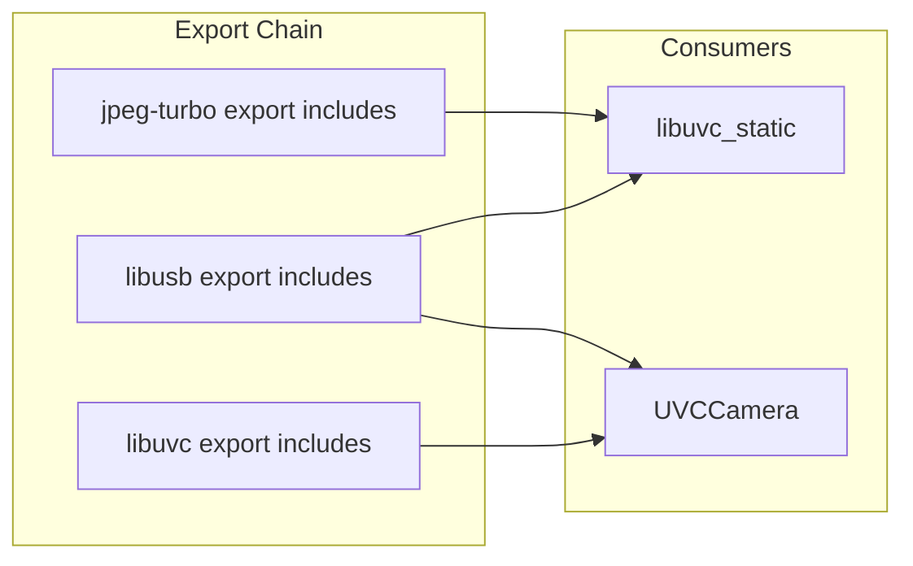
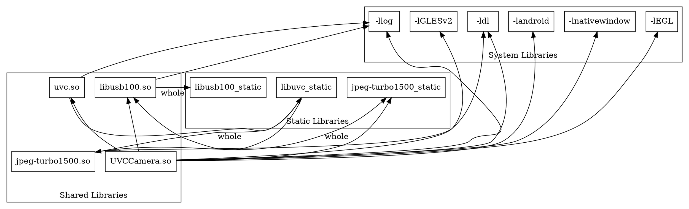

# BUILD-004: Dependency Graph Construction

**Audit:** AUDIT-005 Build System Archaeology
**Generated:** 2026-01-11
**Target:** Module Dependency Analysis

---

## Summary

| Metric | Count |
|--------|-------|
| Active modules | 8 |
| Shared library deps | 5 |
| Static library deps | 3 |
| System library deps | 7 |
| Dependency depth | 3 levels |

---

## 1. Dependency Graph (Mermaid)



---

## 2. Build Order Graph (DAG)

```
Level 0 (no dependencies):
├── jpeg-turbo1500_static
└── libusb100_static

Level 1 (depends on Level 0):
├── jpeg-turbo1500 ← WHOLE_STATIC(jpeg-turbo1500_static)
├── libusb100 ← WHOLE_STATIC(libusb100_static)
└── libuvc_static ← SHARED(jpeg-turbo1500, usb100)

Level 2 (depends on Level 1):
└── uvc ← WHOLE_STATIC(libuvc_static)

Level 3 (depends on all):
└── UVCCamera ← SHARED(usb100, uvc) + STATIC(jpeg-turbo1500_static)
```

---

## 3. Dependency Matrix

### Module-to-Module Dependencies

|  | jpeg_static | jpeg_shared | usb_static | usb_shared | uvc_static | uvc_shared | UVCCamera |
|--|-------------|-------------|------------|------------|------------|------------|-----------|
| jpeg_static | - | - | - | - | - | - | - |
| jpeg_shared | W | - | - | - | - | - | - |
| usb_static | - | - | - | - | - | - | - |
| usb_shared | - | - | W | - | - | - | - |
| uvc_static | - | S | - | S | - | - | - |
| uvc_shared | - | - | - | - | W | - | - |
| UVCCamera | S | - | - | S | - | S | - |

**Legend:** W = WHOLE_STATIC, S = SHARED/STATIC, - = No dependency

### System Library Dependencies

| Module | log | android | nativewindow | EGL | GLESv2 | dl |
|--------|-----|---------|--------------|-----|--------|-----|
| UVCCamera | ✓ | ✓ | ✓ | ✓ | ✓ | ✓ |
| libuvc | ✓ | - | - | - | - | - |
| libusb | ✓ | - | - | - | - | - |
| libjpeg-turbo | - | - | - | - | - | ✓ |

---

## 4. Detailed Module Dependencies

### UVCCamera (Final Product)

```makefile
LOCAL_SHARED_LIBRARIES += usb100 uvc
LOCAL_STATIC_LIBRARIES += jpeg-turbo1500_static

LOCAL_LDLIBS := -L$(SYSROOT)/usr/lib -ldl
LOCAL_LDLIBS += -llog
LOCAL_LDLIBS += -landroid
LOCAL_LDLIBS += -lnativewindow
LOCAL_LDLIBS += -lEGL
LOCAL_LDLIBS += -lGLESv2
```

**Analysis:**
- Links `usb100` and `uvc` as shared libraries
- Links `jpeg-turbo1500_static` directly for JPEG encoding (Phase 4 captureToFd)
- Full set of Android system libraries for rendering

### libuvc (uvc.so)

```makefile
LOCAL_SHARED_LIBRARIES += jpeg-turbo1500
LOCAL_SHARED_LIBRARIES += usb100
LOCAL_WHOLE_STATIC_LIBRARIES = libuvc_static
```

**Analysis:**
- Wraps `libuvc_static.a` into shared library
- Depends on both jpeg and usb shared libraries
- Exports `-llog` to dependents

### libusb (libusb100.so)

```makefile
LOCAL_WHOLE_STATIC_LIBRARIES = libusb100_static
LOCAL_EXPORT_LDLIBS += -llog
```

**Analysis:**
- Wraps `libusb100_static.a` into shared library
- No other library dependencies
- Exports `-llog` to dependents

### libjpeg-turbo (jpeg-turbo1500.so)

```makefile
LOCAL_WHOLE_STATIC_LIBRARIES = jpeg-turbo1500_static
LOCAL_LDLIBS := -L$(SYSROOT)/usr/lib -ldl
```

**Analysis:**
- Wraps static library into shared library
- Only depends on `-ldl` for dynamic loading
- No other library dependencies

---

## 5. WHOLE_STATIC_LIBRARIES Pattern

### Pattern Explanation

All third-party libraries use this pattern:
```makefile
# Step 1: Build static library with all sources
LOCAL_MODULE := libfoo_static
include $(BUILD_STATIC_LIBRARY)

# Step 2: Wrap into shared library
include $(CLEAR_VARS)
LOCAL_WHOLE_STATIC_LIBRARIES = libfoo_static
LOCAL_MODULE := foo
include $(BUILD_SHARED_LIBRARY)
```

**Benefits:**
1. Static library can be linked directly (faster, single binary)
2. Shared library for JNI loading and size optimization
3. Flexibility for both use cases

### Evidence in Codebase

| Static Module | Shared Module | Relationship |
|---------------|---------------|--------------|
| jpeg-turbo1500_static | jpeg-turbo1500 | WHOLE_STATIC |
| libusb100_static | libusb100 | WHOLE_STATIC |
| libuvc_static | uvc | WHOLE_STATIC |

---

## 6. Include Propagation Graph



### Exported Include Paths

| Module | LOCAL_EXPORT_C_INCLUDES |
|--------|------------------------|
| libjpeg-turbo | `$(LOCAL_PATH)/`, `$(LOCAL_PATH)/include`, `$(LOCAL_PATH)/simd` |
| libusb | `$(LOCAL_PATH)/`, `$(LOCAL_PATH)/libusb` |
| libuvc | `$(LOCAL_PATH)/`, `$(LOCAL_PATH)/include`, `$(LOCAL_PATH)/include/libuvc` |

---

## 7. Symbol Dependencies

### External Symbols Required by UVCCamera

| Symbol Category | Source Library |
|-----------------|----------------|
| `uvc_*` | libuvc |
| `libusb_*` | libusb |
| `tjCompress*`, `tjDecompress*` | libjpeg-turbo |
| `ANativeWindow_*` | libnativewindow |
| `egl*` | libEGL |
| `gl*` | libGLESv2 |
| `__android_log_*` | liblog |

### JNI Entry Points

```cpp
// In _onload.cpp
JNIEXPORT jint JNICALL JNI_OnLoad(JavaVM* vm, void* reserved)

// In serenegiant_usb_UVCCamera.cpp
Java_com_serenegiant_usb_UVCCamera_nativeCreate
Java_com_serenegiant_usb_UVCCamera_nativeDestroy
// ... etc.
```

---

## 8. Circular Dependency Check

**Result:** No circular dependencies detected.

**Verification:**
```
jpeg_static → (none)
usb_static → (none)
jpeg_shared → jpeg_static
usb_shared → usb_static
uvc_static → jpeg_shared, usb_shared
uvc_shared → uvc_static
UVCCamera → usb_shared, uvc_shared, jpeg_static
```

All dependencies form a proper DAG (Directed Acyclic Graph).

---

## 9. Build Parallelization Opportunities

### Parallel Build Groups

**Group 1 (Parallel):**
- jpeg-turbo1500_static
- libusb100_static

**Group 2 (Parallel, after Group 1):**
- jpeg-turbo1500 (shared)
- libusb100 (shared)
- libuvc_static

**Group 3 (After Group 2):**
- uvc (shared)

**Group 4 (After all):**
- UVCCamera

### Makefile Build Order

The root Android.mk includes in this order:
```makefile
include $(PROJ_PATH)/UVCCamera/Android.mk
include $(PROJ_PATH)/libjpeg-turbo-1.5.0/Android.mk
include $(PROJ_PATH)/libusb/android/jni/Android.mk
include $(PROJ_PATH)/libuvc/android/jni/Android.mk
```

ndk-build resolves the actual order based on dependencies.

---

## 10. CMake Equivalent Structure

```cmake
# Level 0: No dependencies
add_library(jpeg-turbo1500_static STATIC ...)
add_library(libusb100_static STATIC ...)

# Level 0: Shared wrappers
add_library(jpeg-turbo1500 SHARED ...)
target_link_libraries(jpeg-turbo1500 PRIVATE jpeg-turbo1500_static)

add_library(libusb100 SHARED ...)
target_link_libraries(libusb100 PRIVATE libusb100_static)

# Level 1: libuvc
add_library(libuvc_static STATIC ...)
target_link_libraries(libuvc_static PUBLIC jpeg-turbo1500 libusb100)

add_library(uvc SHARED ...)
target_link_libraries(uvc PRIVATE libuvc_static)

# Level 2: Main library
add_library(UVCCamera SHARED ...)
target_link_libraries(UVCCamera
    PRIVATE
        libusb100
        uvc
        jpeg-turbo1500_static
        android
        log
        nativewindow
        EGL
        GLESv2
)
```

---

## 11. Dependency Graph (Graphviz DOT)



---

## 12. Findings Summary

| ID | Severity | Finding | Impact |
|----|----------|---------|--------|
| DEP-001 | Info | Deep dependency chain (3 levels) | Build time |
| DEP-002 | Info | Dual static/shared pattern used | Flexibility |
| DEP-003 | Low | UVCCamera links jpeg static while uvc links jpeg shared | Potential symbol duplication |

### Positive Findings

| ID | Finding |
|----|---------|
| DEP-P01 | No circular dependencies |
| DEP-P02 | Proper export includes configured |
| DEP-P03 | WHOLE_STATIC pattern correctly applied |
| DEP-P04 | Parallelization opportunities exist |

---

## Cross-Reference

| Document | Relationship |
|----------|--------------|
| **BUILD-001** | Module definitions |
| **BUILD-003** | Compiler/linker flags |
| **BUILD-008** | Build artifact mapping |
| **BUILD-010** | CMake template |

---

*End of BUILD-004*
