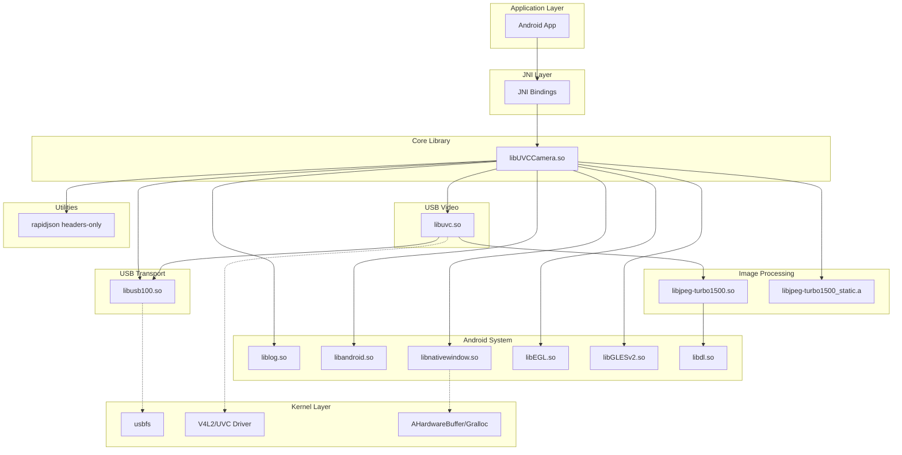
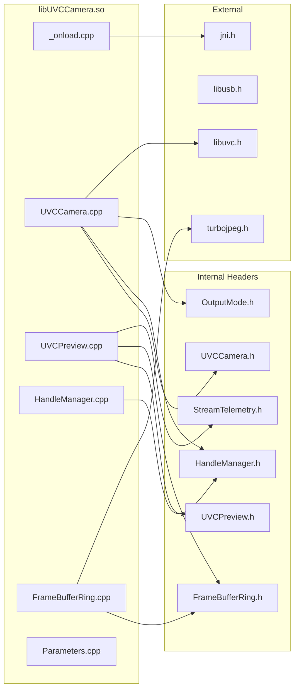
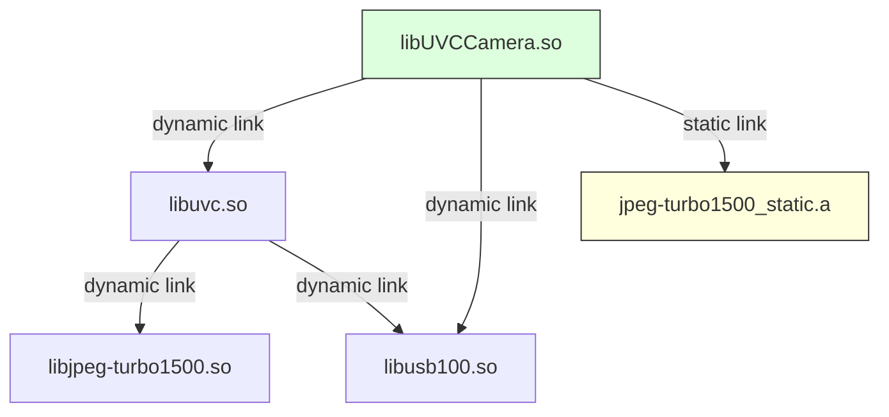

# INVENTORY-005: Dependency Graph

**Audit:** AUDIT-001 UVCCamera Codebase Reconnaissance
**Generated:** 2026-01-11
**Target:** `/lib/src/main/jni/`

---

## Summary

| Metric | Value |
|--------|-------|
| Core Components | 5 (UVCCamera, libuvc, libusb, libjpeg-turbo, rapidjson) |
| External Dependencies | 6 system libraries |
| Internal Header Dependencies | ~200 unique includes |
| Circular Dependencies | None detected |

---

## Component-Level Architecture

### High-Level Dependency Diagram



### Kernel/Driver Dependencies (External)

The library interfaces with kernel-level components through system calls:

| Component | Kernel Interface | Notes |
|-----------|------------------|-------|
| **libusb** | usbfs (`/dev/bus/usb/`) | Android-modified `android_usbfs.c` |
| **libuvc** | V4L2 UVC driver | Quirk handling in userspace (see Appendix C.2) |
| **ANativeWindow** | AHardwareBuffer/Gralloc | V4L2 data_offset (ACK 6.1+, see Appendix C.1) |

**Reference:** See `AUDIT-001-appendix-background.md` for kernel version requirements and quirk documentation.

---

## Component Dependencies

### libUVCCamera.so (Main Library)



### Shared Library Chain



---

## Header Dependency Matrix

### Critical Include Chains

| Source File | Key Dependencies |
|-------------|------------------|
| `UVCCamera.cpp` | jni.h → libUVCCamera.h → UVCCamera.h → libuvc.h → libusb.h |
| `UVCPreview.cpp` | UVCPreview.h → FrameBufferRing.h → android/hardware_buffer.h |
| `FrameBufferRing.cpp` | FrameBufferRing.h → StreamTelemetry.h → turbojpeg.h |
| `stream.c` (libuvc) | libuvc_internal.h → libusb.h → jpeglib.h |

### Include Depth Analysis

```
Max Include Depth: 5 levels

Example Chain (deepest):
UVCCamera.cpp
└── UVCCamera.h
    └── libuvc/libuvc.h
        └── libuvc/libuvc_internal.h
            └── libusb.h
                └── libusbi.h
```

---

## External Dependencies

### System Libraries

| Library | Version | Purpose | API Level |
|---------|---------|---------|-----------|
| `liblog.so` | System | Android logging (LOGD, LOGI, etc.) | 1+ |
| `libandroid.so` | System | Native Android APIs | 1+ |
| `libnativewindow.so` | System | ANativeWindow for display | 26+ |
| `libEGL.so` | System | EGL context management | 1+ |
| `libGLESv2.so` | System | OpenGL ES 2.0 rendering | 1+ |
| `libdl.so` | System | Dynamic loading | 1+ |

### Third-Party Libraries (Bundled)

| Library | Version | Source | License |
|---------|---------|--------|---------|
| libuvc | Custom fork | Embedded | BSD |
| libusb | 1.0.x (modified) | Embedded | LGPL 2.1 |
| libjpeg-turbo | 1.5.0 | Embedded | IJG/BSD |
| rapidjson | (headers) | Embedded | MIT |

---

## File-Level Dependencies

### UVCCamera Core Files

```
UVCCamera/
├── _onload.cpp
│   └── includes: jni.h, _onload.h, libUVCCamera.h
│
├── UVCCamera.cpp (2894 lines)
│   └── includes: utilbase.h, UVCCamera.h, UVCPreview.h,
│                 HandleManager.h, libuvc.h, OutputMode.h
│
├── UVCPreview.cpp (3006 lines)
│   └── includes: UVCPreview.h, utilbase.h, FrameBufferRing.h,
│                 StreamTelemetry.h, libuvc.h, OutputMode.h
│
├── HandleManager.cpp
│   └── includes: HandleManager.h, utilbase.h
│
├── FrameBufferRing.cpp
│   └── includes: FrameBufferRing.h, FrameSlotMetadata.h,
│                 StreamTelemetry.h, turbojpeg.h,
│                 android/hardware_buffer.h
│
├── Parameters.cpp
│   └── includes: Parameters.h, UVCCamera.h, libuvc.h
│
└── LayoutContract.cpp
    └── includes: LayoutContract.h
```

### libuvc Source Files

```
libuvc/src/
├── ctrl.c
│   └── includes: libuvc.h, libuvc_internal.h, libusb.h
│
├── device.c
│   └── includes: libuvc.h, libuvc_internal.h, libusb.h
│
├── frame.c
│   └── includes: libuvc.h, libuvc_internal.h
│
├── frame-mjpeg.c
│   └── includes: libuvc.h, libuvc_internal.h, jpeglib.h
│
├── init.c
│   └── includes: libuvc.h, libuvc_internal.h, libusb.h
│
└── stream.c
    └── includes: libuvc.h, libuvc_internal.h, libusb.h
```

### libusb Source Files

```
libusb/libusb/
├── core.c
│   └── includes: libusbi.h, hotplug.h
│
├── descriptor.c
│   └── includes: libusbi.h
│
├── io.c
│   └── includes: libusbi.h
│
├── os/android_usbfs.c
│   └── includes: libusbi.h, android_usbfs.h
│
└── os/android_netlink.c
    └── includes: libusbi.h
```

---

## Dependency Statistics

### Include Frequency (Top 20)

| Count | Header | Component |
|-------|--------|-----------|
| 65 | `stdlib.h` | System |
| 60 | `stdio.h` | System |
| 59 | `jpeglib.h` | libjpeg |
| 57 | `jinclude.h` | libjpeg |
| 50 | `string.h` | System |
| 37 | `errno.h` | System |
| 27 | `utilbase.h` | UVCCamera |
| 27 | `unistd.h` | POSIX |
| 27 | `libusbi.h` | libusb |
| 22 | `libusb.h` | libusb |
| 21 | `sys/types.h` | System |
| 21 | `libUVCCamera.h` | UVCCamera |
| 21 | `config.h` | Build |
| 16 | `libuvc/libuvc.h` | libuvc |
| 15 | `libuvc/libuvc_internal.h` | libuvc |
| 13 | `pthread.h` | POSIX |
| 13 | `jni.h` | Android |
| 10 | `IPipeline.h` | UVCCamera |

### Component Coupling

| From → To | Include Count | Coupling Level |
|-----------|---------------|----------------|
| UVCCamera → libuvc | 16 | High |
| UVCCamera → libusb | 4 | Medium |
| UVCCamera → libjpeg | 3 | Low |
| libuvc → libusb | 22 | High |
| libuvc → libjpeg | 15 | Medium |

---

## Circular Dependency Analysis

### Status: No Circular Dependencies Detected

The include structure follows a strict layering:

```
Layer 4: UVCCamera (application logic)
    ↓
Layer 3: libuvc (UVC protocol)
    ↓
Layer 2: libusb (USB transport) + libjpeg-turbo (image codec)
    ↓
Layer 1: System libraries (log, android, EGL, etc.)
```

### Potential Coupling Concerns

1. **UVCPreview.cpp** has high fan-out (many dependencies)
2. **libuvc_internal.h** exposes internal structures to UVCCamera
3. **utilbase.h** is widely included but contains macros (not types)

---

## Build Order Constraints

Based on dependencies, correct build order is:

```
1. libjpeg-turbo1500_static.a / libjpeg-turbo1500.so (no deps)
2. libusb100_static.a / libusb100.so (no deps)
3. libuvc_static.a / libuvc.so (deps: jpeg, usb)
4. libUVCCamera.so (deps: uvc, usb, jpeg_static)
```

This matches the current Android.mk include order.

---

## Graphviz DOT File

See: `INVENTORY-005-dependency-graph.dot` for file-level visualization.

---

## Cross-Reference

| Document | Relationship |
|----------|--------------|
| INVENTORY-004 | Build configuration that produces these dependencies |
| INVENTORY-006 | Baseline metrics including platform targets |
| **AUDIT-001-appendix-background.md** | Kernel/V4L2/UVC background (Appendix C), Android 16 (Appendix D) |
| CONCURRENCY-004 | Frame pipeline architecture using these components |

---

*End of INVENTORY-005*
