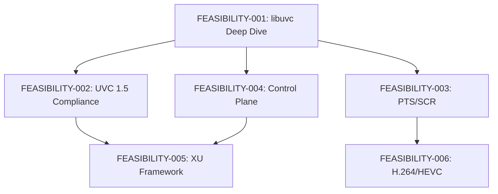

# FEASIBILITY-001: libuvc Deep Dive

**Status:** Complete
**Date:** 2026-01-11
**Author:** Claude
**Prerequisite For:** All subsequent feasibility reports

---

## Executive Summary

The libuvc in this project is a **heavily modified fork** of the upstream ktossell/libuvc, with approximately **4,277 lines added (+108%)** by saki@serenegiant. The fork has preserved original files as `*_original.c` for reference, enabling precise diff analysis.

**Key Finding:** The infrastructure for PTS/SCR timestamps, Extension Units, and error handling **already exists** but is incompletely connected. Most modernization opportunities are "last mile" integrations, not architectural rewrites.

**Recommendation:** **CONTINUE FORK** - The modifications are too extensive to wrapper, and the base is solid enough that rewriting is not justified.

---

## 1. Current State Analysis

### 1.1 Fork Divergence

| File | Original LOC | Modified LOC | Delta | Change % |
|------|--------------|--------------|-------|----------|
| ctrl.c | 469 | 1,719 | +1,250 | +266% |
| frame.c | 370 | 1,395 | +1,025 | +277% |
| stream.c | 1,115 | 1,946 | +831 | +75% |
| device.c | 1,404 | 1,833 | +429 | +31% |
| frame-mjpeg.c | 187 | 570 | +383 | +205% |
| diag.c | 257 | 564 | +307 | +119% |
| init.c | 162 | 214 | +52 | +32% |
| **Total** | **3,964** | **8,241** | **+4,277** | **+108%** |

### 1.2 Architecture Overview

```
┌─────────────────────────────────────────────────────────────────────────────┐
│                          LIBUVC ARCHITECTURE                                 │
├─────────────────────────────────────────────────────────────────────────────┤
│                                                                              │
│  ┌─────────────────┐    ┌─────────────────┐    ┌─────────────────┐          │
│  │   Application   │    │   UVCCamera.cpp │    │    JNI Layer    │          │
│  │   (Kotlin)      │◄──►│   (Native)      │◄──►│  (Bridge)       │          │
│  └────────┬────────┘    └────────┬────────┘    └────────┬────────┘          │
│           │                      │                      │                    │
│           └──────────────────────┼──────────────────────┘                    │
│                                  │                                           │
│                                  ▼                                           │
│  ┌──────────────────────────────────────────────────────────────────────┐   │
│  │                           LIBUVC                                      │   │
│  │  ┌────────────┐  ┌────────────┐  ┌────────────┐  ┌────────────┐      │   │
│  │  │  init.c    │  │  device.c  │  │  stream.c  │  │  ctrl.c    │      │   │
│  │  │ Context    │  │ Discovery  │  │ Streaming  │  │ Controls   │      │   │
│  │  │ Setup      │  │ Parsing    │  │ Payload    │  │ Get/Set    │      │   │
│  │  └────────────┘  └────────────┘  └────────────┘  └────────────┘      │   │
│  │                                                                       │   │
│  │  ┌────────────┐  ┌────────────┐  ┌────────────┐                      │   │
│  │  │  frame.c   │  │ frame-     │  │  diag.c    │                      │   │
│  │  │ Colorspace │  │ mjpeg.c    │  │ Debug      │                      │   │
│  │  │ Conversion │  │ JPEG decode│  │ Logging    │                      │   │
│  │  └────────────┘  └────────────┘  └────────────┘                      │   │
│  └──────────────────────────────────────────────────────────────────────┘   │
│                                  │                                           │
│                                  ▼                                           │
│  ┌──────────────────────────────────────────────────────────────────────┐   │
│  │                           LIBUSB                                      │   │
│  │              USB transfer, device enumeration, async I/O              │   │
│  └──────────────────────────────────────────────────────────────────────┘   │
│                                                                              │
└─────────────────────────────────────────────────────────────────────────────┘
```

### 1.3 Key Data Structures

```c
// Stream handle - contains PTS/SCR fields (libuvc_internal.h:254-284)
struct uvc_stream_handle {
    // ... threading primitives
    uint8_t bfh_err, hold_bfh_err;    // Error flag tracking (XXX added)
    uint8_t fid;                       // Frame ID toggle
    uint32_t seq, hold_seq;            // Sequence numbers
    uint32_t pts, hold_pts;            // PTS from header (EXTRACTED!)
    uint32_t last_scr, hold_last_scr;  // SCR from header (EXTRACTED!)
    size_t got_bytes, hold_bytes;
    uint8_t *outbuf, *holdbuf;
    pthread_mutex_t cb_mutex;
    pthread_cond_t cb_cond;
    uvc_frame_callback_t *user_cb;
    // ...
};

// Frame structure (libuvc.h:455-485)
typedef struct uvc_frame {
    void *data;
    size_t data_bytes;
    size_t actual_bytes;               // XXX added for error detection
    uint32_t width, height;
    enum uvc_frame_format frame_format;
    size_t step;
    uint32_t sequence;
    struct timeval capture_time;       // NOT connected to PTS!
    uvc_device_handle_t *source;
    uint8_t library_owns_data;
} uvc_frame_t;
```

### 1.4 Extension Points Identified

| Extension Point | Location | Status |
|-----------------|----------|--------|
| PTS extraction | stream.c:744-751 | **Implemented, unused** |
| SCR extraction | stream.c:755-763 | **Implemented, unused** |
| Error bit tracking | stream.c:707, 726, etc. | **Implemented** |
| Extension Unit parsing | device.c:1113-1134 | **Implemented** |
| XU get/set | ctrl.c:60-84 | **Generic only** |
| UVC 1.5 stream params | libuvc.h:513-519 | **Defined, usage unclear** |

---

## 2. Target State Definition

### 2.1 What "Aggressive Modernization" Would Look Like

| Dimension | Current | Target |
|-----------|---------|--------|
| **PTS/SCR** | Extracted, discarded | Exposed in frame metadata |
| **Extension Units** | Generic get/set | High-level typed framework |
| **Error Handling** | Partial tracking | Structured error taxonomy |
| **H.264/HEVC** | Not implemented | Frame-based payload support |
| **Still Image** | Not implemented | UVC 1.5 still capture |
| **Thread Model** | pthread raw | Consider C++11 threading |

### 2.2 Spec Requirements (UVC 1.5)

| Feature | UVC Spec Reference | Implementation Gap |
|---------|-------------------|-------------------|
| PTS in payload | §2.4.3.3 | Connection to frame |
| SCR in payload | §2.4.3.3 | Connection to frame |
| GET_INFO | §4.2.1.2 | Not queried |
| Extension Units | §3.7.2.7 | Framework needed |
| Frame-based payload | §2.3 | Not implemented |
| Still image | §4.3.1.3 | Not implemented |

---

## 3. Gap Analysis

### 3.1 PTS/SCR Gap (Critical for FEASIBILITY-003)

**Evidence:** stream.c:1758
```c
/** @todo set the frame time */
```

**Current Flow:**
```
USB Packet → Header Parsing → PTS extracted (strmh->pts) → hold_pts stored
                                                                    ↓
                                                              NEVER USED
                                                                    ↓
Frame callback → frame->capture_time = ??? (unset)
```

**Gap:** ~5 lines of code to connect hold_pts to frame->capture_time

### 3.2 Extension Unit Gap (Critical for FEASIBILITY-005)

**What Exists:**
- XU descriptors parsed into `uvc_extension_unit_t`
- Generic `uvc_get_ctrl()` / `uvc_set_ctrl()` work
- GUID and control bitmap stored

**What's Missing:**
- High-level XU framework (register, type-safe access)
- Vendor protocol handling
- Control capability querying for XU

### 3.3 H.264/HEVC Gap (Critical for FEASIBILITY-006)

**What Exists:**
- `UVC_VS_FORMAT_FRAME_BASED = 0x10` defined
- `UVC_VS_FRAME_FRAME_BASED = 0x11` defined

**What's Missing:**
- Frame-based payload parsing
- MediaCodec integration
- Timestamp synchronization

---

## 4. Technical Feasibility

### 4.1 Can It Be Done?

| Opportunity | Feasibility | Rationale |
|-------------|-------------|-----------|
| PTS/SCR exposure | **HIGH** | Infrastructure exists, ~10 LOC fix |
| XU Framework | **HIGH** | Parsing exists, needs wrapper |
| Error taxonomy | **MEDIUM** | Requires categorization work |
| H.264/HEVC | **MEDIUM** | New payload parser + MediaCodec |
| Still image | **MEDIUM** | New control path |
| Thread modernization | **LOW** | Deep changes, high risk |

### 4.2 Approaches

**Option A: Incremental Enhancement**
- Keep fork as-is
- Add targeted fixes (PTS, XU wrapper)
- Low risk, fast iteration

**Option B: Abstraction Layer**
- Wrap libuvc with C++ layer
- Expose modern API
- Medium risk, cleaner long-term

**Option C: Gradual Rewrite**
- Replace modules one-by-one
- Start with frame handling
- High risk, long timeline

**Recommendation:** Option A for now, transition to Option B for major features

---

## 5. Effort Estimation

### 5.1 PTS/SCR Connection

| Task | LOC | Time |
|------|-----|------|
| Connect hold_pts to frame | 10 | 1 hour |
| Add PTS to frame struct | 5 | 30 min |
| Clock sync algorithm | 200 | 2-3 days |
| Testing | - | 1-2 days |
| **Total** | ~215 | **3-4 days** |

### 5.2 XU Framework

| Task | LOC | Time |
|------|-----|------|
| C++ wrapper class | 300 | 2-3 days |
| Type-safe control access | 200 | 1-2 days |
| JNI exposure | 100 | 1 day |
| Testing with real cameras | - | 3-5 days |
| **Total** | ~600 | **1-2 weeks** |

### 5.3 H.264/HEVC Payload

| Task | LOC | Time |
|------|-----|------|
| Frame-based payload parser | 500 | 1 week |
| MediaCodec integration | 400 | 1 week |
| Timestamp sync | 200 | 2-3 days |
| Testing | - | 1 week |
| **Total** | ~1100 | **3-4 weeks** |

---

## 6. Risk Assessment

### 6.1 Fork Maintenance Risk

| Risk | Likelihood | Impact | Mitigation |
|------|------------|--------|------------|
| Upstream changes | LOW | LOW | Upstream largely dormant |
| Divergence grows | MEDIUM | MEDIUM | Track changes in `*_original.c` |
| Android NDK breaks | LOW | HIGH | Test with each NDK release |
| libusb changes | LOW | MEDIUM | Pin libusb version |

### 6.2 Technical Risks

| Risk | Likelihood | Impact | Mitigation |
|------|------------|--------|------------|
| PTS clock drift | MEDIUM | MEDIUM | Linear regression sync |
| Camera quirks | HIGH | MEDIUM | Quirk flags database |
| Thread safety bugs | LOW | HIGH | ASan/TSan in CI |
| Memory leaks | MEDIUM | MEDIUM | LSan in CI |

### 6.3 Breaking Changes

| Change | Breaking? | Migration Path |
|--------|-----------|----------------|
| Add PTS to frame | No | New field, optional use |
| XU framework | No | Additive API |
| H.264 support | No | New format enum |
| Thread model change | **Yes** | Major version bump |

---

## 7. Dependencies

### 7.1 What Must Happen First



### 7.2 What This Enables

- **FEASIBILITY-003:** PTS/SCR work is now clearly scoped (~3-4 days)
- **FEASIBILITY-005:** XU framework has clear extension points
- **FEASIBILITY-006:** Payload parsing location identified

---

## 8. Recommendation

### 8.1 Decision: **GO - Continue Fork**

**Rationale:**
1. Fork is well-maintained with original files preserved
2. Core infrastructure for modernization exists
3. Modifications are too extensive for wrapper approach
4. Rewrite not justified given working base

### 8.2 Phased Approach

| Phase | Focus | Effort | Risk |
|-------|-------|--------|------|
| **Phase 1** | PTS/SCR connection | 3-4 days | Low |
| **Phase 2** | XU framework | 1-2 weeks | Low |
| **Phase 3** | Error taxonomy | 3-5 days | Low |
| **Phase 4** | H.264/HEVC | 3-4 weeks | Medium |
| **Phase 5** | Still image | 1-2 weeks | Medium |

### 8.3 Key Decisions Required

1. **Clock sync algorithm** - Linear regression vs. PLL vs. simple offset?
2. **XU vendor support** - Which cameras to prioritize?
3. **H.264 decoder** - MediaCodec vs. software fallback?

---

## Appendix A: Fork Modification Summary

### A.1 Saki Modifications (XXX markers)

| Category | Count | Example |
|----------|-------|---------|
| Error handling | 15+ | `bfh_err` flag tracking |
| Colorspace | 20+ | RGB565, RGBX, YUV420SP conversions |
| Android-specific | 10+ | `__android_log` integration |
| UVC 1.1/1.5 params | 5+ | `dwClockFrequency`, `bmLayoutPerStream` |
| FD-based device access | 3 | `uvc_get_device_with_fd()` |
| Diagnostics | 10+ | `uvc_print_*` functions |

### A.2 Key Functions Added

```c
// FD injection for Android
uvc_error_t uvc_get_device_with_fd(uvc_context_t *ctx, uvc_device_t **device,
    int vid, int pid, const char *serial, int fd, int busnum, int devaddr);

// Bandwidth control
uvc_error_t uvc_start_streaming_bandwidth(uvc_device_handle_t *devh,
    uvc_stream_ctrl_t *ctrl, uvc_frame_callback_t *cb, void *user_ptr,
    float bandwidth, uint8_t flags);

// Extended conversions
uvc_error_t uvc_mjpeg2rgbx(uvc_frame_t *in, uvc_frame_t *out);
uvc_error_t uvc_yuyv2yuv420SP(uvc_frame_t *in, uvc_frame_t *out);
uvc_error_t uvc_any2iyuv420SP(uvc_frame_t *in, uvc_frame_t *out);
```

---

## Appendix B: Upstream Comparison

| Aspect | Upstream (ktossell) | This Fork |
|--------|---------------------|-----------|
| Last commit | ~2018 | Active |
| Android support | None | Full |
| FD injection | No | Yes |
| UVC 1.1/1.5 params | Partial | Extended |
| Colorspace conversions | 5 | 20+ |
| Error tracking | Basic | Extended |

**Conclusion:** This fork has significantly outgrown upstream. Merging back is impractical.

---

*End of FEASIBILITY-001*
