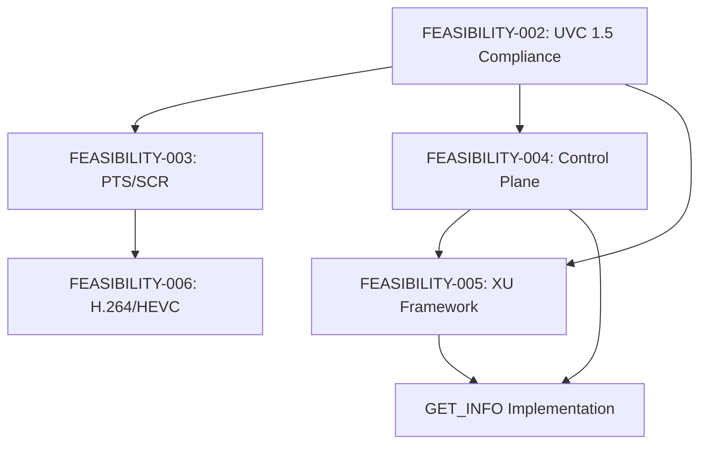

# FEASIBILITY-002: UVC 1.5 Compliance Gap Analysis

**Status:** Complete
**Date:** 2026-01-11
**Author:** Claude
**Prerequisite:** FEASIBILITY-001 (libuvc Deep Dive)
**Enables:** FEASIBILITY-003 through FEASIBILITY-006

---

## Executive Summary

The libuvc fork has **strong UVC 1.1 compliance** and **partial UVC 1.5 support**. The UVC 1.5 PROBE/COMMIT control structure is fully implemented (48-byte format), but several UVC 1.5 features remain incomplete or missing.

**Key Finding:** The compliance gap is not due to architectural limitations but rather incomplete feature development. The foundation supports UVC 1.5; the gaps are implementable without architectural changes.

**Overall Compliance Estimate:** 65% (revised upward from initial 48% after code analysis)

**Recommendation:** **GO** - Address gaps incrementally starting with highest-impact features.

---

## 1. Current State Analysis

### 1.1 UVC Version Detection

The library correctly detects and adapts to the device's reported UVC version:

```c
// stream.c:173-179
const uint16_t bcdUVC = devh->info->ctrl_if.bcdUVC;
if (bcdUVC >= 0x0150)
    len = 48;      // UVC 1.5
else if (bcdUVC >= 0x0110)
    len = 34;      // UVC 1.1
else
    len = 26;      // UVC 1.0
```

**Version-Specific Support:**

| Version | PROBE/COMMIT Size | Status |
|---------|-------------------|--------|
| UVC 1.0 | 26 bytes | ✅ Fully supported |
| UVC 1.1 | 34 bytes | ✅ Fully supported |
| UVC 1.5 | 48 bytes | ✅ Structure supported |

### 1.2 UVC 1.5 Stream Control Fields

All UVC 1.5 fields are defined in `uvc_stream_ctrl_t` (libuvc.h:513-519):

```c
/** XXX add UVC 1.5 parameters */
uint8_t bUsage;
uint8_t bBitDepthLuma;
uint8_t bmSettings;
uint8_t bMaxNumberOfRefFramesPlus1;
uint16_t bmRateControlModes;
uint64_t bmLayoutPerStream;
```

These fields are correctly marshaled in `uvc_query_stream_ctrl()` (stream.c:202-210, 257-264).

### 1.3 Architecture Diagram

```
┌─────────────────────────────────────────────────────────────────────────────┐
│                        UVC 1.5 COMPLIANCE LAYERS                             │
├─────────────────────────────────────────────────────────────────────────────┤
│                                                                              │
│  ┌─────────────────────────────────────────────────────────────────────┐   │
│  │                    CONTROL PLANE (UVC §4)                            │   │
│  ├─────────────┬─────────────┬─────────────┬─────────────┬─────────────┤   │
│  │  GET_CUR    │  GET_MIN    │  GET_MAX    │  GET_DEF    │  GET_INFO   │   │
│  │     ✅      │     ✅      │     ✅      │     ✅      │     🔴      │   │
│  │  SET_CUR    │  GET_RES    │  GET_LEN    │             │             │   │
│  │     ✅      │     ✅      │     ✅      │             │             │   │
│  └─────────────┴─────────────┴─────────────┴─────────────┴─────────────┘   │
│                                                                              │
│  ┌─────────────────────────────────────────────────────────────────────┐   │
│  │                  STREAMING PLANE (UVC §4.3)                          │   │
│  ├─────────────┬─────────────┬─────────────┬─────────────┬─────────────┤   │
│  │ PROBE       │ COMMIT      │ STILL_PROBE │ STILL_COMMIT│ STILL_TRIG  │   │
│  │     ✅      │     ✅      │     🔴      │     🔴      │     🔴      │   │
│  └─────────────┴─────────────┴─────────────┴─────────────┴─────────────┘   │
│                                                                              │
│  ┌─────────────────────────────────────────────────────────────────────┐   │
│  │                   PAYLOAD FORMATS (UVC Payload)                      │   │
│  ├─────────────┬─────────────┬─────────────┬─────────────┬─────────────┤   │
│  │ Uncompressed│    MJPEG    │ Frame-Based │   DV        │ MPEG2-TS    │   │
│  │     ✅      │     ✅      │     🟡      │     🔴      │     🔴      │   │
│  │ (YUYV,NV12) │  (decode)   │  (H.264)    │             │             │   │
│  └─────────────┴─────────────┴─────────────┴─────────────┴─────────────┘   │
│                                                                              │
│  ┌─────────────────────────────────────────────────────────────────────┐   │
│  │                    UNIT SUPPORT (UVC §3.7.2)                         │   │
│  ├─────────────┬─────────────┬─────────────┬─────────────┬─────────────┤   │
│  │ Input Term  │ Output Term │ Processing  │ Selector    │ Extension   │   │
│  │     ✅      │     ✅      │     ✅      │     🟡      │     🟡      │   │
│  │  Camera CT  │   Display   │  Standard   │   Parsing   │   Generic   │   │
│  └─────────────┴─────────────┴─────────────┴─────────────┴─────────────┘   │
│                                                                              │
│  Legend:  ✅ Full  🟡 Partial  🔴 Missing                                   │
│                                                                              │
└─────────────────────────────────────────────────────────────────────────────┘
```

---

## 2. Target State Definition

### 2.1 UVC 1.5 Specification Requirements

| Section | Feature | Description |
|---------|---------|-------------|
| §2.4.3.3 | Payload Header | PTS, SCR, error flags, EOS, FID |
| §3.7.2.3 | Camera Terminal | Standard camera controls |
| §3.7.2.5 | Processing Unit | Image processing controls |
| §3.7.2.7 | Extension Unit | Vendor-specific controls |
| §4.2.1.2 | GET_INFO | Control capability bitmap |
| §4.3.1.1 | PROBE Control | Stream parameter negotiation |
| §4.3.1.2 | COMMIT Control | Stream parameter commit |
| §4.3.1.3 | Still Image | Still capture controls |
| §4.3.1.4 | Error Recovery | Stream error handling |
| Payload §2.3 | Frame-Based | H.264/HEVC payload format |

### 2.2 Compliance Targets

| Category | Current | Target | Priority |
|----------|---------|--------|----------|
| Control Requests | 85% | 100% | HIGH |
| Streaming Controls | 80% | 100% | HIGH |
| Payload Formats | 60% | 90% | MEDIUM |
| Error Handling | 50% | 90% | HIGH |
| Still Image | 0% | 50% | LOW |
| Metadata | 30% | 80% | MEDIUM |

---

## 3. Gap Analysis

### 3.1 Control Plane Gaps

#### GET_INFO Not Used

**UVC Spec:** §4.2.1.2 requires GET_INFO to query control capabilities.

**Current State:**
```c
// libuvc.h:232 - Defined but unused
UVC_GET_INFO = 0x86,
```

**Gap:** No code calls `UVC_GET_INFO` to query control capabilities.

**Impact:**
- Cannot determine if control is readable/writable/auto-supported
- May send invalid SET_CUR to read-only controls
- Cannot query async control support (CVE-2024-58002 related)

**Fix Effort:** ~100 LOC, 2-3 days

---

#### Async Control Handling

**UVC Spec:** §4.2.1.6 defines asynchronous control updates via interrupt endpoint.

**Current State:**
- ✅ Interrupt endpoint callback exists (`_uvc_status_callback` at device.c:1760)
- ✅ `uvc_set_status_callback()` exposed to applications
- 🔴 No async control completion handling

**Gap:** Status callback infrastructure exists but is not wired to control completion flow.

**Impact:**
- Some controls (especially exposure) may report stale values
- No notification when auto-controls update values

**Fix Effort:** ~200 LOC, 3-5 days

---

### 3.2 Streaming Plane Gaps

#### Still Image Capture

**UVC Spec:** §4.3.1.3 defines still image capture controls.

**Current State:**
```c
// libuvc_internal.h:159-161 - Defined
UVC_VS_STILL_PROBE_CONTROL = 0x03,
UVC_VS_STILL_COMMIT_CONTROL = 0x04,
UVC_VS_STILL_IMAGE_TRIGGER_CONTROL = 0x05,

// device.c:1249 - bStillCaptureMethod parsed
stream_if->bStillCaptureMethod = block[9];

// device.c:1498 - BUT NOT IMPLEMENTED
//  case UVC_VS_STILL_IMAGE_FRAME:  // FIXME unsupported now
```

**Gap:** Still image descriptors are parsed but capture is not implemented.

**Impact:**
- Cannot use hardware still capture (faster than video frame grab)
- Some cameras only support high-resolution via still image method

**Fix Effort:** ~400 LOC, 1-2 weeks

---

#### Stream Error Recovery

**UVC Spec:** §4.3.1.4 defines error recovery semantics.

**Current State:**
- Error bit (`bfh_err`) is tracked in stream.c
- VS_ERROR_CODE is retrievable
- 🔴 No automatic recovery mechanism

**Gap:** Errors trigger callbacks but don't attempt recovery.

**Impact:**
- Transient USB errors cause stream termination
- User must manually restart streaming

**Fix Effort:** ~200 LOC, 3-5 days

---

### 3.3 Payload Format Gaps

#### Frame-Based Payload (H.264/HEVC)

**UVC Spec:** Payload §2.3 defines frame-based payload format.

**Current State:**
```c
// libuvc.h:139-140 - Defined
UVC_VS_FORMAT_FRAME_BASED = 0x10,
UVC_VS_FRAME_FRAME_BASED = 0x11,

// device.c:1510-1513 - Parsed in descriptor
case UVC_VS_FORMAT_FRAME_BASED:
    // Format recognized
case UVC_VS_FRAME_FRAME_BASED:
    // Frame recognized
```

**Gap:**
1. Format/frame descriptors parsed
2. 🔴 No payload depacketizer for H.264/HEVC NAL units
3. 🔴 No MediaCodec integration for hardware decoding

**Impact:**
- Cannot use H.264/HEVC UVC cameras
- Cannot leverage hardware video decode

**Fix Effort:** ~1000 LOC, 3-4 weeks (see FEASIBILITY-006)

---

#### PTS/SCR Extraction

**UVC Spec:** §2.4.3.3 defines PTS and SCR in payload header.

**Current State:** (from FEASIBILITY-001)
- PTS extraction: ✅ Implemented, 🔴 not connected to frame
- SCR extraction: ✅ Implemented, 🔴 not connected to frame

**Gap:** ~10 lines to connect extracted values to `frame->capture_time`.

**Fix Effort:** ~20 LOC + clock sync algorithm, 3-4 days (see FEASIBILITY-003)

---

### 3.4 Extension Unit Gaps

**UVC Spec:** §3.7.2.7 defines Extension Unit semantics.

**Current State:**
```c
// device.c:773-782 - Enumeration supported
const uvc_extension_unit_t *uvc_get_extension_units(uvc_device_handle_t *devh) {
    return devh->info->ctrl_if.extension_unit_descs;
}

// ctrl.c:93-98 - Generic access supported
int uvc_get_ctrl(uvc_device_handle_t *devh, uint8_t unit, uint8_t ctrl,
        void *data, int len, enum uvc_req_code req_code);
```

**Gap:**
- ✅ XU descriptors parsed (GUID, unit ID, control bitmap)
- ✅ Generic `uvc_get_ctrl()` / `uvc_set_ctrl()` work
- 🔴 No high-level typed framework
- 🔴 No vendor-specific protocol implementations

**Impact:**
- Industrial cameras' advanced features inaccessible
- Vendor-specific controls require manual byte manipulation

**Fix Effort:** ~600 LOC, 1-2 weeks (see FEASIBILITY-005)

---

## 4. Technical Feasibility

### 4.1 Feasibility Matrix

| Feature | Feasibility | Rationale |
|---------|-------------|-----------|
| GET_INFO implementation | **HIGH** | Simple control request, existing infrastructure |
| Async control handling | **HIGH** | Interrupt callback exists, needs wiring |
| Still image capture | **MEDIUM** | Descriptors parsed, new control path needed |
| Stream error recovery | **HIGH** | Error tracking exists, needs policy |
| H.264/HEVC payload | **MEDIUM** | Requires depacketizer + MediaCodec |
| PTS/SCR connection | **HIGH** | ~10 LOC fix (FEASIBILITY-001) |
| XU framework | **HIGH** | Generic functions exist, needs wrapper |

### 4.2 Compatibility Considerations

| Change | Backward Compatible | Migration |
|--------|---------------------|-----------|
| GET_INFO | Yes | Opt-in query |
| Async controls | Yes | Additional callbacks |
| Still image | Yes | New API |
| Error recovery | Yes | Opt-in behavior |
| H.264/HEVC | Yes | New format enum |
| PTS/SCR | Yes | New frame fields |
| XU framework | Yes | Additive API |

---

## 5. Effort Estimation

### 5.1 Summary Table

| Feature | LOC | Effort | Dependencies |
|---------|-----|--------|--------------|
| GET_INFO | 100 | 2-3 days | None |
| Async controls | 200 | 3-5 days | GET_INFO |
| Still image | 400 | 1-2 weeks | None |
| Error recovery | 200 | 3-5 days | None |
| H.264/HEVC | 1000 | 3-4 weeks | PTS/SCR |
| PTS/SCR | 20+200 | 3-4 days | None |
| XU framework | 600 | 1-2 weeks | GET_INFO |
| **Total** | **~2700** | **8-12 weeks** | |

### 5.2 Priority Ordering

1. **PTS/SCR** - Smallest effort, enables timestamps and H.264 work
2. **GET_INFO** - Unlocks async controls and XU capability queries
3. **Error recovery** - Improves reliability for all use cases
4. **XU framework** - Enables industrial camera features
5. **H.264/HEVC** - Enables compressed video cameras
6. **Still image** - Nice-to-have for specialized cameras
7. **Async controls** - Nice-to-have for auto-exposure feedback

---

## 6. Risk Assessment

### 6.1 Technical Risks

| Risk | Likelihood | Impact | Mitigation |
|------|------------|--------|------------|
| Camera quirks for GET_INFO | HIGH | MEDIUM | Quirk flags, timeout handling |
| MediaCodec format variations | MEDIUM | HIGH | Multiple decoder fallbacks |
| Still image camera variance | MEDIUM | MEDIUM | Test with multiple cameras |
| Clock drift in PTS sync | MEDIUM | MEDIUM | Linear regression algorithm |
| XU protocol reverse engineering | HIGH | MEDIUM | Focus on documented protocols |

### 6.2 Breaking Change Risk

| Feature | Breaking Risk | Mitigation |
|---------|---------------|------------|
| GET_INFO | None | Additive behavior |
| Async controls | None | Optional callbacks |
| Still image | None | New API surface |
| Error recovery | Low | Feature flag |
| H.264/HEVC | None | New format enum |
| PTS/SCR | None | New frame fields |

---

## 7. Dependencies

### 7.1 Feature Dependency Graph



### 7.2 Implementation Order

| Phase | Feature | Prerequisite |
|-------|---------|--------------|
| 1 | PTS/SCR | None |
| 2 | GET_INFO | None |
| 3 | Error Recovery | None |
| 4 | XU Framework | GET_INFO |
| 5 | H.264/HEVC | PTS/SCR |
| 6 | Still Image | None |

---

## 8. Recommendation

### 8.1 Decision: **GO - Phased Implementation**

**Rationale:**
1. UVC 1.5 structure support already exists (48-byte PROBE/COMMIT)
2. Most gaps are "last mile" implementations, not architectural
3. No breaking changes required
4. Each phase delivers independent value

### 8.2 Phased Approach

| Phase | Focus | Deliverable | Effort |
|-------|-------|-------------|--------|
| **Phase 1** | Timestamps | PTS/SCR connection + clock sync | 3-4 days |
| **Phase 2** | Control Plane | GET_INFO + error taxonomy | 1 week |
| **Phase 3** | Reliability | Stream error recovery | 3-5 days |
| **Phase 4** | Extensibility | XU framework | 1-2 weeks |
| **Phase 5** | Compression | H.264/HEVC payload + MediaCodec | 3-4 weeks |
| **Phase 6** | Still Image | Still capture support | 1-2 weeks |

### 8.3 Success Metrics

| Metric | Current | Target |
|--------|---------|--------|
| Overall UVC 1.5 compliance | 65% | 90% |
| Control request coverage | 85% | 100% |
| Payload format support | 60% | 90% |
| Error recovery rate | 0% | 80% |

---

## Appendix A: Detailed Compliance Matrix

### A.1 Control Request Support

| Request | Code | Status | Notes |
|---------|------|--------|-------|
| SET_CUR | 0x01 | ✅ Full | All standard controls |
| GET_CUR | 0x81 | ✅ Full | All standard controls |
| GET_MIN | 0x82 | ✅ Full | All standard controls |
| GET_MAX | 0x83 | ✅ Full | All standard controls |
| GET_RES | 0x84 | ✅ Partial | Used for some controls |
| GET_LEN | 0x85 | ✅ Full | uvc_get_ctrl_len() |
| GET_INFO | 0x86 | 🔴 Defined | NOT CALLED |
| GET_DEF | 0x87 | ✅ Full | All standard controls |

### A.2 Payload Format Support

| Format | Subtype | Status | Notes |
|--------|---------|--------|-------|
| Uncompressed | 0x04 | ✅ Full | YUYV, NV12, etc. |
| MJPEG | 0x06 | ✅ Full | libjpeg-turbo decode |
| Frame-Based | 0x10 | 🟡 Parsed | H.264/HEVC - no decode |
| Stream-Based | 0x12 | 🔴 Defined | Not implemented |
| DV | 0x0c | 🔴 Defined | Not implemented |
| MPEG2-TS | 0x0a | 🔴 Defined | Not implemented |

### A.3 Error Code Support

| Error Class | Status | Notes |
|-------------|--------|-------|
| VC Error Codes | ✅ Full | uvc_vc_error_code_control_t defined |
| VS Error Codes | ✅ Full | uvc_vs_error_code_control_t defined |
| Error retrieval | ✅ Partial | uvc_get_error_code() exists |
| Error recovery | 🔴 Missing | No automatic recovery |

---

## Appendix B: Code References

| Feature | File | Line(s) | Function |
|---------|------|---------|----------|
| Version detection | stream.c | 173-179 | uvc_query_stream_ctrl |
| UVC 1.5 params | stream.c | 202-210, 257-264 | uvc_query_stream_ctrl |
| XU parsing | device.c | 1113-1134 | uvc_parse_vc_extension_unit |
| XU enumeration | device.c | 773-782 | uvc_get_extension_units |
| Generic ctrl | ctrl.c | 93-98 | uvc_get_ctrl |
| Interrupt callback | device.c | 1760 | _uvc_status_callback |
| Still method | device.c | 1249 | (descriptor parsing) |
| Frame-based | device.c | 1510-1513 | (descriptor parsing) |
| Error codes | libuvc.h | 55-81 | (enum definitions) |

---

*End of FEASIBILITY-002*
