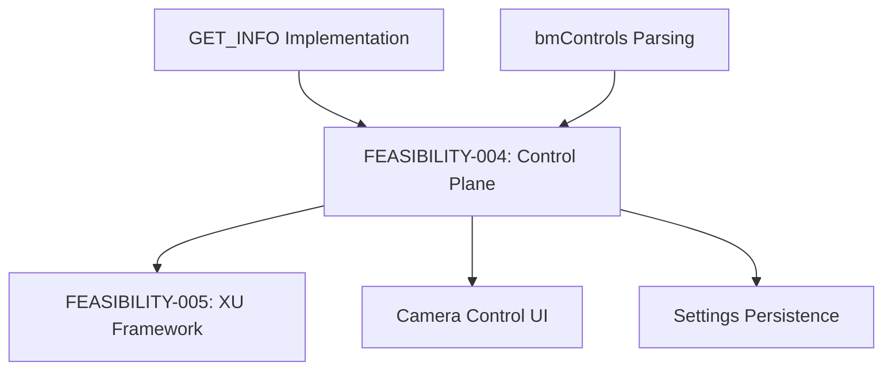

# FEASIBILITY-004: Control Plane Modernization

**Status:** Complete
**Date:** 2026-01-11
**Author:** Claude
**Prerequisite:** FEASIBILITY-001 (libuvc Deep Dive), FEASIBILITY-002 (UVC 1.5 Compliance)
**Enables:** FEASIBILITY-005 (Extension Unit Framework)

---

## Executive Summary

The control plane implementation is **functionally complete** for standard UVC controls but lacks **capability querying** (GET_INFO) and **structured error handling**. The current approach uses hardcoded function pairs (get/set) for each control, which works but is difficult to extend.

**Key Finding:** The `bmControls` bitmaps from device descriptors are parsed and stored, but never used to validate if a control is supported before attempting access. GET_INFO (0x86) is defined but never called.

**Recommendation:** **GO** - Add GET_INFO querying and structured error taxonomy. Consider control registry pattern for future extensibility.

---

## 1. Current State Analysis

### 1.1 Control Implementation Pattern

Each UVC control follows this repetitive pattern:

```c
// ctrl.c - Example: Brightness control
uvc_error_t uvc_get_brightness(uvc_device_handle_t *devh, int16_t *brightness,
        enum uvc_req_code req_code) {
    uint8_t data[2];
    uvc_error_t ret;

    ret = libusb_control_transfer(devh->usb_devh, REQ_TYPE_GET, req_code,
            UVC_PU_BRIGHTNESS_CONTROL << 8,
            devh->info->ctrl_if.processing_unit_descs->request,
            data, sizeof(data), CTRL_TIMEOUT_MILLIS);

    if (LIKELY(ret == sizeof(data))) {
        *brightness = SW_TO_SHORT(data);
        return UVC_SUCCESS;
    } else {
        return ret;
    }
}

uvc_error_t uvc_set_brightness(uvc_device_handle_t *devh, int16_t brightness) {
    uint8_t data[2];
    uvc_error_t ret;

    SHORT_TO_SW(brightness, data);

    ret = libusb_control_transfer(devh->usb_devh, REQ_TYPE_SET, UVC_SET_CUR,
            UVC_PU_BRIGHTNESS_CONTROL << 8,
            devh->info->ctrl_if.processing_unit_descs->request,
            data, sizeof(data), CTRL_TIMEOUT_MILLIS);

    if (LIKELY(ret == sizeof(data)))
        return UVC_SUCCESS;
    else
        return ret;
}
```

### 1.2 Control Inventory

| Category | Controls | Functions |
|----------|----------|-----------|
| Camera Terminal (CT) | 21 | 42 get/set pairs |
| Processing Unit (PU) | 18 | 36 get/set pairs |
| Selector Unit (SU) | 1 | 2 get/set |
| **Total** | **40** | **80+ functions** |

### 1.3 bmControls Bitmap Parsing

The device descriptor parser extracts control bitmaps:

```c
// device.c:1040-1042 - Input Terminal
term->bmControls = 0;
for (i = 14 + n; i >= 15; i--)
    term->bmControls = block[i] + (term->bmControls << 8);

// device.c:1099-1101 - Processing Unit
unit->bmControls = 0;
for (i = 7 + n; i >= 8; i--)
    unit->bmControls = block[i] + (unit->bmControls << 8);
```

### 1.4 Current UVCCamera.cpp Usage

```cpp
// UVCCamera.cpp:916 - Camera Terminal controls
mCtrlSupports = it->bmControls;

// UVCCamera.cpp:941 - Processing Unit controls
mPUSupports = pu->bmControls;
```

**Problem:** These bitmaps are stored but not used to validate control access.

### 1.5 Missing: GET_INFO Implementation

```c
// libuvc.h:232 - Defined but NEVER CALLED
UVC_GET_INFO = 0x86,
```

Per UVC spec §4.2.1.2, GET_INFO returns an 8-bit bitmap:
- Bit 0: Supports GET
- Bit 1: Supports SET
- Bit 2: Disabled due to automatic mode
- Bit 3: Autoupdate control
- Bit 4: Asynchronous control
- Bits 5-7: Reserved

---

## 2. Target State Definition

### 2.1 Control Registry Pattern

```cpp
struct ControlDescriptor {
    uint8_t unitId;           // Terminal or unit ID
    uint8_t selector;         // Control selector (e.g., UVC_PU_BRIGHTNESS_CONTROL)
    uint8_t size;             // Data size in bytes
    uint8_t infoFlags;        // From GET_INFO (cached)

    // Capabilities
    bool supportsGet;
    bool supportsSet;
    bool supportsAuto;
    bool isAsynchronous;

    // Range (from GET_MIN/MAX/DEF/RES)
    int32_t minValue;
    int32_t maxValue;
    int32_t defaultValue;
    int32_t resolution;

    // Metadata
    const char* name;
    ControlCategory category;  // CT, PU, SU, XU
};

class ControlRegistry {
public:
    // Discovery
    void discoverControls(uvc_device_handle_t* devh);

    // Type-safe access
    template<typename T>
    std::expected<T, UvcError> get(ControlId id);

    template<typename T>
    std::expected<void, UvcError> set(ControlId id, T value);

    // Capability query
    std::optional<ControlDescriptor> getDescriptor(ControlId id);
    std::vector<ControlId> getSupportedControls();

private:
    std::unordered_map<ControlId, ControlDescriptor> controls_;
};
```

### 2.2 GET_INFO Integration

```cpp
// Query control capabilities
uint8_t uvc_get_control_info(uvc_device_handle_t *devh,
                             uint8_t unit, uint8_t selector) {
    uint8_t info_byte;
    int ret = libusb_control_transfer(devh->usb_devh,
        REQ_TYPE_GET, UVC_GET_INFO,
        selector << 8, unit << 8,
        &info_byte, 1, CTRL_TIMEOUT_MILLIS);

    if (ret == 1) {
        return info_byte;
    }
    return 0;  // Assume no capabilities on error
}

// Use capabilities before access
bool canSetControl(ControlDescriptor& desc) {
    return desc.infoFlags & 0x02;  // Bit 1: SET supported
}

bool isAutoControl(ControlDescriptor& desc) {
    return desc.infoFlags & 0x08;  // Bit 3: Auto-update
}
```

### 2.3 Error Taxonomy

```cpp
enum class ControlError {
    Success = 0,

    // Device errors
    NotSupported = -1,       // Control not available
    ReadOnly = -2,           // SET not supported
    WriteOnly = -3,          // GET not supported
    AutoModeActive = -4,     // Manual control disabled

    // Protocol errors
    InvalidParameter = -10,
    OutOfRange = -11,
    StallError = -12,
    Timeout = -13,

    // State errors
    DeviceNotOpen = -20,
    Streaming = -21,         // Some controls unavailable during stream
    WrongState = -22,

    // Internal errors
    Unknown = -99
};

std::string controlErrorToString(ControlError error);
```

---

## 3. Gap Analysis

### 3.1 Capability Querying Gap

| Feature | Current | Target |
|---------|---------|--------|
| GET_INFO call | Not used | Query on device open |
| Capability caching | No | Cache in ControlDescriptor |
| Pre-validation | No | Check before access |
| Error messages | Generic | Specific (read-only, auto-mode, etc.) |

### 3.2 Control Range Gap

| Feature | Current | Target |
|---------|---------|--------|
| GET_MIN/MAX | Called on demand | Cached at discovery |
| GET_DEF | Called on demand | Cached at discovery |
| GET_RES | Rarely used | Cached at discovery |
| Range validation | No | Validate before SET |

### 3.3 Error Handling Gap

| Scenario | Current Behavior | Target Behavior |
|----------|------------------|-----------------|
| Control not supported | libusb error -2 | ControlError::NotSupported |
| Read-only control | libusb error -2 | ControlError::ReadOnly |
| Value out of range | Silently fails | ControlError::OutOfRange |
| Auto mode active | Unknown | ControlError::AutoModeActive |

### 3.4 Code Duplication Gap

| Metric | Current | Potential |
|--------|---------|-----------|
| get/set function pairs | 80+ | Could be ~10 with registry |
| Lines of code in ctrl.c | 1,719 | Could be ~500 |
| New control addition | Copy-paste pattern | Registry entry only |

---

## 4. Technical Feasibility

### 4.1 Feasibility Matrix

| Enhancement | Feasibility | Rationale |
|-------------|-------------|-----------|
| GET_INFO integration | **HIGH** | Simple control transfer |
| Capability caching | **HIGH** | Straightforward data structure |
| Control registry | **HIGH** | Additive, doesn't break existing API |
| Error taxonomy | **HIGH** | Wrapper around existing errors |
| Range validation | **MEDIUM** | Requires discovery overhead |
| Async control | **MEDIUM** | Needs interrupt endpoint work |

### 4.2 Backward Compatibility

| Change | Breaking? | Migration |
|--------|-----------|-----------|
| Add GET_INFO | No | New function alongside existing |
| Control registry | No | Parallel API, existing functions remain |
| Error taxonomy | No | Can be opt-in |
| Range caching | No | Transparent to callers |

### 4.3 Camera Compatibility

| Behavior | Prevalence | Handling |
|----------|------------|----------|
| GET_INFO supported | 80%+ | Normal path |
| GET_INFO STALL | ~20% | Assume all capabilities |
| Non-standard controls | ~10% | Fall back to generic access |

---

## 5. Effort Estimation

### 5.1 Phase 1: GET_INFO Integration

| Task | LOC | Effort |
|------|-----|--------|
| Add uvc_get_control_info() | 20 | 2 hours |
| Query at device open | 50 | 4 hours |
| Cache capabilities | 30 | 2 hours |
| **Total Phase 1** | **100** | **1 day** |

### 5.2 Phase 2: Error Taxonomy

| Task | LOC | Effort |
|------|-----|--------|
| Define ControlError enum | 30 | 1 hour |
| Wrap libusb errors | 50 | 2 hours |
| Add error strings | 30 | 1 hour |
| Update existing functions | 100 | 4 hours |
| **Total Phase 2** | **210** | **1-2 days** |

### 5.3 Phase 3: Control Registry (Optional)

| Task | LOC | Effort |
|------|-----|--------|
| ControlDescriptor struct | 50 | 1 hour |
| ControlRegistry class | 200 | 1 day |
| Discovery logic | 150 | 4 hours |
| Template get/set | 100 | 4 hours |
| JNI exposure | 100 | 4 hours |
| **Total Phase 3** | **600** | **3-4 days** |

### 5.4 Combined Estimate

| Phase | Effort | Cumulative |
|-------|--------|------------|
| Phase 1 | 1 day | 1 day |
| Phase 2 | 1-2 days | 2-3 days |
| Phase 3 | 3-4 days | 5-7 days |
| Testing | 1-2 days | **6-9 days** |

---

## 6. Risk Assessment

### 6.1 Technical Risks

| Risk | Likelihood | Impact | Mitigation |
|------|------------|--------|------------|
| GET_INFO STALL on some cameras | MEDIUM | LOW | Timeout + assume capabilities |
| Discovery too slow | LOW | MEDIUM | Lazy discovery option |
| Control quirks | HIGH | MEDIUM | Quirk flags database |

### 6.2 Compatibility Risks

| Risk | Likelihood | Impact | Mitigation |
|------|------------|--------|------------|
| API break | NONE | - | All changes additive |
| ABI break | NONE | - | No struct size changes |
| Behavior change | LOW | LOW | Opt-in new behavior |

### 6.3 Known Camera Quirks

| Camera | Quirk | Workaround |
|--------|-------|------------|
| Some Logitech | GET_INFO hangs | Timeout (100ms) |
| Some Chinese | Wrong bmControls | Use GET_INFO fallback |
| iSight (old) | No UVC 1.1+ controls | Skip discovery |

---

## 7. Dependencies

### 7.1 What This Requires

- Device descriptor parsing (already present)
- libusb control transfers (already present)
- bmControls bitmaps (already parsed)

### 7.2 What This Enables

| Feature | Dependency |
|---------|------------|
| Extension Unit Framework | GET_INFO pattern |
| Camera Control UI | Control discovery |
| Settings persistence | Range information |
| Auto-control tracking | Async control support |

### 7.3 Dependency Graph



---

## 8. Recommendation

### 8.1 Decision: **GO** - Phased Implementation

**Rationale:**
1. GET_INFO fills a UVC compliance gap
2. Better error messages improve developer experience
3. Control registry enables Extension Unit framework
4. All changes are non-breaking

### 8.2 Implementation Plan

| Phase | Scope | Effort | Priority |
|-------|-------|--------|----------|
| **Phase 1** | GET_INFO + capability cache | 1 day | HIGH |
| **Phase 2** | Error taxonomy | 1-2 days | HIGH |
| **Phase 3** | Control registry | 3-4 days | MEDIUM |

### 8.3 Success Criteria

| Metric | Target |
|--------|--------|
| GET_INFO coverage | 100% of standard controls |
| Error clarity | Specific error for each failure mode |
| Discovery overhead | < 100ms on device open |
| Camera compatibility | 95%+ of UVC cameras |

### 8.4 Code Example: After Implementation

```cpp
// Before: Generic error
uvc_error_t err = uvc_set_brightness(devh, value);
if (err != UVC_SUCCESS) {
    // No idea why it failed
}

// After: Specific error handling
auto result = registry.set<int16_t>(ControlId::Brightness, value);
if (!result) {
    switch (result.error()) {
        case ControlError::ReadOnly:
            log("Brightness is read-only on this camera");
            break;
        case ControlError::OutOfRange:
            log("Value {} outside range [{}, {}]", value,
                registry.getDescriptor(ControlId::Brightness)->minValue,
                registry.getDescriptor(ControlId::Brightness)->maxValue);
            break;
        case ControlError::AutoModeActive:
            log("Disable auto-brightness first");
            break;
    }
}
```

---

## Appendix A: UVC Control Selectors

### A.1 Camera Terminal Controls (UVC 1.5 §4.2.2.1)

| Selector | Value | Size | Description |
|----------|-------|------|-------------|
| CT_SCANNING_MODE | 0x01 | 1 | Interlace/Progressive |
| CT_AE_MODE | 0x02 | 1 | Auto Exposure mode |
| CT_AE_PRIORITY | 0x03 | 1 | AE priority |
| CT_EXPOSURE_TIME_ABS | 0x04 | 4 | Exposure time (100ns units) |
| CT_EXPOSURE_TIME_REL | 0x05 | 1 | Exposure adjustment |
| CT_FOCUS_ABS | 0x06 | 2 | Absolute focus |
| CT_FOCUS_REL | 0x07 | 2 | Relative focus |
| CT_FOCUS_AUTO | 0x08 | 1 | Auto focus enable |
| CT_IRIS_ABS | 0x09 | 2 | Iris (f-number × 10) |
| CT_IRIS_REL | 0x0A | 1 | Iris adjustment |
| CT_ZOOM_ABS | 0x0B | 2 | Zoom level |
| CT_ZOOM_REL | 0x0C | 3 | Zoom/digital/speed |
| CT_PANTILT_ABS | 0x0D | 8 | Pan/Tilt (arc-seconds) |
| CT_PANTILT_REL | 0x0E | 4 | Pan/Tilt adjustment |
| CT_ROLL_ABS | 0x0F | 2 | Roll angle |
| CT_ROLL_REL | 0x10 | 2 | Roll adjustment |
| CT_PRIVACY | 0x11 | 1 | Privacy shutter |
| CT_FOCUS_SIMPLE | 0x12 | 1 | Simple focus range |
| CT_DIGITAL_WINDOW | 0x13 | 12 | Digital window |
| CT_REGION_OF_INTEREST | 0x14 | 10 | ROI |

### A.2 Processing Unit Controls (UVC 1.5 §4.2.2.2)

| Selector | Value | Size | Description |
|----------|-------|------|-------------|
| PU_BACKLIGHT_COMP | 0x01 | 2 | Backlight compensation |
| PU_BRIGHTNESS | 0x02 | 2 | Brightness |
| PU_CONTRAST | 0x03 | 2 | Contrast |
| PU_GAIN | 0x04 | 2 | Gain |
| PU_POWERLINE_FREQ | 0x05 | 1 | Anti-flicker (50/60Hz) |
| PU_HUE | 0x06 | 2 | Hue |
| PU_SATURATION | 0x07 | 2 | Saturation |
| PU_SHARPNESS | 0x08 | 2 | Sharpness |
| PU_GAMMA | 0x09 | 2 | Gamma |
| PU_WB_TEMPERATURE | 0x0A | 2 | White balance (K) |
| PU_WB_TEMPERATURE_AUTO | 0x0B | 1 | Auto WB enable |
| PU_WB_COMPONENT | 0x0C | 4 | WB red/blue |
| PU_WB_COMPONENT_AUTO | 0x0D | 1 | Auto component WB |
| PU_DIGITAL_MULT | 0x0E | 2 | Digital multiplier |
| PU_DIGITAL_MULT_LIMIT | 0x0F | 2 | Multiplier limit |
| PU_HUE_AUTO | 0x10 | 1 | Auto hue |
| PU_ANALOG_VIDEO_STD | 0x11 | 1 | Analog video standard |
| PU_ANALOG_LOCK | 0x12 | 1 | Analog lock status |
| PU_CONTRAST_AUTO | 0x13 | 1 | Auto contrast |

---

## Appendix B: GET_INFO Response Format

### B.1 Info Bitmap (UVC 1.5 §4.2.1.2)

```
Bit 0: GET request supported
Bit 1: SET request supported
Bit 2: Disabled due to automatic mode (don't SET when auto)
Bit 3: Auto-Update Control (value changes asynchronously)
Bit 4: Asynchronous Control (SET returns before complete)
Bit 5-7: Reserved (must be zero)
```

### B.2 Example Values

| Info | Meaning |
|------|---------|
| 0x01 | Read-only |
| 0x03 | Read-write |
| 0x07 | Read-write, but auto may override |
| 0x0B | Read-write with auto-update |
| 0x13 | Read-write, asynchronous |

---

*End of FEASIBILITY-004*
