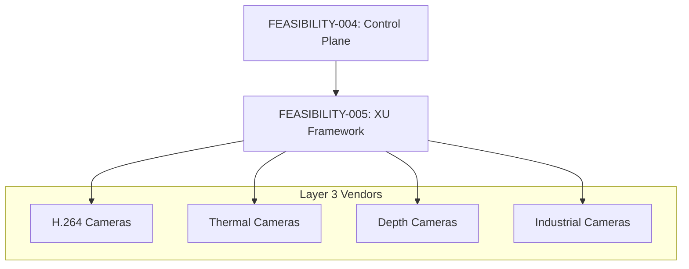

# FEASIBILITY-005: Extension Unit Framework

**Status:** Complete
**Date:** 2026-01-11
**Author:** Claude
**Prerequisite:** FEASIBILITY-004 (Control Plane Modernization)
**Enables:** Industrial camera support, vendor-specific features

---

## Executive Summary

Extension Unit (XU) support in libuvc is **partially implemented**: XU descriptors are parsed, and generic `uvc_get_ctrl()`/`uvc_set_ctrl()` functions exist. However, there is **no high-level framework** for type-safe XU access or vendor protocol handling.

**Key Finding:** The foundation exists (GUID parsing, generic control access), but industrial/scientific camera features remain inaccessible without manual byte manipulation.

**Recommendation:** **GO** - Build a layered XU framework: generic access + typed wrappers + vendor protocol library.

---

## 1. Current State Analysis

### 1.1 XU Descriptor Parsing (Implemented)

```c
// device.c:1113-1138 - XU descriptors are parsed
uvc_error_t uvc_parse_vc_extension_unit(uvc_device_t *dev,
        uvc_device_info_t *info, const unsigned char *block, size_t block_size) {
    uvc_extension_unit_t *unit = calloc(1, sizeof(*unit));

    unit->bUnitID = block[3];
    memcpy(unit->guidExtensionCode, &block[4], 16);  // ✅ GUID extracted

    // bmControls parsed
    unit->bmControls = 0;
    for (i = size_of_controls - 1; i >= 0; i--)
        unit->bmControls = start_of_controls[i] + (unit->bmControls << 8);

    DL_APPEND(info->ctrl_if.extension_unit_descs, unit);
    return UVC_SUCCESS;
}
```

### 1.2 XU Structure Definition

```c
// libuvc.h:394-404
typedef struct uvc_extension_unit {
    struct uvc_extension_unit *prev, *next;
    uint8_t bUnitID;                    // Unit ID for requests
    uint8_t guidExtensionCode[16];      // GUID identifying vendor/feature
    uint64_t bmControls;                // Available controls bitmap
    uint16_t request;                   // wIndex for USB requests
} uvc_extension_unit_t;
```

### 1.3 XU Enumeration (Implemented)

```c
// device.c:773-782
const uvc_extension_unit_t *uvc_get_extension_units(uvc_device_handle_t *devh) {
    return devh->info->ctrl_if.extension_unit_descs;
}
```

### 1.4 Generic XU Access (Implemented)

```c
// ctrl.c:93-98
int uvc_get_ctrl(uvc_device_handle_t *devh, uint8_t unit, uint8_t ctrl,
        void *data, int len, enum uvc_req_code req_code) {
    return libusb_control_transfer(devh->usb_devh, REQ_TYPE_GET, req_code,
            ctrl << 8,
            unit << 8,  // FIXME comment notes wrong wIndex
            data, len, CTRL_TIMEOUT_MILLIS);
}
```

### 1.5 Current Usage Example (Raw Bytes)

```cpp
// Accessing an XU control today requires:
uint8_t buffer[64];
uvc_extension_unit_t *xu = uvc_get_extension_units(devh);

// Find XU by GUID (manual comparison)
while (xu) {
    if (memcmp(xu->guidExtensionCode, MY_GUID, 16) == 0) {
        // Read control 0x01
        int ret = uvc_get_ctrl(devh, xu->bUnitID, 0x01,
                               buffer, sizeof(buffer), UVC_GET_CUR);
        // Manually decode buffer bytes...
    }
    xu = xu->next;
}
```

---

## 2. Target State Definition

### 2.1 Layered Architecture

```
┌─────────────────────────────────────────────────────────────────────────────┐
│                     EXTENSION UNIT FRAMEWORK LAYERS                          │
├─────────────────────────────────────────────────────────────────────────────┤
│                                                                              │
│  ┌───────────────────────────────────────────────────────────────────────┐  │
│  │                       LAYER 3: VENDOR PROTOCOLS                        │  │
│  │  ┌─────────────┐  ┌─────────────┐  ┌─────────────┐  ┌─────────────┐   │  │
│  │  │ ToupTek     │  │ Altair      │  │ Microsoft   │  │ Intel       │   │  │
│  │  │ Thermal     │  │ Astronomy   │  │ H.264 XU    │  │ RealSense   │   │  │
│  │  └─────────────┘  └─────────────┘  └─────────────┘  └─────────────┘   │  │
│  └───────────────────────────────────────────────────────────────────────┘  │
│                                      │                                       │
│  ┌───────────────────────────────────────────────────────────────────────┐  │
│  │                       LAYER 2: TYPED WRAPPERS                          │  │
│  │                                                                        │  │
│  │   XUControl<T>  │  XUEnum<E>  │  XUBitfield  │  XUByteArray          │  │
│  │                                                                        │  │
│  └───────────────────────────────────────────────────────────────────────┘  │
│                                      │                                       │
│  ┌───────────────────────────────────────────────────────────────────────┐  │
│  │                       LAYER 1: GENERIC ACCESS                          │  │
│  │                                                                        │  │
│  │   XURegistry  │  GUID lookup  │  Raw get/set  │  Capability query    │  │
│  │                                                                        │  │
│  └───────────────────────────────────────────────────────────────────────┘  │
│                                      │                                       │
│  ┌───────────────────────────────────────────────────────────────────────┐  │
│  │                       LAYER 0: EXISTING LIBUVC                         │  │
│  │                                                                        │  │
│  │   uvc_get_extension_units()  │  uvc_get_ctrl()  │  uvc_set_ctrl()    │  │
│  │                                                                        │  │
│  └───────────────────────────────────────────────────────────────────────┘  │
│                                                                              │
└─────────────────────────────────────────────────────────────────────────────┘
```

### 2.2 Layer 1: Generic Access API

```cpp
class XURegistry {
public:
    // Discovery
    std::vector<ExtensionUnit> enumerate();
    std::optional<ExtensionUnit> findByGuid(const Guid& guid);
    std::optional<ExtensionUnit> findByUnitId(uint8_t unitId);

    // Generic access
    std::expected<std::vector<uint8_t>, XUError>
        get(uint8_t unitId, uint8_t selector, size_t size, UvcReqCode req);

    std::expected<void, XUError>
        set(uint8_t unitId, uint8_t selector, std::span<const uint8_t> data);

    // Capability query
    std::optional<uint8_t> getInfo(uint8_t unitId, uint8_t selector);
    std::optional<uint16_t> getLen(uint8_t unitId, uint8_t selector);

private:
    uvc_device_handle_t* devh_;
    std::vector<ExtensionUnit> units_;
};
```

### 2.3 Layer 2: Typed Wrappers

```cpp
// Type-safe XU control
template<typename T>
class XUControl {
public:
    XUControl(XURegistry& registry, uint8_t unitId, uint8_t selector);

    std::expected<T, XUError> get(UvcReqCode req = UVC_GET_CUR);
    std::expected<void, XUError> set(const T& value);

    // Range query
    std::expected<T, XUError> getMin();
    std::expected<T, XUError> getMax();
    std::expected<T, XUError> getDefault();

private:
    XURegistry& registry_;
    uint8_t unitId_;
    uint8_t selector_;
};

// Enum control (select from list)
template<typename E>
class XUEnum {
public:
    std::expected<E, XUError> get();
    std::expected<void, XUError> set(E value);
    std::vector<E> getAvailableValues();
};

// Bitfield control (multiple flags)
class XUBitfield {
public:
    std::expected<uint64_t, XUError> get();
    std::expected<void, XUError> set(uint64_t bits);
    bool isSet(uint8_t bit);
    void setBit(uint8_t bit, bool value);
};
```

### 2.4 Layer 3: Vendor Protocol (Example: Microsoft H.264 XU)

```cpp
// Known GUID: {A29E7641-DE04-47E3-8B2B-F4341AFF003B}
class MicrosoftH264XU {
public:
    static constexpr Guid GUID = {
        0xA2, 0x9E, 0x76, 0x41, 0xDE, 0x04, 0x47, 0xE3,
        0x8B, 0x2B, 0xF4, 0x34, 0x1A, 0xFF, 0x00, 0x3B
    };

    enum class Selector : uint8_t {
        VideoConfig = 0x01,
        RateControlMode = 0x02,
        FrameInterval = 0x03,
        BitRate = 0x04,
        QP = 0x05,
        // ...
    };

    struct VideoConfig {
        uint32_t width;
        uint32_t height;
        uint32_t frameInterval;
        uint32_t bitRate;
        // ...
    };

    MicrosoftH264XU(XURegistry& registry);

    std::expected<VideoConfig, XUError> getVideoConfig();
    std::expected<void, XUError> setVideoConfig(const VideoConfig& config);

    std::expected<uint32_t, XUError> getBitRate();
    std::expected<void, XUError> setBitRate(uint32_t bps);
};
```

### 2.5 Kotlin DSL (Target API)

```kotlin
// Kotlin API for XU access
val xu = camera.extensionUnit("A29E7641-DE04-47E3-8B2B-F4341AFF003B")
    ?: throw UnsupportedFeatureException("H.264 XU not found")

// Typed access
val bitRate: Int = xu.getInt(selector = 0x04)
xu.setInt(selector = 0x04, value = 5_000_000)  // 5 Mbps

// Vendor protocol (if available)
val h264 = camera.h264XU()
h264?.apply {
    setBitRate(5_000_000)
    setRateControlMode(RateControlMode.CBR)
}
```

---

## 3. Gap Analysis

### 3.1 Discovery and Identification

| Feature | Current | Target |
|---------|---------|--------|
| XU enumeration | ✅ Linked list | Indexed collection |
| GUID lookup | Manual loop | O(1) hash lookup |
| Control capabilities | Not queried | GET_INFO/GET_LEN |
| Control names | None | Known-GUID registry |

### 3.2 Access Patterns

| Feature | Current | Target |
|---------|---------|--------|
| Generic get/set | ✅ Raw bytes | Raw bytes (keep) |
| Typed access | None | Template wrappers |
| Bounds checking | None | Range validation |
| Error handling | libusb codes | XUError taxonomy |

### 3.3 Vendor Support

| Vendor | GUID Known | Protocol Documented | Implementation |
|--------|------------|---------------------|----------------|
| Microsoft H.264 | Yes | Partial | Future |
| Intel RealSense | Yes | Yes (SDK) | Future |
| Logitech | Partial | Reverse-engineered | Future |
| ToupTek | Unknown | Vendor docs | Future |
| Generic | N/A | UVC spec | Layer 1 |

---

## 4. Technical Feasibility

### 4.1 Feasibility Matrix

| Layer | Feasibility | Rationale |
|-------|-------------|-----------|
| Layer 1 (Generic) | **HIGH** | Wraps existing libuvc |
| Layer 2 (Typed) | **HIGH** | C++ templates |
| Layer 3 (Vendor) | **MEDIUM** | Requires protocol documentation |
| Kotlin DSL | **HIGH** | JNI wrapper |

### 4.2 Known GUID Registry

| Vendor/Feature | GUID | Documentation |
|----------------|------|---------------|
| Microsoft H.264 | A29E7641-DE04-47E3-8B2B-F4341AFF003B | Partial |
| Intel RealSense D400 | Multiple | Intel SDK |
| Logitech Webcam | 82066163-7050-AB49-B8CC-B3855E8D221E | Reverse-eng |
| UVC 1.5 Metadata | {XXXXXXXX-XXXX-XXXX-XXXX-XXXXXXXXXXXX} | UVC 1.5 spec |

### 4.3 wIndex Calculation Issue

```c
// ctrl.c:97 - Note the FIXME comment
unit << 8,  // FIXME this will work wrong, invalid wIndex value
```

The current generic access may have wIndex issues. Correct format per UVC spec:

```
wIndex = (Unit ID << 8) | Interface Number
```

The XU framework should fix this.

---

## 5. Effort Estimation

### 5.1 Layer 1: Generic Access

| Task | LOC | Effort |
|------|-----|--------|
| XURegistry class | 150 | 1 day |
| GUID lookup (hash) | 50 | 2 hours |
| GET_INFO/GET_LEN integration | 50 | 4 hours |
| wIndex fix | 20 | 1 hour |
| **Total Layer 1** | **270** | **2 days** |

### 5.2 Layer 2: Typed Wrappers

| Task | LOC | Effort |
|------|-----|--------|
| XUControl<T> template | 100 | 4 hours |
| XUEnum<E> template | 80 | 3 hours |
| XUBitfield class | 60 | 2 hours |
| Range validation | 50 | 2 hours |
| **Total Layer 2** | **290** | **2 days** |

### 5.3 Layer 3: Vendor Protocols (Per Vendor)

| Task | LOC | Effort |
|------|-----|--------|
| Protocol research | - | 1-3 days |
| Control definitions | 100 | 4 hours |
| Struct marshaling | 150 | 1 day |
| Testing with hardware | - | 1-2 days |
| **Total per vendor** | **250** | **3-6 days** |

### 5.4 JNI/Kotlin Layer

| Task | LOC | Effort |
|------|-----|--------|
| JNI wrapper for XURegistry | 150 | 1 day |
| Kotlin ExtensionUnit class | 100 | 4 hours |
| Type conversion helpers | 50 | 2 hours |
| **Total JNI/Kotlin** | **300** | **2 days** |

### 5.5 Combined Estimate

| Phase | Effort | Cumulative |
|-------|--------|------------|
| Layer 1 | 2 days | 2 days |
| Layer 2 | 2 days | 4 days |
| JNI/Kotlin | 2 days | 6 days |
| One vendor protocol | 3-6 days | 9-12 days |
| Testing | 2 days | **11-14 days** |

---

## 6. Risk Assessment

### 6.1 Technical Risks

| Risk | Likelihood | Impact | Mitigation |
|------|------------|--------|------------|
| Vendor protocol undocumented | HIGH | HIGH | Generic layer fallback |
| wIndex calculation varies | MEDIUM | MEDIUM | Per-device quirk flags |
| Control size varies | MEDIUM | LOW | GET_LEN query |
| Camera-specific bugs | HIGH | MEDIUM | Quirk database |

### 6.2 Compatibility Risks

| Risk | Likelihood | Impact | Mitigation |
|------|------------|--------|------------|
| Existing code breaks | NONE | - | Additive API |
| libuvc struct changes | LOW | HIGH | Stable API wrapper |

### 6.3 Documentation Risks

| Vendor | Documentation Quality |
|--------|----------------------|
| Microsoft | Good (USB.org spec) |
| Intel | Good (SDK) |
| Logitech | Poor (reverse-eng) |
| Chinese brands | Variable |

---

## 7. Dependencies

### 7.1 What This Requires

- FEASIBILITY-004 (GET_INFO pattern)
- Device descriptor parsing (already present)
- Generic control access (already present)

### 7.2 What This Enables

| Feature | Dependency |
|---------|------------|
| H.264 camera support | Microsoft H.264 XU |
| Thermal imaging | ToupTek/FLIR XU |
| PTZ control (advanced) | Vendor PTZ XU |
| Depth cameras | Intel RealSense XU |

### 7.3 Dependency Graph



---

## 8. Recommendation

### 8.1 Decision: **GO** - Phased Implementation

**Rationale:**
1. Generic layer enables all XU access immediately
2. Typed wrappers improve developer experience
3. Vendor protocols can be added incrementally
4. Critical for industrial/scientific camera market

### 8.2 Implementation Plan

| Phase | Scope | Effort | Priority |
|-------|-------|--------|----------|
| **Phase 1** | Layer 1 (Generic) + wIndex fix | 2 days | HIGH |
| **Phase 2** | Layer 2 (Typed) + JNI | 4 days | HIGH |
| **Phase 3** | Microsoft H.264 XU | 4-6 days | MEDIUM |
| **Phase 4** | Additional vendors | 3-6 days each | LOW |

### 8.3 Success Criteria

| Metric | Target |
|--------|--------|
| XU discovery | 100% of cameras with XU |
| Generic access | Works with any XU |
| Type safety | No buffer overflows |
| Documentation | Each vendor protocol documented |

### 8.4 Code Example: After Implementation

```kotlin
// Before: Raw byte manipulation
val xu = uvc_get_extension_units(devh)
val buffer = ByteArray(64)
val ret = uvc_get_ctrl(devh, xu.bUnitID, 0x04, buffer, buffer.size, UVC_GET_CUR)
val bitRate = ByteBuffer.wrap(buffer).order(ByteOrder.LITTLE_ENDIAN).int

// After: Type-safe access
val bitRate = camera.extensionUnit(MicrosoftH264XU.GUID)
    ?.getInt(MicrosoftH264XU.Selector.BitRate)
    ?: throw UnsupportedFeatureException("H.264 XU not found")

// Or with vendor protocol
val h264 = camera.h264XU()
h264?.setBitRate(5_000_000)
```

---

## Appendix A: UVC Extension Unit Descriptor Format

### A.1 Descriptor Structure (UVC 1.5 §3.7.2.7)

```
Offset  Field                   Size    Description
------  -----                   ----    -----------
0       bLength                 1       Descriptor size
1       bDescriptorType         1       CS_INTERFACE (0x24)
2       bDescriptorSubType      1       VC_EXTENSION_UNIT (0x06)
3       bUnitID                 1       Unit ID
4       guidExtensionCode       16      Extension Unit GUID
20      bNumControls            1       Number of controls
21      bNrInPins               1       Number of input pins
22      baSourceID(p)           p       Source unit IDs
22+p    bControlSize            1       Size of bmControls
23+p    bmControls(n)           n       Control bitmap
23+p+n  iExtension              1       String descriptor index
```

### A.2 Example Parsed Structure

```
Unit ID: 0x04
GUID: A29E7641-DE04-47E3-8B2B-F4341AFF003B
bmControls: 0x1F (controls 0-4 available)
```

---

## Appendix B: Known Vendor GUIDs

### B.1 Microsoft UVC 1.5 Extensions

| Extension | GUID |
|-----------|------|
| H.264 | A29E7641-DE04-47E3-8B2B-F4341AFF003B |
| Frame Metadata | TBD |
| Camera Intrinsics | TBD |

### B.2 Intel RealSense

| Extension | GUID |
|-----------|------|
| Depth Control | 8087-0B00-xxxx-xxxx |
| Advanced Mode | (SDK specific) |

### B.3 Logitech

| Extension | GUID |
|-----------|------|
| Webcam Control | 82066163-7050-AB49-B8CC-B3855E8D221E |
| Pan/Tilt | (Varies by model) |

---

*End of FEASIBILITY-005*
